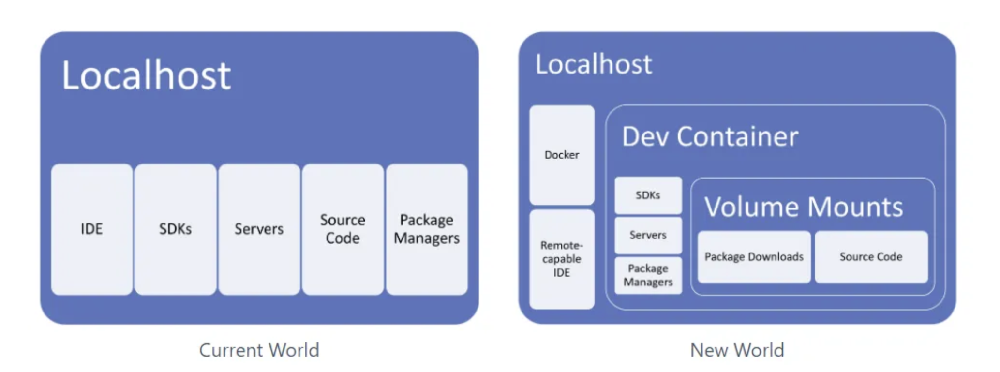
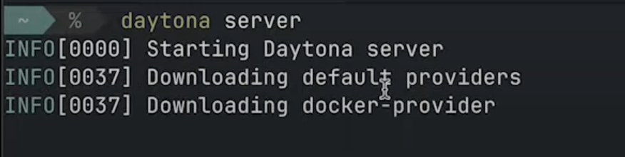
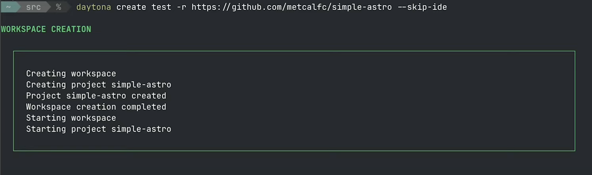
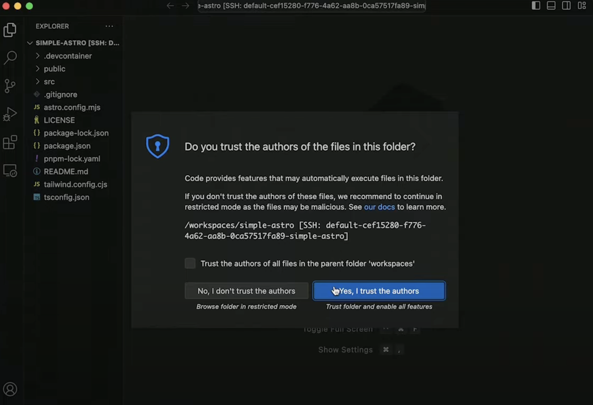
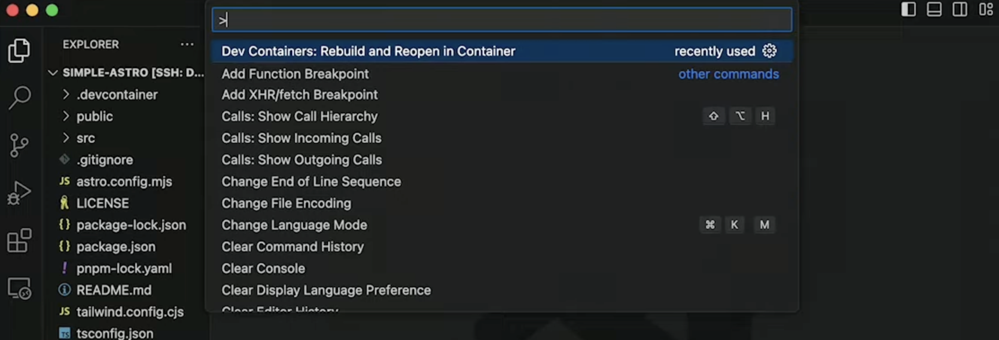

# Creating a Development Container: A Step-by-Step Guide

## Introduction

Creating a development container involves setting up a standardized and reproducible development environment that can run consistently across different workstations or CI/CD environments. This guide will walk you through the process of creating a basic development container using Docker and Visual Studio Code (VSCode).

## What Are Dev Containers?

Dev containers are isolated, lightweight environments that allow developers to work inside a containerized version of a build environment. Essentially, dev containers provide a pre-configured development environment right inside your editor or IDE.

Some of the main benefits of using dev containers include:

- **Pre-configured Build Environments**: Dev containers come with a base image that has all the software, tools, and dependencies pre-installed, so you can get started coding right away.
- **Isolated Environments**: Each dev container has its own isolated filesystem, networking, memory, and CPU, so there are no conflicts with other projects or software on your local machine.
- **Reproducible Builds**: Dev containers provide the exact same environment every time they're launched, ensuring consistent build results. No more "it works on my machine!" issues.
- **Less Setup Time**: Starting a new project with dev containers means you can skip the lengthy setup and configuration process. Just open your project in the container and everything is ready to go.
- **Flexibility**: You can choose a base image with the software and tools you want or build your own custom base image, meeting your specific needs.

  

Dev containers revolutionize the developer experience by providing pre-configured, isolated environments that can supercharge your productivity. If you haven't tried them yet, you owe it to yourself as a developer to give dev containers a shot. They may just change the way you work! The future is containerized!

## Prerequisites

Before you begin, ensure you have the following:

- **Docker**: Installed and running on your machine.
- **VSCode**: Installed with the Remote - Containers extension.
- **Basic Familiarity**: With Docker and VSCode.

1. **Create a Directory**: For your project and navigate into it.

   ```sh
   mkdir my-dev-container && cd my-dev-container
   ```

2. **Create a Dockerfile**: Inside the directory, create a file named Dockerfile with the following content:

   ```sh
   FROM mcr.microsoft.com/devcontainers/go:1-${templateOption:imageVariant}

    # [Optional] Uncomment this section to install additional OS packages.
    # RUN apt-get update && export DEBIAN_FRONTEND=noninteractive \
    #     && apt-get -y install --no-install-recommends <your-package-list-here>

    # [Optional] Uncomment the next lines to use go get to install anything else you need
    # USER vscode
    # RUN go get -x <your-dependency-or-tool>
    # USER root

    # [Optional] Uncomment this line to install global node packages.
    # RUN su vscode -c "source /usr/local/share/nvm/nvm.sh && npm install -g <your-package-here>" 2>&1
   ```

   This Dockerfile sets up a Go development environment using Microsoft's `go:1` image, with options to install additional OS packages, Go dependencies, and global Node.js packages.

   Source: [Dockerfile Configuration `Dockerfile`](https://github.com/devcontainers/templates/blob/main/src/go-postgres/.devcontainer/Dockerfile)

## Start to create your first dev container

Get started with a fully isolated development environment that’s quick to set up and easy to use. Let’s dive in!

### Step 1: **Create a `devcontainer.json` File**

The devcontainer.json file describes how VSCode should interact with the development container. In the same directory, create a file named devcontainer.json with the following content:

```json
{
  "name": "Go & PostgreSQL",
  "dockerComposeFile": "docker-compose.yml",
  "service": "app",
  "workspaceFolder": "/workspaces/${localWorkspaceFolderBasename}"

  // Features to add to the dev container. More info: https://containers.dev/features.
  // "features": {},

  // Configure tool-specific properties.
  // "customizations": {},

  // Use 'forwardPorts' to make a list of ports inside the container available locally.
  // "forwardPorts": [5432],

  // Use 'postCreateCommand' to run commands after the container is created.
  // "postCreateCommand": "go version",

  // Uncomment to connect as root instead. More info: https://aka.ms/dev-containers-non-root.
  // "remoteUser": "root"
}
```

This file tells VSCode to build the development container image using the Dockerfile in the current directory and set the remote user to `developer`.

Source: [DevContainer Configuration `devcontainer.json`](https://github.com/devcontainers/templates/blob/main/src/go-postgres/.devcontainer/devcontainer.json)

### Step 2a: Open the Project in VSCode

1. **Open the Directory**: You created in VSCode.
2. **Reopen in Container**: Press `F1` to open the command palette and select `Remote-Containers: Reopen in Container`. This will build the Docker image if it's not already built and start a container with your development environment, attaching VSCode to it.

### Step 2b: Open the Project in Daytona

**Why Daytona?**  
Daytona automates environment setup, manages containers, and handles SSH and port forwarding, ensuring a stable, consistent development environment with minimal setup time and no drift.

**How to Setup?**

1. **Start Daytona**: Run `daytona server` to launch the server.

   

2. **Create DevContainer**: Use `daytona create <REPO_URL>` or `daytona create <REPO_URL> --no-ide` to set up your container.

   

3. **Open in VSCode**: Run `daytona code` to open the project in VSCode.

   

4. **Rebuild in Container**: Press `Cmd + Shift + P` or `Ctrl + Shift + P` in VSCode and select "_Rebuild and Reopen in Container._"

   

### Step 3: Develop Inside the Container

Now you are inside a containerized development environment. You can open a terminal in VSCode, and you'll be interacting with the shell inside the container. Install your project's dependencies, develop your code, and run your applications all within the container. You can add more tools and dependencies you need for your project by modifying the Dockerfile and rebuilding the container.

Note: Find the source here for better understanding: [source](https://www.daytona.io/docs/usage/workspaces/)

### Conclusion

By following these steps, you can create a consistent and isolated development environment using Docker and VSCode. This setup ensures that your development environment is reproducible and portable, making it easier to collaborate with other developers and deploy your applications.

Feel free to ask if you have any questions or need further assistance!

### References

- [Ultimate Guide to Dev Containers](https://www.daytona.io/dotfiles/ultimate-guide-to-dev-containers)
- [Creating a Development Container](https://www.daytona.io/dotfiles/creating-a-development-container)
- [Demo | Run the server in VS-Code](https://www.youtube.com/watch?v=uL-TaEhvVwk)

- [Development with DevContainer](https://medium.com/cwan-engineering/reproducible-local-development-with-dev-containers-0ed5fa850b36)
