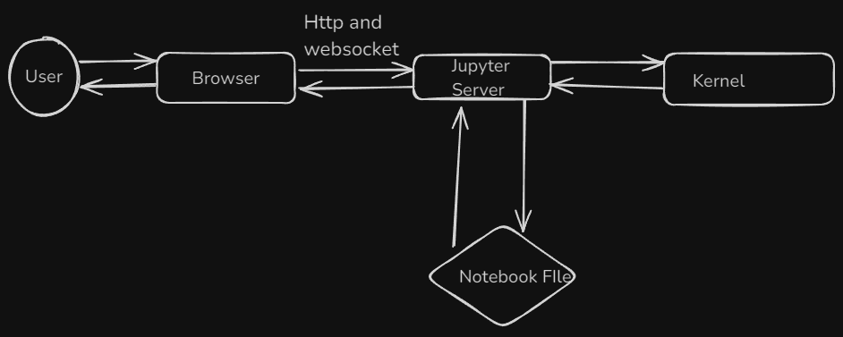

# Introduction to Jupyter Notebook: A Comprehensive Guide

## Introduction

Jupyter Notebook has become an essential tool for data scientists, developers, and researchers alike. It provides an interactive environment that allows users to combine code execution, text, and rich media into a single document. This flexibility makes it ideal for data analysis, machine learning, academic research, and even teaching.

The rise of Jupyter Notebook can be attributed to its ability to streamline workflows, support multiple programming languages, and integrate with various data visualization libraries. Whether you're prototyping a new model or sharing your findings with colleagues, Jupyter Notebook offers a powerful and intuitive platform.

### TL;DR

- **Interactive Environment**: Jupyter Notebook allows for the integration of code, text, and visualizations in one place.
- **Supports Multiple Languages**: While it started with Python, Jupyter now supports over 40 programming languages through different kernels.
- **Ideal for Data Analysis**: It's widely used for data analysis, machine learning, and research, offering robust support for data visualization.

## What is Jupyter Notebook?

Jupyter Notebook is an open-source web application that enables users to create and share documents containing live code, equations, visualizations, and narrative text. It was originally developed as part of the IPython project but has since evolved into a standalone tool that supports multiple programming languages.

The notebook interface consists of cells, where each cell can contain either code or text. The ability to execute code in an interactive manner makes it particularly useful for data analysis and exploration. Additionally, Jupyter Notebooks can be easily shared, making it an excellent tool for collaboration.

**Key Point:** Jupyter Notebook’s versatility makes it a go-to tool for both beginners and seasoned professionals in various fields.


### The Interface and Components

The Jupyter Notebook interface is composed of several key components:

- **Notebook Dashboard**: The control panel for managing your notebooks.
- **Cells**: The main building blocks of a notebook, which can contain code, text, or markdown.
- **Kernel**: The computational engine that runs your code.
- **Toolbar**: A set of buttons that allow you to save your notebook, add cells, and control the kernel.

Understanding these components is essential to effectively use Jupyter Notebook for your projects.

## How Does Jupyter Notebook Work?

Jupyter Notebook operates on a client-server architecture, where the user interacts with the notebook interface through a web browser, while the underlying computation is handled by a separate process known as the kernel.




### Underlying Technology

The core of Jupyter Notebook is powered by IPython, specifically the IPython kernel. This kernel is a separate process responsible for executing user code and handling tasks like autocompletions. The Jupyter Notebook, along with other interfaces like the Qt console and the IPython console in the terminal, all communicate with this kernel.

Communication between the frontend (the notebook interface) and the IPython kernel is managed through JSON messages sent over ZeroMQ sockets. This messaging protocol allows the frontends and kernel to exchange information seamlessly, as described in the [Messaging in Jupyter](https://jupyter-client.readthedocs.io/en/stable/messaging.html) documentation.

One of the strengths of this design is that multiple frontends can connect to a single kernel simultaneously. This means that different interfaces can share the same environment and variables, facilitating collaborative work or multi-interface interaction.

The flexibility of the IPython kernel also extends to support other programming languages. There are three main ways to develop a kernel for a new language:

1. **Wrapper Kernels**: These reuse the communication mechanisms from IPykernel, focusing only on the execution part. Wrapper kernels are ideal for languages with strong Python bindings, like Octave or Bash.
2. **Native Kernels**: These implement both the execution and communication in the target language, often maintained by the respective language communities, such as IJulia for Julia or IHaskell for Haskell.
3. **Xeus Kernels**: Based on the native implementation of the messaging protocol, these kernels are easier to develop for languages that offer C++ or C APIs.

### Workflow Description

The typical workflow in Jupyter Notebook involves creating a notebook, writing code in cells, executing the code, and then saving the notebook. The notebook document is structured as JSON data and is saved with a `.ipynb` extension. This format contains your code, metadata, content, and outputs, making it easy to share and version control.

The Jupyter server acts as the communication hub between the browser, the notebook file on disk, and the kernel. When you execute code, the server sends the code from your browser to the kernel, which processes it and sends the results back to be displayed in the notebook. The server is also responsible for saving and loading notebooks, which means you can edit notebooks without having the kernel for that language installed—though you won't be able to run the code.

Jupyter Notebooks can also be exported to other formats such as HTML, LaTeX, or reStructuredText using the `nbconvert` tool. This conversion process involves:

- **Preprocessors**: Modify the notebook in memory (e.g., running the code and updating the output).
- **Exporters**: Convert the notebook to another format, often using templates.
- **Postprocessors**: Operate on the exported file to finalize the output.

For example, the `nbviewer` website uses `nbconvert` with an HTML exporter to fetch a notebook from a given URL, convert it to HTML, and then serve that HTML to users.

In addition to single-machine execution, IPython also supports parallel computing through `IPython.parallel`, allowing you to manage multiple instances of the IPython kernel across different machines or cores.

### Code Example

```python
# Example: Running a simple Python function in Jupyter Notebook
def square(x):
    return x ** 2

square(4)

```
# Getting Started with Jupyter Notebook

## Installation Guide

### System Requirements

Before setting up Jupyter Notebook in Daytona, ensure your system meets the following requirements:

- **Operating System**: Windows, macOS, or Linux
- **Docker**: Docker Desktop or an equivalent tool installed
- **Visual Studio Code**: With the Remote - Containers extension installed
- **Internet Access**: For pulling the Docker image and dependencies

### Step-by-Step Installation in Daytona

1. **Create a `devcontainer.json` File**:
   - Inside your project directory, create a `.devcontainer` folder.
   - In this folder, create a `devcontainer.json` file with the following content:

     ```json
     {
       "name": "Jupyter Notebook Dev Container",
       "image": "mcr.microsoft.com/vscode/devcontainers/python:3.9",
       "extensions": [
         "ms-python.python",
         "ms-toolsai.jupyter"
       ],
       "postCreateCommand": "pip install notebook",
       "portsAttributes": {
         "8888": {
           "label": "Jupyter Notebook",
           "onAutoForward": "notify"
         }
       },
       "forwardPorts": [8888],
       "remoteUser": "vscode"
     }
     ```

2. **Open the Project in Visual Studio Code**:
   - Open your project directory in Visual Studio Code.
   - When prompted, reopen the project in a container. This will set up the development environment based on the `devcontainer.json` file.

3. **Verify Installation**:
   - Once the container is running, open a terminal in VS Code and verify the Jupyter Notebook installation by running:
     ```bash
     jupyter --version
     ```
   - This command should display the version of Jupyter Notebook installed inside the container.

4. **Launch Jupyter Notebook**:
   - In the terminal, run:
     ```bash
     jupyter notebook --ip=0.0.0.0 --no-browser --allow-root
     ```
   - Jupyter Notebook will start, and you will see a message in the terminal with the URL to access the notebook.

5. **Access Jupyter Notebook**:
   - Open your web browser and navigate to the forwarded port (usually `localhost:8888`), where you can start using Jupyter Notebook.


### **Creating a New Notebook**
- In the Jupyter Notebook dashboard, click on the New button on the right-hand side.
From the dropdown menu, select Python 3 (or another kernel, depending on your setup).
A new notebook will open in a new tab, ready for you to start coding.
### Basic Operations
#### Adding a Cell:

- Click the + button in the toolbar or use the Insert menu to add a new cell.
#### Running a Cell:

- Write your code in the cell and press Shift + Enter to execute it.
### Example:

```
# Importing Libraries
import pandas as pd
import matplotlib.pyplot as plt

# Loading Data
df = pd.read_csv('data.csv')

# Display the first few rows of the dataframe
print(df.head())

# Data Exploration
print(df.describe())
print(df.isnull().sum())

# Convert the 'Date' column to datetime
df['Date'] = pd.to_datetime(df['Date'])

# Set 'Date' as the index
df.set_index('Date', inplace=True)

# Plot Sales over time
plt.figure(figsize=(10, 6))
plt.plot(df.index, df['Sales'], marker='o', linestyle='-', color='b')
plt.title('Sales Over Time')
plt.xlabel('Date')
plt.ylabel('Sales')
plt.grid(True)
plt.show()
```

## Key Features and Differences

### Unique Features of Jupyter Notebook

- **Interactive Output**: Jupyter Notebook allows for interactive data exploration and visualization. Users can see the results of their code immediately below the code cell.
- **Rich Media Integration**: Notebooks support the inclusion of rich media such as images, videos, and interactive widgets. This makes it possible to create highly engaging and informative documents.
- **Live Code Execution**: Code cells can be executed independently, which allows for iterative development and testing of code snippets.
- **Markdown and LaTeX Support**: Users can write text, explanations, and equations using Markdown and LaTeX, providing a versatile environment for creating well-documented and educational content.

### Comparison with JupyterLab

JupyterLab is a more recent and advanced interface compared to Jupyter Notebook. Here’s a comparison of the two:

| Feature               | Jupyter Notebook                                    | JupyterLab                                         |
|-----------------------|------------------------------------------------------|----------------------------------------------------|
| **Interface**         | Single document view                                | Multi-document interface with tabs and panels     |
| **File Management**   | Limited file management                             | Enhanced file browser and management               |
| **Code Execution**    | Single document execution                           | Supports multiple documents and consoles in one view |
| **Customization**     | Limited customization options                       | Highly customizable with extensions and layouts    |
| **Rich Media**        | Supports images, videos, and interactive widgets    | Enhanced support for rich media with improved layout options |

### Examples and Visuals

#### Interface
JupyterLab provides a more advanced workspace compared to Jupyter Notebook. Its workspace includes a main work area where you can open and manage multiple documents and activities, along with a collapsible left sidebar. This sidebar offers access to the file browser, running kernels and terminals, command palette, and notebook cell tools.

In JupyterLab, the main work area features a tab-based layout that allows for easy switching between multiple open documents. You can also drag and drop tabs to rearrange them, split the view to display multiple documents side-by-side, or create new windows for a more customized workspace experience.

### Jupyter Lab


### Jupyter Notebook


### Which One Should You Choose?

Both Jupyter Notebook and JupyterLab are outstanding tools for data science, and the choice between them depends on your specific needs and preferences.

If you are comfortable with Jupyter Notebook and appreciate its straightforward user interface, it may be the right choice for you. On the other hand, if you seek a more advanced and versatile environment with enhanced support for extensions and integrated tools like terminals and text editors, JupyterLab might be a better fit.
