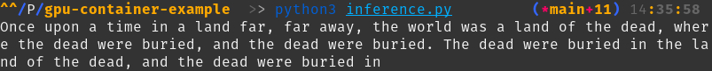
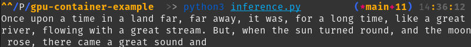

# Optimizing LLM Inference with GPU-Accelerated Docker Containers

## Introduction

[Large Language Models (LLMs)](/definitions/20240820_definition_large-language-model.md) such as GPT-2 and GPT-3 have significantly pushed the boundaries of [natural language processing (NLP)](/definitions/20240820_definition_natural-language-processing.md), enabling a wide range of applications from complex text generation to translation and summarization. However, deploying these models efficiently requires substantial computational power, particularly for tasks like real-time text generation. GPUs are indispensable for handling these operations effectively, and [containerization](/definitions/20240819_definition_containerization.md) offers a streamlined solution for managing and scaling such workloads.

This guide will take you through setting up and configuring [Docker](/definitions/20240819_definition_docker.md) containers specifically for GPU-accelerated tasks. We'll cover everything from initial setup to optimizing performance and troubleshooting common issues. By the end of this guide, you'll be equipped to deploy and manage [LLMs](/definitions/20240820_definition_large-language-model.md) in a GPU-enabled [containerized environment](/definitions/20240819_definition_containerization.md).


### TL;DR

- **Set up a GPU-enabled environment**: Install and configure Docker with NVIDIA Container Toolkit for GPU support.
- **Build a container with essential libraries**: Include PyTorch, Transformers, and other dependencies for LLM inference.
- **Create and optimize a text generation script**: Leverage GPU resources to enhance performance in LLM tasks.
- **Monitor and improve performance**: Use tools like `nvidia-smi` and benchmarking to ensure efficient GPU utilization.
- **Address common issues**: Learn troubleshooting techniques for memory errors, slow performance, and GPU access problems.

## Installing Dependencies

Before setting up your environment for GPU-intensive tasks, ensure that you have the following prerequisites:

- A machine with a CUDA-compatible GPU (e.g., NVIDIA GPUs)
- [Docker](/definitions/20240819_definition_docker.md)
- [Daytona](https://github.com/daytonaio/daytona)
- [NVIDIA Container Toolkit](https://docs.nvidia.com/datacenter/cloud-native/container-toolkit/latest/install-guide.html)

### Daytona Installation

You can install Daytona by running the following command in your terminal:

```bash
curl -sf -L https://download.daytona.io/daytona/install.sh | sudo bash
```

Daytona creates a controlled [development environment](/definitions/20240819_definition_development-environment.md) where you can work on the project with all dependencies correctly configured, reducing the likelihood of compatibility issues.

### Docker Installation

[Docker](/definitions/20240819_definition_docker.md) is a platform that allows you to automate the deployment of applications inside lightweight, portable containers. These containers include everything needed to run the application, such as the code, runtime, libraries, and dependencies, ensuring consistency across different environments.

If [Docker](/definitions/20240819_definition_docker.md) isn't already installed on your system, follow the [steps in their documentation](https://docs.docker.com/get-started/get-docker/).

### NVIDIA Container Toolkit Installation

The NVIDIA Container Toolkit is essential for enabling GPU support in [Docker](/definitions/20240819_definition_docker.md) containers. It provides the necessary libraries and tools to seamlessly access NVIDIA GPUs from within [Docker](/definitions/20240819_definition_docker.md) containers, allowing you to leverage GPU acceleration for your applications.


To enable GPU support in [Docker](/definitions/20240819_definition_docker.md) containers, you need to install the NVIDIA Container Toolkit on your system machine. The toolkit is available for Linux and Windows.

#### Linux

To install the GPU driver for a compatible Linux distribution, follow the steps [in this guide](https://docs.nvidia.com/datacenter/cloud-native/container-toolkit/latest/install-guide.html) for your respective package manager.

After it's installed, you can configure Docker to use the driver with the following commands:

```bash
sudo nvidia-ctk runtime configure --runtime=docker
sudo systemctl restart docker
```

#### Windows

To enable NVIDIA CUDA on Windows, you can follow the [guide on Microsoft's website](https://learn.microsoft.com/en-us/windows/ai/directml/gpu-cuda-in-wsl).

You need to use a Windows Subsystem for Linux (WSL) instance for Linux compatibility. Details on that can be found [here](https://learn.microsoft.com/en-us/windows/wsl/install).

#### macOS

The toolkit cannot be installed on macOS. A Linux-compatible system is required.

### Verify GPU Configuration

To verify that your [Docker](/definitions/20240819_definition_docker.md) setup can access the GPU, run the following command:

```bash
docker run --rm --gpus all nvidia/cuda:12.6.0-base-ubuntu24.04 nvidia-smi
```

If your setup is correct, the `nvidia-smi` command will display information about your GPU, confirming that the GPU is accessible inside [Docker](/definitions/20240819_definition_docker.md) containers.

## Running LLM Inference in a Docker Container

With your GPU-enabled [Docker](/definitions/20240819_definition_docker.md) environment ready, the next step is to develop a text generation script using an [LLM](/definitions/20240820_definition_large-language-model.md) and run it inside a [Docker](/definitions/20240819_definition_docker.md) container.

### Create Daytona Workspace

To make it easier to set up the development environment in the future, we'll be creating a Daytona workspace.

First, create a new Github repository. Add the following configuration to `.devcontainer/devcontainer.json`:

```json
{
  "name": "GPU LLM Container",
  "image": "mcr.microsoft.com/devcontainers/python:3.12-bookworm",
  "customizations": {
    "vscode": {
      "settings": {
        "python.defaultInterpreterPath": "/bin/python",
        "python.linting.enabled": true,
        "python.linting.pylintEnabled": true,
        "python.formatting.autopep8Path": "/usr/local/bin/autopep8",
        "python.formatting.blackPath": "/usr/local/bin/black",
        "python.formatting.yapfPath": "/usr/local/bin/yapf",
        "python.linting.banditPath": "/usr/local/bin/bandit",
        "python.linting.flake8Path": "/usr/local/bin/flake8",
        "python.linting.mypyPath": "/usr/local/bin/mypy",
        "python.linting.pycodestylePath": "/usr/local/bin/pycodestyle",
        "python.linting.pydocstylePath": "/usr/local/bin/pydocstyle",
        "python.linting.pylintPath": "/usr/local/bin/pylint"
      },
      "extensions": [
        "ms-python.python",
        "ms-python.vscode-pylance"
      ]
    }
  },
  "postCreateCommand": "pip3 install -r requirements.txt"
}
```

Then, add the required Python dependencies to `requirements.txt`:

```
torch==2.4.0
transformers==4.44.2
```

Once the repository is set up, create the workspace with your respective username and repo name.

```bash
daytona create https://github.com/<username>/<repository>
```

This will create a controlled environment with the required Python dependencies installed.

You can open the workspace in your preferred IDE with the following command:

```bash
daytona code
```

### Download the GPT-2 Model

To download the GPT-2 model and tokenizer, create the following script:

```python
# download.py

from transformers import GPT2LMHeadModel, GPT2Tokenizer

model_name = "gpt2"
model = GPT2LMHeadModel.from_pretrained(model_name)
tokenizer = GPT2Tokenizer.from_pretrained(model_name)
model.save_pretrained("./gpt2_model")
tokenizer.save_pretrained("./gpt2_tokenizer")
```

This script downloads and saves the GPT-2 model and tokenizer.

Run the script with:

```bash
python3 download.py
```

You should see `gpt2_model` and `gpt2_tokenizer` directories.

### Test the Model

Now, create a script to generate text using the downloaded GPT-2 model:

```python
# inference.py

import torch
from transformers import GPT2LMHeadModel, GPT2Tokenizer

def generate_text(prompt, max_length=50):
    # Check if GPU is available and set device accordingly
    device = torch.device("cuda" if torch.cuda.is_available() else "cpu")
    
    # Load downloaded GPT-2 model and tokenizer
    model = GPT2LMHeadModel.from_pretrained("./gpt2_model")
    tokenizer = GPT2Tokenizer.from_pretrained("./gpt2_tokenizer", clean_up_tokenization_spaces=True)
    
    # Move model to the GPU
    model.to(device)

    # Encode the input prompt
    inputs = tokenizer.encode(prompt, return_tensors="pt").to(device)

    # Create attention mask
    attention_mask = torch.ones(inputs.shape, device=inputs.device)

    # Generate text
    outputs = model.generate(
        inputs,
        max_length=max_length, 
        attention_mask=attention_mask,
        pad_token_id=tokenizer.eos_token_id
    )

    # Decode the generated text
    return tokenizer.decode(outputs[0], skip_special_tokens=True)

if __name__ == "__main__":
    prompt = "Once upon a time in a land far, far away"
    generated_text = generate_text(prompt)
    print(generated_text)
```

This script loads the model and tokenizer, performs text generation, and prints the output.

You can test the script in your workspace with the following command:

```bash
python3 inference.py
```

Which should output generated text like so:



### Create a Docker Container

To run this script in a [Docker](/definitions/20240819_definition_docker.md) container, create a `Dockerfile` that includes all necessary dependencies, such as PyTorch and the Transformers library:

```Dockerfile
FROM nvidia/cuda:12.6.0-base-ubuntu24.04

# Install Pip
RUN apt-get update && apt-get install -y \
    python3-pip \
    python3-dev \
    python3-venv

# Create virtual environment
RUN python3 -m venv workspace

# Install PyTorch and Transformers libraries
RUN /workspace/bin/pip install torch transformers

# Set the working directory
WORKDIR /workspace

# Copy your script into the container
COPY inference.py /workspace

# Copy downloaded model into container
COPY gpt2_model /workspace/gpt2_model

# Copy downloaded tokenizer into container
COPY gpt2_tokenizer /workspace/gpt2_tokenizer

# Specify the command to run
CMD ["bin/python", "inference.py"]
```

This `Dockerfile` sets up a GPU-enabled environment, installs Python and the necessary libraries, and copies the text generation script into the container.

### Build and Run the Docker Container

With your `Dockerfile` ready, build the container:

```bash
docker build -t llm-gpu .
```


And run it with NVIDIA GPUs enabled:

```bash
docker run --gpus all llm-gpu
```


## Implementing Advanced Text Generation Techniques

When generating text using [LLMs](/definitions/20240820_definition_large-language-model.md), advanced sampling methods can significantly improve the quality and diversity of the output. This section will introduce top-k sampling, nucleus sampling (top-p sampling), and temperature scaling.

### Top-k Sampling

Top-k sampling restricts the model's predictions to the top `k` most probable next words, reducing the likelihood of generating less coherent outputs.

### Nucleus Sampling (Top-p Sampling)

Nucleus sampling selects from the smallest set of words whose cumulative probability is greater than or equal to `p`. This method allows for more dynamic sampling, adapting the number of considered tokens based on context.

### Temperature Setting

The temperature parameter controls the randomness of predictions by scaling the logits before applying the softmax function. Lower temperatures produce more deterministic results, while higher temperatures introduce greater variability.

### Configuring the Script

Here's how to integrate these techniques into the text generation script:

```python
# inference.py

import torch
from transformers import GPT2LMHeadModel, GPT2Tokenizer

def generate_text(prompt, max_length=50, top_k=50, top_p=0.9, temperature=0.8):
    # Check if GPU is available and set device accordingly
    device = torch.device("cuda" if torch.cuda.is_available() else "cpu")
    
    # Load pre-trained GPT-2 model and tokenizer
    model = GPT2LMHeadModel.from_pretrained("./gpt2_model")
    tokenizer = GPT2Tokenizer.from_pretrained("./gpt2_tokenizer", clean_up_tokenization_spaces=True)
    
    # Move model to the GPU
    model.to(device)

    # Encode the input prompt
    inputs = tokenizer.encode(prompt, return_tensors="pt").to(device)

    # Create attention mask
    attention_mask = torch.ones(inputs.shape, device=inputs.device)

    # Generate text with advanced sampling techniques
    outputs = model.generate(
        inputs,
        max_length=max_length, 
        attention_mask=attention_mask,
        pad_token_id=tokenizer.eos_token_id,
        do_sample=True,  # Enable sampling
        top_k=top_k,     # Top-k sampling
        top_p=top_p,     # Nucleus (top-p) sampling
        temperature=temperature  # Adjust temperature
    )

    # Decode the generated text
    return tokenizer.decode(outputs[0], skip_special_tokens=True)

if __name__ == "__main__":
    prompt = "Once upon a time in a land far, far away"
    generated_text = generate_text(prompt)
    print(generated_text)
```


The output should now be more coherent and varied.



## Monitoring and Optimizing Performance

After running the script, it's crucial to monitor performance and optimize as needed. This involves tracking GPU utilization, measuring execution time, and fine-tuning parameters for better efficiency. Tools like `nvidia-smi` and Python's `time` module can assist in these tasks.

### Monitoring GPU Utilization

To ensure your GPU is being effectively utilized during inference or training, you can use the NVIDIA System Management Interface (`nvidia-smi`). It provides real-time metrics, including memory usage, GPU load, and power consumption. Execute the following command:

```bash
nvidia-smi
```

This will display a dashboard showing all running processes on your GPU, making it easier to identify bottlenecks or underutilization. For continuous monitoring, consider combining `nvidia-smi` with logging tools or exporting data for analysis using the `--query-gpu` and `--format=csv` options.

### Benchmarking and Performance Tuning

Benchmarking helps evaluate the script's efficiency, including GPU utilization, latency, and resource allocation. To benchmark the code, create the following script:

```python
# benchmark.py

import time
import torch
from transformers import GPT2LMHeadModel, GPT2Tokenizer

def generate_text(prompt, max_length=50, model_name='gpt2', top_k=50, top_p=0.9, temperature=0.8):
    device = torch.device("cuda" if torch.cuda.is_available() else "cpu")
    model = GPT2LMHeadModel.from_pretrained(model_name)
    tokenizer = GPT2Tokenizer.from_pretrained(model_name, clean_up_tokenization_spaces=True)
    model.to(device)
    inputs = tokenizer.encode(prompt, return_tensors='pt').to(device)
    attention_mask = torch.ones(inputs.shape, device=inputs.device)

    start_time = time.time()
    outputs = model.generate(
        inputs,
        max_length=max_length, 
        attention_mask=attention_mask,
        pad_token_id=tokenizer.eos_token_id,
        do_sample=True,
        top_k=top_k,
        top_p=top_p,
        temperature=temperature
    )
    end_time = time.time()

    print(f"Time taken: {end_time - start_time:.2f} seconds")
    return tokenizer.decode(outputs[0], skip_special_tokens=True)

if __name__ == "__main__":
    prompt = "Once upon a time in a land far, far away"
    print(generate_text(prompt))
```

Run the script with:

```bash
python3 benchmark.py
```


Running the benchmark script not only measures the performance of your model but also helps identify areas where tuning and optimization can yield significant improvements.

## Optimization and Troubleshooting

### Fine-Tuning Performance

To maximize GPU efficiency, consider the following optimizations:

- **Mixed Precision Inference**: Use mixed precision to reduce memory usage and boost performance.
- **Batch Size Optimization**: Experiment with different batch sizes to balance memory usage and processing speed.

### Troubleshooting Common Issues

Even with a well-configured setup, issues can arise. Below are some common problems and their solutions:

1. GPU Access Issues

    - **Problem**: [Docker](/definitions/20240819_definition_docker.md) cannot access the GPU inside the container.
    - **Solution**: Ensure that the NVIDIA Container Toolkit is correctly installed and that you are using the `--gpus all` flag when running the container.

2. Out-of-Memory Errors

    - **Problem**: Out-of-memory (OOM) errors during inference.
    - **Solution**: Lower the `max_length` parameter or reduce batch sizes in your script. Consider using mixed precision to reduce memory usage.

3. Slow GPU Performance

    - **Problem**: Slow inference times despite using a GPU.
    - **Solution**: Verify that the script is utilizing the GPU by monitoring usage with `nvidia-smi`. If usage is low, optimize the script by adjusting sampling parameters, reducing model size, or increasing batch size within memory limits.

## Conclusion

This guide has walked you through setting up a [Docker](/definitions/20240819_definition_docker.md) environment for GPU-accelerated [LLM](/definitions/20240820_definition_large-language-model.md) inference. By following these steps, you can efficiently deploy and manage [LLMs](/definitions/20240820_definition_large-language-model.md), fully leveraging the power of GPUs for [natural language processing](/definitions/20240820_definition_natural-language-processing.md) tasks. Whether you're developing models for research or deploying them in production, [containerization](20240819_definition_containerization.md) with [Docker](/definitions/20240819_definition_docker.md) provides the scalability and efficiency needed to maximize your hardware resources.

By mastering these techniques, you'll ensure that your AI and machine learning projects are both powerful and efficiently deployed in any environment.

## References

- [Docker Documentation](https://docs.docker.com/get-started/)
- [NVIDIA Container Toolkit Documentation](https://docs.nvidia.com/datacenter/cloud-native/container-toolkit/overview.html)
- [PyTorch CUDA Integration](https://pytorch.org/get-started/locally/)
- [Transformers Documentation](https://huggingface.co/docs/transformers/)
