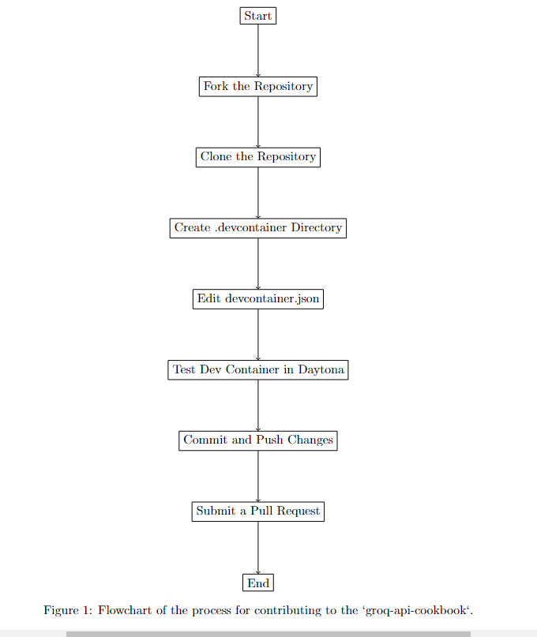

# How to Set Up and Contribute a `devcontainer.json` to the `groq-api-cookbook` Repository

## Introduction

If you've ever contributed to an open-source project, you know how tricky it can be to ensure that everyone is working with the same environment. This guide will show you how to create a development container using `devcontainer.json` and contribute it to the `groq-api-cookbook` repository. The process is straightforward, and by the end of this tutorial, you'll have set up a fully functional development environment and learned how to contribute it back to the community.

## Why Use a Dev Container?

A development container ensures that your project runs the same way, regardless of where it's being developed. Whether you're on Windows, macOS, or Linux, a `devcontainer.json` file helps maintain consistency by specifying the tools, dependencies, and settings required for the project.

## Prerequisites

Before diving in, make sure you have the following tools installed:

- [Docker](https://www.docker.com/get-started)
- [Visual Studio Code](https://code.visualstudio.com/)
- [Remote - Containers extension](https://marketplace.visualstudio.com/items?itemName=ms-vscode-remote.remote-containers)
- A GitHub account

If you're new to any of these tools, don't worry—there are plenty of resources online to get you started.

## Step 1: Fork and Clone the Repository

First things first, you'll need to fork the `groq-api-cookbook` repository. This gives you your own copy of the project where you can make changes without affecting the original codebase.

1. Head over to the [groq-api-cookbook repository](https://github.com/groq/groq-api-cookbook) and click the **Fork** button in the top right corner.
2. Once forked, clone the repository to your local machine:

    ```bash
    git clone https://github.com/<your-username>/groq-api-cookbook.git
    cd groq-api-cookbook
    ```

## Step 2: Set Up Your Dev Container

Now that you have the repository on your local machine, it's time to set up the dev container.

### 2.1 Create a `.devcontainer` Directory

Inside the cloned repository, create a new directory named `.devcontainer`:

```bash
mkdir .devcontainer
cd .devcontainer
```
### 2.2 Create the devcontainer.json File
In the .devcontainer directory, create a file named devcontainer.json and add the following configuration:

```json
{
    "name": "Groq API Cookbook Development Container",
    "image": "mcr.microsoft.com/vscode/devcontainers/python:3.9",
    "features": {
        "ghcr.io/devcontainers/features/docker-outside-of-docker:1": {}
    },
    "postCreateCommand": "pip install -r requirements.txt",
    "customizations": {
        "vscode": {
            "settings": {
                "python.pythonPath": "/usr/local/bin/python3"
            },
            "extensions": [
                "ms-python.python",
                "ms-python.vscode-pylance"
            ]
        }
    }
}
```

### Explanation
- **name**: This is just a label for your container.
- **image**: Specifies the Docker image to use. In this case, we're using Python 3.9.
- **features**: Here, we're adding Docker support inside the container, which might come in handy.
- **postCreateCommand**: This command runs after the container is created. We're using it to install the necessary Python packages.
- **customizations**: These are specific to VS Code, like Python path settings and useful extensions.

## Step 3: Test the Dev Container
1. It's time to see if everything works as expected.

2. Open the repository in Visual Studio Code.

3. When prompted, select Reopen in Container. This will start your development environment inside the container you just set up.

4. To verify that everything is running smoothly, try running one of the cookbook examples:
```bash
python examples/your_example.py
```

If the example runs without issues, congratulations! Your dev container is set up correctly.

## Step 4: Commit Your Changes
After testing and confirming that your devcontainer.json works, it’s time to commit your changes.

```bash
git add .devcontainer/devcontainer.json
git commit -m "Add devcontainer configuration for Groq API Cookbook"
git push origin main
```
## Step 5: Submit a Pull Request
Now that your changes are committed, you can contribute them back to the original project.

1. Go back to the groq-api-cookbook repository on GitHub.
2. Click on the Compare & pull request button that appears after you push your changes.
3. Fill out the pull request form, making sure to follow the [contribution guidelines](https://github.com/groq/groq-api-cookbook/blob/main/CONTRIBUTING.md).

Be sure to explain what your dev container does and why it’s useful for the project.



## Step 6: Using Daytona Workspace
Daytona is a cloud-based environment that can integrate with your devcontainer.json setup. Here's how you can get started:

1. Open Daytona and connect it to your GitHub account.
2. Import your forked `groq-api-cookbook` repository.
3. Start a development session in Daytona, and it will automatically detect and use the `devcontainer.json` configuration.
4. Just like before, run one of the cookbook examples to make sure everything is working smoothly.

## Conclusion
By following this guide, you've not only set up a consistent development environment but also contributed to an open-source project. This is a great way to help others in the community and ensure that future contributors have an easier time getting started. Remember, contributions like these are what make open-source projects thrive.