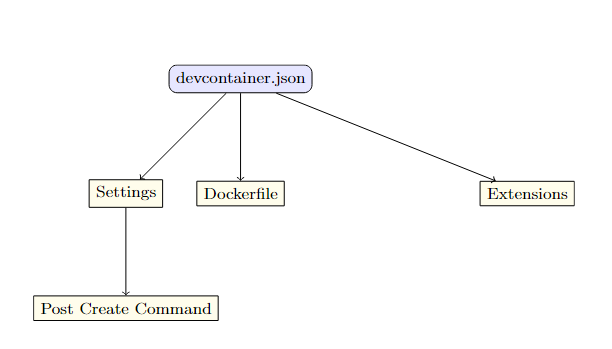

# Using Phi-3 and .NET Development in Daytonas

## Introduction

With the release of Phi-3.5, the Phi-3 Labs project has introduced advanced features and enhancements for AI and machine learning applications. The Phi-3.5 update brings significant improvements over its predecessors, offering enhanced capabilities for researchers and developers working with language models.

Daytona, a cloud-based development environment, provides a powerful platform for managing dependencies and configurations, making it ideal for developing, testing, and deploying AI models. This guide will walk you through setting up Phi-3.5 Labs samples in Daytona using a .NET configuration via `devcontainer.json`, streamlining your development process and enhancing collaboration.

### TL;DR

- **Set up Daytona with .NET**: Learn how to configure a .NET environment using `devcontainer.json`.
- **Integrate Phi-3.5 Labs**: Incorporate the latest Phi-3.5 models into your development workflow.
- **Run and Test Samples**: Execute and test Phi-3.5 Labs samples within Daytona.
- **Best Practices**: Discover tips for optimizing AI development in cloud environments.

## Setting Up Daytona with .NET Using devcontainer.json

To integrate Phi-3.5 Labs into your Daytona environment, start by setting up a .NET environment using `devcontainer.json`. Follow these steps:

### Creating devcontainer.json

1. **Create the `devcontainer.json` File**: In your project root, create a `.devcontainer` directory if it doesn’t already exist, and add a `devcontainer.json` file.

2. **Configure the Environment**: Populate your `devcontainer.json` with the following configuration:

    ```json
    {
        "version": "2",
        "name": "Daytona .NET Environment",
        "dockerFile": "Dockerfile",
        "extensions": [
            "ms-dotnettools.csharp",
            "ms-vscode.vscode-node-azure-pack"
        ],
        "settings": {
            "terminal.integrated.shell.linux": "/bin/bash"
        },
        "postCreateCommand": "dotnet restore"
    }
    ```

3. **Create Dockerfile**: Define the base image and install necessary dependencies:

    ```dockerfile
    FROM mcr.microsoft.com/dotnet/aspnet:7.0
    WORKDIR /app
    COPY . .
    RUN dotnet restore
    ```

### Diagram for `devcontainer.json` Configuration
This diagram illustrates the different parts of the devcontainer.json configuration file.



## Configuring the Environment for Phi-3.5 Labs

With the .NET environment in place, you need to configure it for Phi-3.5 Labs.

1. **Install Dependencies**: Add any required dependencies to your `Dockerfile` or install them manually in the Daytona container.

    ```dockerfile
    RUN apt-get update && apt-get install -y \
        libfoo-dev \
        libbar-dev
    ```

2. **Download Phi-3.5 Models**: Use a script to download and set up Phi-3.5 models. Create a `setup.sh` script:

    ```bash
    #!/bin/bash
    mkdir -p /models/phi-3
    wget -O /models/phi-3/phi-3.5-model.bin https://example.com/phi-3.5-model.bin
    ```

    Add this script to your `postCreateCommand` in `devcontainer.json`:

    ```json
    "postCreateCommand": "./setup.sh"
    ```

### Diagram for Phi-3 Labs Integration
This diagram shows how to integrate Phi-3 Labs models within your development environment.


## Running and Testing Phi-3.5 Labs Samples

To run and test Phi-3.5 Labs samples:

1. **Execute the Sample Project**: Navigate to your project directory and run the sample project:

    ```bash
    dotnet run --project Samples/Phi3Sample.csproj
    ```

2. **Verify Execution**: Ensure that the samples run correctly and test various functionalities.

### Code Example

```csharp
// Phi3Sample.cs
using System;

class Program
{
    static void Main()
    {
        Console.WriteLine("Running Phi-3.5 Labs Sample");
        // Code to interact with Phi-3.5 model
    }
}
```

### Simple Flowchart for the Setup Process
This flowchart outlines the steps for setting up Daytona with .NET and Phi-3 Labs.


## Best Practices for Using Daytona with .NET and AI Models
- **Optimize Resource Usage:** Ensure your Daytona environment is configured to use resources efficiently. Monitor and adjust as needed.
- **Version Control**: Keep your devcontainer.json and Dockerfiles under version control to track changes and ensure reproducibility.
- **Regular Updates**: Regularly update your dependencies and models to leverage the latest improvements and security patches.
- **Efficient Collaboration**: Use Daytona’s collaborative features to streamline teamwork and maintain consistency across different development environments.
- **Performance Monitoring**: Continuously monitor the performance of your models and environment to identify and address any bottlenecks.
**Key Point**: Regularly update your dependencies and models to leverage the latest improvements and security patches.


## Conclusion
Integrating Phi-3 Labs with a Daytona environment using .NET can significantly enhance your development experience. By leveraging the power of Daytona’s cloud-based development environment, you can streamline your AI projects, making it easier to manage dependencies and collaborate with team members.