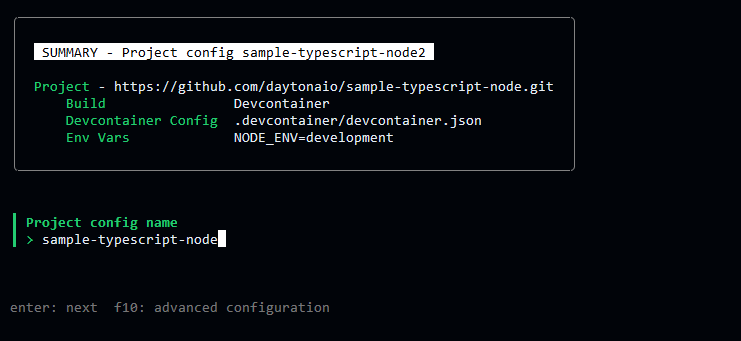
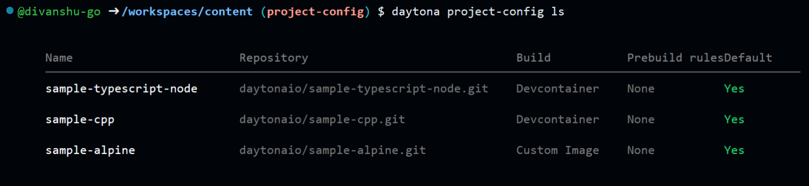

# Introducing Daytona Project Config: Simplify and Streamline Workspace Setup

# Introduction

Developing similar
[development environments](/definitions/20240819_definition_development%20environment.md)
for different projects can often be boring and time-consuming. Each time you
begin a new project or adjust a new
[workspace](/definitions/20240819_definition_daytona%20workspace.md), you
probably recreate [repository](/definitions/20240819_definition_repository.md),
environment variables, and build settings by hand. The more complex your
projects are, the more these overhead tasks hinder your productivity.

You can automate all those processes and even keep the whole consistency
throughout your workspaces by using Project Configs. They were introduced in
[v0.24.0](https://github.com/daytonaio/daytona/releases/tag/v0.24.0). It enables
you to predefine project settings .

---

## TL;DR

- **What are Project Configs?** Preset workspace parameters to save down on
  setup time.
- **Why use them?** they reduce setup time and are prefered by power users
- **Key Features:** They use the KEY=VALUE syntax to enclose your project's
  environment variables, build parameters (devcontainer.json), and Git URL.
- **Future Development:** Project Configs will soon integrate with
  [Prebuilds](https://www.daytona.io/docs/usage/prebuilds) , enhancing workspace
  readiness.

---

## What Is a Project-Config ?

A project configuration contains all necessary properties to define and manage
projects within a
[Workspace](/definitions/20240819_definition_daytona%20workspace.md). It stores
information such as the
[repository URL](/definitions/20240819_definition_repository.md), build
configuration, and environment variables. This allows for easy reuse of
previously set configurations, ensuring a consistent and reproducible setup
across multiple Workspaces.

**What makes this significant?**

Maintaining a consistent
[development environment](/definitions/20240819_definition_development%20environment.md)
is crucial for developers managing several projects or working in teams in order
to prevent problems like inconsistent build procedures, missing dependencies,
and version mismatches. In addition to saving time, project configurations
provide reproducible and consistent environments.

### Key Features of a Project-Config

A project configuration encapsulates all the essential elements for setting up a
project, including:

#### Repository URL

The URL of the Git repository associated with the Project.

#### Build Configuration

- **[Automatic](https://www.daytona.io/docs/usage/builders#automatic)**:
  Auto-detects the most appropriate Builder for your project.
- **[Devcontainer](https://www.daytona.io/docs/usage/builders#dev-container)**:
  Utilizes a predefined development container specified by a `devcontainer.json`
  file.
- **[Custom image](https://www.daytona.io/docs/usage/builders#custom-image)**:
  Builds the Project image by specifying a custom base container.
- **[None](https://www.daytona.io/docs/usage/builders#none)**: Builds a Project
  by using the default base image (`daytonaio/workspace-project`).

#### Environment Variables

Environment variables are specified in the `KEY=VALUE` format. These variables
are essential for the Project’s build and runtime environments. You can set the
variables directly or pass them from the machine’s environment during execution.

#### Project Configuration Name

A unique identifier for the Project Configuration, which distinguishes it from
other configurations within the system.

---

`daytona project-config` command allows you to add, inspect, change, list, set
as default, and delete Project Configurations, providing you complete control
over the configuration and reuse of your Project configurations across many
Workspaces.

## Step-by-Step Guide: Creating a New Project Config

To get started in actual process steps included:

### No 1. Add a New Project Config

Open your terminal and run the following command:

```bash
daytona project-config add
```

You'll be asked to enter key information for the configuration, such as the
[repository URL](/definitions/20240819_definition_repository.md), build
configuration, and environment variables.

We will see an example now:

```bash
daytona project-config add
> Enter repository URL: https://github.com/user/repo
> Select build configuration: Devcontainer
> Enter environment variables: ENV_VAR=production
> Name your project config: MyProjectConfig
```

This simple set of inputs ensures that the next time you create a workspace,
Daytona will automatically load these settings, significantly reducing setup
time.

### 2. Sample Repository for Project Config

Let's set up a Project Config for a
[TypeScript Node Project](https://github.com/daytonaio/sample-typescript-node) ,
which includes a basic Node.js app and a `devcontainer.json` for an easy
development setup.

Let's learn how to make a Project Config:

```bash
daytona project-config add
> Enter repository URL: https://github.com/daytonaio/sample-typescript-node
> Select build configuration: Devcontainer
> Enter environment variables: NODE_ENV=development
> Name your project config: TypeScript-Node
```



Saving this, will apply this configuration to multiple workspaces, ensuring that
each workspace has the same repository and environment setup. To create a new
workspace with this setup, use:

```bash
daytona create
> Select project config: TypeScript-Node
```

This process will easily set up your workspace with the exact configuration,
making it smooth to get started.

---

## Managing Your Project Configs

Once you've created a Project Config, Daytona provides several commands to
manage and view these configurations. You can explore these commands in more
detail in the
[Daytona CLI Reference](https://www.daytona.io/docs/reference/cli/#daytona-project-config).

### Listing All Project Configs

To list all your existing Project Configs, use the command:

```bash
daytona project-config list
```

This will display a table with the Project Config name, associated repository,
build configuration, and whether it's set as the default.



### Seeing the Details of a Project Config

To see the details of a specific Project Config, run:

```bash
daytona project-config info
```

Select the configuration you want to view, and Daytona will display details
about the repository URL, build configuration, and any environment variables
associated with it. It might look like this:

```bash
Project Config Info:
---------------------
Name: sample-typescript-node
Repository: https://github.com/daytonaio/sample-typescript-node.git
Default: Yes
Build: Devcontainer
Devcontainer path: .devcontainer/devcontainer.json
```

This result provides a structured view of the Project Config, showing important
details such as the repository URL, build configuration, and the path to the
development container configuration.

---

## Updating or Removing Project Configs

### Updating a Project Config

If you need to change settings within an before active Project Config, Daytona
makes it easy. Simply run:

```bash
daytona project-config update
```

You'll be asked to choose the Project Config you want to remake and then change
any of the settings, such as changing the repository URL or adding new
environment variables.

### Deleting a Project Config

If a configuration is no longer needed, you can delete it using the following
command:

```bash
daytona project-config delete
```

This will remove the configuration from Daytona, ensuring your workspace remains
clean and organized.

---

## What's Next: Project Configs and Prebuilds

The introduction of Project Configs is part of Daytona's broader start to
improve developer productivity by automating repetitive tasks. One upcoming
feature that will further streamline the development process is **Prebuilds**.

### How Prebuilds Will Enhance Project Configs

Prebuilds allow for even rapid workspace setup by listening for changes in the
underlying repository and automatically running builds in the background. This
ensures that when a developer creates a new workspace, all necessary builds have
already been completed, significantly reducing wait times.

> **"Prebuilds are made to take Daytona's automation to the next level, allowing
> for 'ready-to-go' environments. Coupled with Project Configs, they'll make
> workspace creation nearly instantaneous."** – Daytona Engineering Team

---

## Conclusion

Daytona's **Project Configs** streamline workspace setup by reducing the time
and effort needed to configure repositories, environment variables, and build
settings. Whether you're a solo developer or part of a larger team, the ability
to define and reuse configurations can dramatically enhance your productivity.

As Daytona continues to launch new features like **Prebuilds**, the development
experience will only get faster and more efficient, allowing developers to spend
less time on setup and more time coding.

```bash
# Commands Recap
daytona project-config add
daytona project-config list
daytona project-config info
daytona project-config update
daytona project-config delete
```

For detailed documentation, visit the official
[Daytona CLI Reference](https://www.daytona.io/docs/tools/cli/#daytona-project-config)
or explore our comprehensive
[Project Configuration Usage Guide](https://www.daytona.io/docs/usage/projects/#project-configuration)
