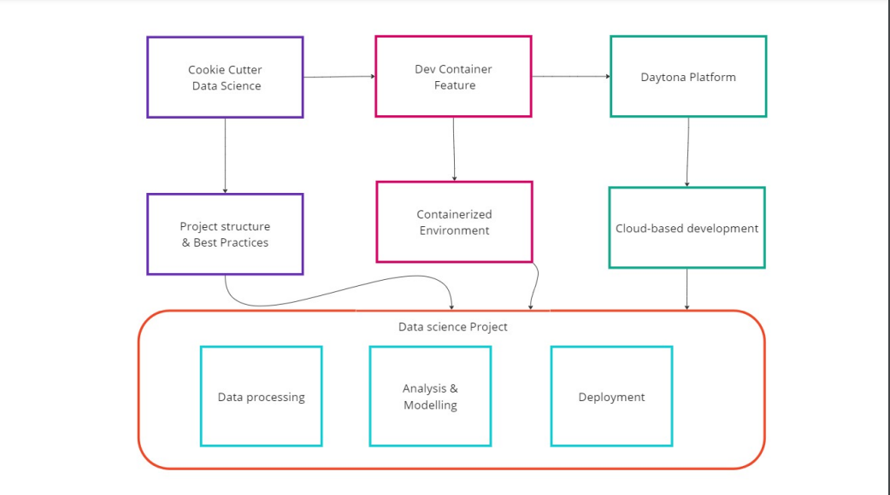

# Streamlining Data Science Workflows with Cookiecutter and Daytona

# Introduction

Have you ever felt like you're spending more time setting up projects than
coding and analyzing data? You're not alone. Tools like
[Cookiecutter Data Science](https://cookiecutter-data-science.drivendata.org/)
and [Daytona](https://www.daytona.io/docs/about/what-is-daytona/) were created
so that you don't have to create projects from scratch and reinvent the wheel
each time you want to jump into a new project.

Cookiecutter gives you a solid starting point for your data science projects. On
the other hand, Daytona ensures everyone on your team is working with the same
tools and setup, no matter where they are. The
[Dev Container feature](/definitions/20240910_definition_dev_container_feature.md)
supported by Daytona makes sure your models work the same way in testing as they
do in the real world, especially when you are working with a team. Essentially,
these tools will make your life easier when it comes to deploying and scaling
data science projects.

## TL;DR

- This article provides a step-by-step guide for setting up a
  [dev container](https://www.daytona.io/definitions/d/development-container)
  with specific features for data science projects.
- Integration of Cookiecutter Data Science with Daytona's dev containers creates
  a powerful workflow for data scientists.
- Cookiecutter provides standardized project templates, while Daytona ensures
  consistent development environments.
- The process involves installing Daytona, creating a
  [workspace](https://www.daytona.io/definitions/d/daytona-workspace), adding
  Cookiecutter feature, and using the 'ccds' command to generate project
  structures.
- This setup aims to reduce time spent on project configuration and increase
  focus on actual data analysis and modeling.



## Prerequisites

Before starting this tutorial, you need to have the following:

- A basic understanding of command-line interfaces
- Familiarity with [Git](definitions/20240819_definition_git.md) and
  [version control](https://www.daytona.io/definitions/v/version-control)
  concepts

Along with [Python](definitions/20240820_defintion_python.md), the following
need to also be installed:

- **Visual Studio Code**: A free source code editor developed by Microsoft.
- **Docker**: An open-source platform that enables developers to build, deploy,
  run, update, and manage applications in containers.
- **Remote - Containers**: An extension for Visual Studio Code allows developers
  to use a Docker container as a full-featured development environment,

### Installation Guide

1. Download and install VS Code from the
   [official website](https://code.visualstudio.com/)

2. Install Docker:

   - For Windows and Mac: Download Docker Desktop
     [here](https://www.docker.com/products/docker-desktop)
   - For Linux: Follow
     [this installation instructions](https://docs.docker.com/engine/install/)
     for your specific distribution.

3. Install the Remote - Containers extension in VS Code:

   - Open VS Code
   - Go to the Extensions view (Ctrl+Shift+X)
   - Search for "Remote - Containers"
   - Click "Install"

4. Download and install Git [here](https://git-scm.com/downloads)

5. Install the [latest version of python](https://www.python.org/downloads/)
   from their website.

Now that you have the necessary tools installed, let's proceed with the
step-by-step guide to add a Dev Container to your project.

## What are Dev Container Features?

Dev Container features are pre-built, shareable components that can be easily
added to your development container. They allow you to modularize and customize
your Dev Container setup, making adding tools, runtimes, or libraries to your
environment easier.

Benefits of using Dev Container features include:

- Simplified configuration
- Improved consistency across team environments
- Easier maintenance and updates
- Flexibility to mix and match tools as needed

## Step-by-Step Guide to Adding Dev Container Features

### Step 1: Set Up Your Basic Dev Container

1. Create a `.devcontainer` folder in your project root.
2. Inside this folder, create a `devcontainer.json` file.

Here's a basic structure:

```json
{
  "name": "Python Data Science",
  "dockerFile": "Dockerfile",
  "settings": {
    "python.defaultInterpreterPath": "/usr/local/bin/python"
  }
}
```

### Step 2: Identify Needed Features

Consider what tools and libraries you need for your data science project. Common
needs might include:

- Python
- Jupyter Notebooks
- Data manipulation libraries (Pandas, NumPy)
- Version control (Git)
- Code quality tools (Black, Flake8)

### Step 3: Add Features to Your devcontainer.json

To add features, include a `features` object in your `devcontainer.json`:

```json
{
  "name": "Python Data Science",
  "image": "mcr.microsoft.com/devcontainers/python:3.12-bookworm",
  "features": {
    "ghcr.io/devcontainers/features/python:1": {}
  },
  "settings": {
    "python.defaultInterpreterPath": "/usr/local/bin/python"
  }
}
```

### Step 4: Add VS Code Extensions

While not strictly part of Dev Container features, adding relevant VS Code
extensions enhances your development experience:

```json
"extensions": [
    "ms-python.python",
    "ms-python.vscode-pylance"
]
```

### Step 5: Configure Settings

Adjust VS Code settings to match your preferences:

```json
"settings": {
    "python.defaultInterpreterPath": "/usr/local/bin/python",
    "python.linting.enabled": true,
    "python.linting.pylintEnabled": true
}
```

### Step 6: Add Post-Create Commands

If you need to run commands after the container is created (e.g., installing
additional packages), use `postCreateCommand`:

```json
"postCreateCommand": "pip install -r requirements.txt"
```

Your `devcontainer.json` file should look like this:

```json
{
  "name": "Python Data Science",
  "image": "mcr.microsoft.com/devcontainers/python:3.12-bookworm",
  "features": {
    "ghcr.io/devcontainers/features/python:1": {}
  },
  "customizations": {
    "vscode": {
      "settings": {
        "python.defaultInterpreterPath": "/usr/local/bin/python",
        "python.linting.enabled": true,
        "python.linting.pylintEnabled": true
      },
      "extensions": ["ms-python.python", "ms-python.vscode-pylance"]
    }
  },

  "postCreateCommand": "pip install -r requirements.txt"
}
```

### Step 7: Create a requirements file

At the root of your project, create a `requirements.txt` file. List any
additional packages you want to include in your project (e.g., Flask) by adding
the package names to the file. These packages will automatically be installed
via the `postCreateCommand`.

### Step 8: Rebuild and Test

After making changes:

- Press F1 or Ctrl+Shift+P.
- Type and select **Remote-Containers: Reopen in Container**.
- Alternatively, click the blue button at the bottom-left corner of VS Code and
  select **Reopen in Container** from the modal.

VS Code will then build the container based on the configuration in your
`devcontainer.json` file and open your project inside the container. This
process might take a few minutes the first time, as it needs to download and set
up the container environment.

Once the container is running, you can start coding and running your application
within this isolated environment.

You can find other lists of useful Dev Container features at
[containers.dev/features](https://containers.dev/features)

## Using Cookiecutter Data Science Feature in Daytona

Combining Cookiecutter Data Science with Daytona's Dev Container features
creates a powerful synergy for data science workflows. This integration allows
you to leverage the standardized project structure of Cookiecutter Data Science
within the reproducible environment provided by Daytona's Dev Containers.

By using this feature, you'll be able to:

- Quickly set up a standardized data science project structure
- Ensure all team members are working with the same tools and dependencies
- Seamlessly switch between projects without worrying about conflicting
  environments

### Getting started

To use this feature in your Daytona cloud development environment, follow these
steps:

- Install Daytona. You can follow these
  [installation steps](https://www.daytona.io/docs/installation/installation/)
  to install Daytona for your operating system.

- After you have successfully installed Daytona, start a new server and create a
  new
  [Daytona workspace](https://www.daytona.io/definitions/d/daytona-workspace).

```bash
daytona server
daytona create
```

The command above creates a new Daytona workspace and opens the workspace in
VSCode. When prompted to either enter a **custom Repository URL** or **Create
from sample**, select the latter. Then select Python from the options of sample
workspaces.

- Navigate to the `.devcontainer/devcontainer.json` file and edit the file by
  adding a new feature.

```json
  "features": {
    "ghcr.io/bellatrick/feature-starter/cookiecutter:latest": {}
  }
```

The feature in the JSON file will install Cookiecutter Datascience into your
workspace along with the required packages.

- Commit this file to your repository.

- Open the Command Palette (F1 or Ctrl+Shift+P). Type and select
  **Remote-Containers: Rebuild Container**.

- Once the workspace is rebuilt, you can use the `ccds` command to create a new
  data science project structure.

```bash
ccds
```

This will prompt you for project details and create a new data science project
structure based on the `cookiecutter-data-science` template.

Note: If the `ccds` command is not recognized, try running
`source /usr/local/bin/activate-cookiecutter-ds` first to activate the
environment then run `ccds` again.

## Step 3: Confirmation

To confirm that you've successfully set up your Daytona workspace with
Cookiecutter Data Science, follow these steps:

- In your workspace, run the `ccds` command. You should be prompted to enter
  project details.
- After entering the details, check that a new directory has been created with
  the specified project name.
- Navigate into the new directory and verify that it contains the standard
  Cookiecutter Data Science project structure, including folders like data,
  models, and notebooks.
- Try running a Python script or Jupyter Notebook within the new project
  structure to ensure necessary libraries are installed and functioning
  correctly.

If you can complete these steps without errors, you've successfully set up your
Daytona workspace with Cookiecutter Data Science!

## Maximizing Your New Setup: Best Practices

Now that you've set up your environment, let's explore some best practices.
These will help you make the most of your Cookiecutter and Daytona setup.

1. **USE VERSION CONTROL** Always use version control (like Git) for your
    projects. This allows you to track changes, collaborate with others, and
    roll back if needed. Remember to:

      - Create a .gitignore file to exclude large data files, sensitive information, and environment-specific files.
      - Commit early and often with meaningful commit messages.

2. **DOCUMENT YOUR WORK**

    - Maintain a comprehensive README.md file that explains the project's
      purpose, setup instructions, and usage guidelines.
    - Use docstrings in your Python functions and classes.
    - Keep a change log to track major updates to your project.

3. **MANAGE DEPENDENCIES**

    - Use virtual environments (like venv or conda) to isolate project
      dependencies.
    - Maintain a requirements.txt file or use tools like Poetry or Pipenv for
      more advanced dependency management.

4. **FOLLOW CODING BEST PRACTICES**

    - Follow PEP 8 style guidelines for Python code.
    - Use meaningful variable and function names.
    - Write modular, reusable code.
    - Include unit tests for your functions.

5. **ENSURE REPRODUCIBILITY**

    - Use random seeds when necessary to ensure consistent results.
    - Document the steps to reproduce your analysis, including data
      preprocessing.
    - Consider using tools like DVC (Data Version Control) for managing large
      datasets.

6. **SECURE SENSITIVE INFORMATION**
    - Never commit sensitive information (like API keys or passwords) to version
      control.
    - Use environment variables or dedicated config files for managing secrets.

## Common Issues and Troubleshooting

**Unable to run daytona code**: If you are using WSL2, you might run into issues
while trying to run the command, `daytona code`. Follow the instructions in
[this Github issue](https://github.com/daytonaio/daytona/issues/282).

## Conclusion

By integrating Cookiecutter Data Science templates with Daytona's Dev Container
features, you've set up a powerful, reproducible environment for your data
science projects. As your projects grow or as you onboard new team members, this
setup makes it easy to maintain best practices and consistent workflows.

Moving forward, consider exploring more advanced features of both Cookiecutter
and Daytona. You might want to customize the Cookiecutter template to better fit
your needs or explore additional Dev Container features to further enhance your
development environment.

Remember, the goal is to spend less time on setup and more time on solving data
science problems. With this workflow in place, you're well-equipped to do just
that. Happy coding!

## References

The code for the Dev Container feature is available on
[Github](https://github.com/bellatrick/feature-starter). You should also check
out these resources:

- [Cookiecutter Data Science](https://cookiecutter-data-science.drivendata.org/#with-pip)
- [Daytona Documentation](https://www.daytona.io/docs/)
- [VS Code Remote - Containers](https://code.visualstudio.com/docs/devcontainers/containers)
- [Dev Containers Features](https://containers.dev/features)
