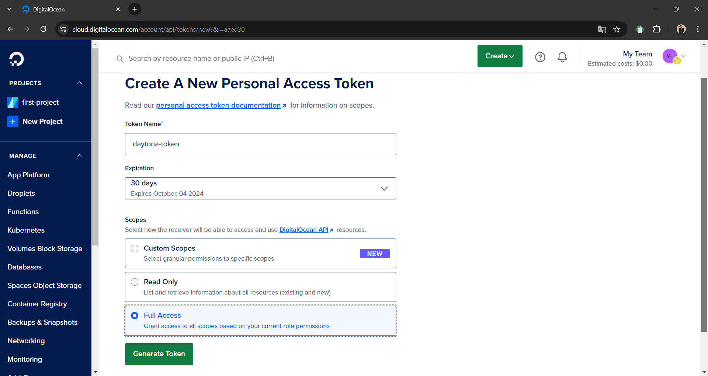

# Setting Up Daytona DigitalOcean Provider

# Introduction

The DigitalOcean Provider allows Daytona to create and manage Workspace projects
on DigitalOcean droplets. This provider integrates Daytona with DigitalOcean,
enabling scalable and flexible management of Workspaces in a cloud environment.
To use the DigitalOcean Provider, we need a DigitalOcean API token with
appropriate permissions. This token grants the necessary access to manage
droplets, critical for Daytona’s Workspace project creation and management.

In this article, we will walk you through the setup and configuration of the
Daytona DigitalOcean Provider, including creating an API token with the required
permissions.

## Prerequisites

To follow along with this article, you should have:

- A basic understanding of
  [DigitalOcean](../definitions/20240910_definition_digitalocean.md) and
  [Droplets](../definitions/20240910_definition_droplets.md).
- A DigitalOcean account with access to create API tokens.
- Installed Daytona latest version [install from
  [here](https://www.daytona.io/docs/installation/installation/)]

**Note:** _[In this article, Daytona v0.29.1 is used]_

## TL;DR

- Creating a DigitalOcean API Token with necessary permissions.

- Install and configure the Daytona DigitalOcean Provider for creating and
  managing workspaces.

- Set up DigitalOcean targets, including configuring auth token, size, region,
  and more.

- Troubleshooting tips for common issues like invalid API Token, Droplet
  Creation Failure, and Provider Errors.

## Step 1: Preparations

### Create a DigitalOcean API Token

To configure the Daytona DigitalOcean Provider, create a DigitalOcean API token
with `Full Access` permission. This token will allow Daytona to manage your
droplets. Follow the steps below to create an API token:

- **Step 1.1**: Log in to your DigitalOcean account and navigate to the API
  section in the dashboard.

  

- **Step 1.2**: Click on Generate New Token under the Personal Access Tokens
  section.

  

- **Step 1.3**: Give your token a descriptive name (e.g., daytona-provider) and
  select the scopes required for managing droplets.

  **Note:** _[Select `Full Access` Scope, by selecting this you will give both
  read and write permission]_

  

- **Step 1.4**: Click Generate Token and copy your token to use it later.

  

Now that you have your API token, you're ready to set up the Daytona
DigitalOcean Provider.

## Step 2: Main Process

### Step 2.1: Start Daytona Server

Start the daytona server by running the command

```bash
daytona server
```


### Step 2.2: Install the DigitalOcean Provider

Run the below command, You will be prompted to choose a provider. Select
`digitalocean-provider` from the list

```bash
daytona provider install
```


### Step 2.3: Set the DigitalOcean Target

Run the following command to initiate the target setup process:

```bash
daytona target set
```

#### Step 2.3.1: Select the DigitalOcean Provider

You will be prompted to choose a provider. Select `digitalocean-provider` from
the list


#### Step 2.3.2: Create a New Target

After selecting the DigitalOcean provider, choose to create a new target and
enter a unique and descriptive name for your DigitalOcean target (e.g.,
`daytona-digitalocean-target`).


#### Step 2.3.3: Configure DigitalOcean target options

You will be prompted to enter several configuration options for the DigitalOcean
provider. Here's an overview:

- **Auth Token**:

  Enter the API token you generated earlier. If you left empty, Daytona will
  attempt to retrieve it from the `DIGITALOCEAN_API_TOKEN` environment variable.

- **Disk Size**:

  The size of the disk, in GB. Default is 20 GB.

- **Image**:

  Select the base image for your droplet (e.g., `ubuntu-24-04-x64`). More
  information on images can be found here.
  [here](https://docs.digitalocean.com/products/droplets/how-to/create/)

- **Region**:

  Select the DigitalOcean region where the droplets will be deployed (e.g.,
  `nyc3` for New York). Check available regions
  [here](https://docs.digitalocean.com/platform/regional-availability/)

- **Size**:

  Choose the droplet size (e.g., s-1vcpu-1gb). Find available droplet sizes
  [here](https://docs.digitalocean.com/products/droplets/concepts/choosing-a-plan/)

  

Click enter after filling all the details.

Congratulations, You have successfully setup and configured Daytona DigitalOcean
Provider to create and manage workspace on droplets.

To verify daytona DigitalOcean provider has been successfully installed or not,
run the below command you will get provider and target configuration information
you have configured.

```bash
daytona provider list
```


## Common Issues and Troubleshooting

While setting up and configuring the DigitalOcean Provider with Daytona, you may
encounter some common issues. Below are troubleshooting tips to help resolve
them:

1. **Problem:** Invalid API Token

   **Solution:** Double-check that your DigitalOcean API token is correct and
   has the necessary scopes. You can generate a new token if needed.

2. **Problem:** Droplet Creation Failure

   **Solution:** Ensure the selected region, droplet size, and image are valid
   for your target. Verify that you have sufficient resources (e.g., account
   limits) on DigitalOcean.

3. **Problem:** Provider Errors

   **Solution:** If you encounter issues with the DigitalOcean provider, it
   could be due to bugs or limitations in the latest release. Keep an eye on the
   [DigitalOcean Provider GitHub Repository](https://github.com/daytonaio/daytona-provider-digitalocean)
   for updates and fixes.

## Conclusion

By following this article, you’ve successfully set up and configured the Daytona
DigitalOcean Provider. You can now manage Workspaces on DigitalOcean using
Daytona, leveraging its powerful infrastructure for your development and
deployment needs.

For the latest information, refer to the official Daytona
[documentation](https://www.daytona.io/docs/).

## References

- [Daytona Docs - Configuration Providers](https://www.daytona.io/docs/configuration/providers/#officially-supported-providers)

- [Daytona DigitalOcean Provider Repository](https://github.com/daytonaio/daytona-provider-digitalocean)

- [DigitalOcean Droplet Documentation](https://docs.digitalocean.com/products/droplets/how-to/create/)
