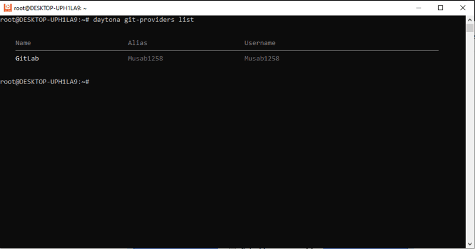

# Building a Codespace-Like Experience With Daytona and GitLab

## Introduction

Software development is fast-paced and requires efficiency. Software development teams need a consistent and streamlined environment as they grow in size and their projects become more complex. Software developers spend significant time setting up their environments, configuring tools, and ensuring correct installation of dependencies. Setting up environments can be particularly challenging for new team members or those working across multiple projects with different requirements. However, automated [development environments](https://www.daytona.io/definitions/d/development-environment) solve the challenge of setting up environments. Some tools like Daytona help to automate and standardize environment setups, allowing developers to focus on writing code rather than configuring their tools. Daytona allows developers to create a [codespace](https://www.daytona.io/definitions/c/codespaces)-like experience when integrated with [GitLab](https://www.daytona.io/definitions/g/gitlab), which enables teams to spin up fully configured development environments with minimal effort.

In this article, you will learn how to build a codespace-like experience using Daytona and GitLab. This article will cover the steps to set up a development environment using Daytona’s powerful features with the Starlight project on GitLab. Developers can start writing code quickly and efficiently by automating the environment setup process without needing extensive setup knowledge or getting frustrated with troubleshooting configuration issues.

### TL;DR

- **Automated Development Environments**: *Automated environments save time and reduce errors by providing a consistent setup for all team members. Automated environments are crucial for agile development, enabling quick switching between projects and minimizing setup frustrations.*

- **Daytona Overview**: *Daytona automates environment setups through various methods, supports multiple IDEs, and integrates seamlessly with GitLab. Daytona allows teams to spin up standardized development environments tailored to project needs easily.*

- **Integrating Daytona with GitLab**: *Daytona can be integrated with GitLab to create development environments based on branches, tags, or merge requests. The integration of Daytona with Gitlab can be triggered manually or automated as part of the CI/CD pipeline.*

- **Method for Setting Up Environments**: *A method of environment setup is covered: Using the Daytona CLI. This method offers flexibility in creating environments based on project requirements.*

- **Customizable and Collaborative Features**: *Daytona environments support custom configurations, public ports for sharing, and integration with various tools and services, enhancing collaboration and productivity.*

- **Conclusion**: *Integrating Daytona with GitLab creates a codespace-like experience that improves development efficiency, reduces errors, and supports agile workflows.*

## Prerequisites

To follow along with this article, you must have the following:

- Daytona installed and running on your system. You can check this [guide](https://www.daytona.io/docs/installation/installation/) for the installation.

- Docker installed and running (e.g. Docker Desktop)

## The Importance of Automated Development Environments

It is important to understand why automated development environments are crucial in today’s development landscape. Traditionally, setting up a development environment involves a series of manual steps: installing dependencies, configuring tools, setting up databases, and ensuring that components work together seamlessly. This process is not only time-consuming but also error-prone.

Different team members might use different versions of a dependency, leading to subtle bugs that are difficult to diagnose. Similarly, new developers in the team might struggle to get their environment up and running, which may delay their ability to contribute to the project. Automated development environments solve these problems by providing a consistent, repeatable setup process. The environment setup can be automatically created by Daytona based on the project dependencies. This ensures that all team members work in the same environment, reducing the risk of errors and improving overall productivity.

Moreover, automated environments are particularly beneficial for teams working on multiple projects. Developers on those teams can switch between projects without worrying about conflicting dependencies or configurations. This flexibility is important in agile development environments, where teams may need to pivot quickly between different tasks.

## Introduction to Daytona and Its Integration with GitLab

### What is Daytona?

Daytona is a software tool designed to automate and standardize software teams’ development environments. Daytona allows developers to create isolated environments tailored to specific projects, ensuring everyone on the team works with the same setup. Daytona supports various programming languages, tools, and services, which makes it a versatile solution for teams working on diverse projects.

A key feature of Daytona is its ability to automate the environment creation process. Daytona also offers flexibility in how environments are accessed. Developers can choose their preference from browser-based IDEs, Visual Studio Code, JetBrains IDEs, or SSH access. This flexibility makes Daytona a great fit for teams with diverse toolchains and workflows.

### How Daytona Integrates with GitLab

Many development teams use GitLab. It is a popular version control system and CI/CD platform. You can automate the creation of development environments based on a project’s [repository](https://www.daytona.io/definitions/r/repository) by integrating Daytona with GitLab. This integration allows developers to quickly spin up environments for specific branches, tags, or merge requests, making it easier to work on different features or review changes.

To integrate Daytona with GitLab, you can add your GitLab account to Daytona by using the Daytona Git Providers. You can then create a development environment (workspace) using the CLI. For example, developers can create an environment for a GitLab's repository after integrating their GitLab account with Daytona, allowing them to start working on the repository immediately.

This integration is particularly useful for teams working in an agile environment, where developers need to quickly switch between different tasks or projects. By automating the environment setup process, Daytona and GitLab ensure that developers can focus on writing code rather than configuring their tools.

## Setting Up a Development Environment with Daytona and GitLab Using Datona CLI

Daytona has a CLI that provides an efficient way to manage environments for developers who prefer working in the terminal. The CLI allows developers to create, delete, or switch between environments with a few simple commands. To integrate Daytona with GitLab, you have to first set up your GitLab repository.

### Setting Up your GitLab repository

In this article, you will use the Starlight project as a sample to set up your development environment with Daytona and GitLab. The Starlight project is hosted on GitHub, [here](https://github.com/withastro/starlight). You will have to fork the GitHub repository to your personal GitHub account, then import it as a new project on your GitLab account.


### Adding your GitLab to Daytona

To add your GitLab account to Daytona, you will go to your terminal and use this command.

```bash
daytona git-providers add
```

Then, you will be given a prompt to select the Git Provider you will be adding, in this case, GitLab. After selecting GitLab as your Git Provider, click on the enter button to proceed.


After that, you will be taken to another prompt to add your GitLab's personal access token. You can follow this [guide](https://docs.gitlab.com/ee/user/profile/personal_access_tokens.html#create-a-personal-access-token) to learn how to create your personal access token, then copy the token and paste it in your terminal.


And Lastly, you will be taken to some other prompts to add your alias and your commit signing method. You can select none if you currently don't have any commit signing method for your GitLab account.


When you are done adding GitLab as a Git Provider, you can use this command to list out the Git Providers you have added to Daytona.

```bash
daytona git-providers list
```



### Creating your workspace

You can create your workspace using the Daytona CLI in two ways:

- From a Git Repository
- From a Git URL

#### From a Git Repository

To create a workspace from a Git repository, you will use this command.

```bash
daytona create
```

After running the command, you will be shown a prompt to choose a Git Provider. Choose GitLab and click the enter button to continue.


Then, it will take you to another prompt that displays a list of your GitLab repositories. Click on the enter button to select the repository you want to create a workspace for.


After that, it will display some other prompts that allow you to name your workspace and select a target for your workspace. You can select any target for your workspace, but to follow along with this article, you should select the local Docker provider.


With that done, Daytona will help you spin up a workspace for your repository.


#### From a Git URL

You can also create a workspace with Daytona by using the URL of your git repository. To do this, you will add your repository URL to the ```daytona create``` command:

```bash
daytona create https://gitlab.com/Musab1258/starlight
```

You can also create workspaces for different branches and merge requests. This is particularly useful when working on new features or reviewing changes, as it allows developers to test their code in an isolated environment without affecting the main branch. For instance, these two commands create a workspace for the dev branch and also for the merge request, ```27``` respectively.

```bash
daytona create https://gitlab.com/Musab1258/starlight/-/tree/dev
```

```bash
daytona create https://gitlab.com/Musab1258/starlight/-/merge_requests/27
```

In both of these cases, Daytona will create the environment based on the specified branch or merge request, ensuring the environment is consistent with the project’s requirements.

This feature is valuable for teams that use feature branches or have a rigorous code review process. Development teams can ensure their code is thoroughly tested before merging it into the main branch by creating isolated environments for each branch or merge requests.

## Exploring the Created Environment

After creating the environment, you can access it, explore its features, or customize it.

### Accessing the Environment

Developers can access the created environment using their preferred IDE or toolchain.

To access a workspace, you can use this command:

```bash
daytona code
```

It will display a prompt that will ask you to select the workspace you want to open.


### Setting a Default IDE

Daytona supports a variety of access methods, including Visual Studio Code, Visual Studio Code - Browser, CLion, Terminal SSH, and so on.

To change your default IDE, you can use this command.

```bash
daytona ide
```

It will display a prompt that will ask you to select the IDE you want to set as your default IDE.


### Exploring Environment Features

Daytona environments come with several features designed to enhance the development experience. Daytona environments can be configured to include pre-installed tools, services, and dependencies, ensuring that developers have everything they need to start working immediately.

Furthermore, Daytona supports using public ports, allowing developers to share their environment with teammates. This is particularly useful for collaborative development, pair programming, or demonstrating features to other team members.
You can share a public port with this command:

```bash
daytona forward 4321 starlight2 --public
# Where starlight2 is the workspace name
```

The command above makes Daytona generate a URL that allows teammates to access the environment in real-time. This feature is invaluable for teams that work remotely or have members in different time zones, as it facilitates seamless collaboration.


### Environment Customization

Daytona supports custom environment configurations. Developers can tailor the environment to meet the specific needs of their project, ensuring that all necessary tools and dependencies are included. You can add additional services, like Redis or MongoDB, required by your project to the `.daytona.yml` file. Daytona will automatically set up these services when the environment is created.

You can also include custom scripts in your `.daytona.yml` file to automate a specific build process or configuration step required by your project. This further reduces the time required to set up the environment and ensures that all developers follow the same setup procedure.

## Conclusion

In today’s fast-paced development environment, automating the setup and management of development environments is crucial for maintaining productivity and consistency across teams. Daytona, when integrated with GitLab, offers a powerful solution for creating codespace-like experiences that streamline the development process.

By automating the environment creation process, Daytona eliminates the need for manual configuration, reducing the risk of errors and ensuring that all team members work in a consistent setup. This is particularly beneficial for teams working on multiple projects or those that need to quickly switch between different tasks.

The integration with GitLab further enhances this process, allowing developers to create environments directly from the project’s repository. Whether working on a new feature, reviewing a merge request, or testing code in isolation, Daytona and GitLab provide the tools needed to create a seamless development experience.

The combination of Daytona and GitLab offers a flexible, powerful, and user-friendly solution for automating development environments. By following the steps outlined in this guide, software development teams can create a standardized, quick-to-setup development environment that enhances collaboration, reduces setup time, and improves overall productivity.

## References

Daytona Documentation - Explore the full range of Daytona’s features and its API by visiting the [Daytona Documentation.](https://www.daytona.io/docs/)