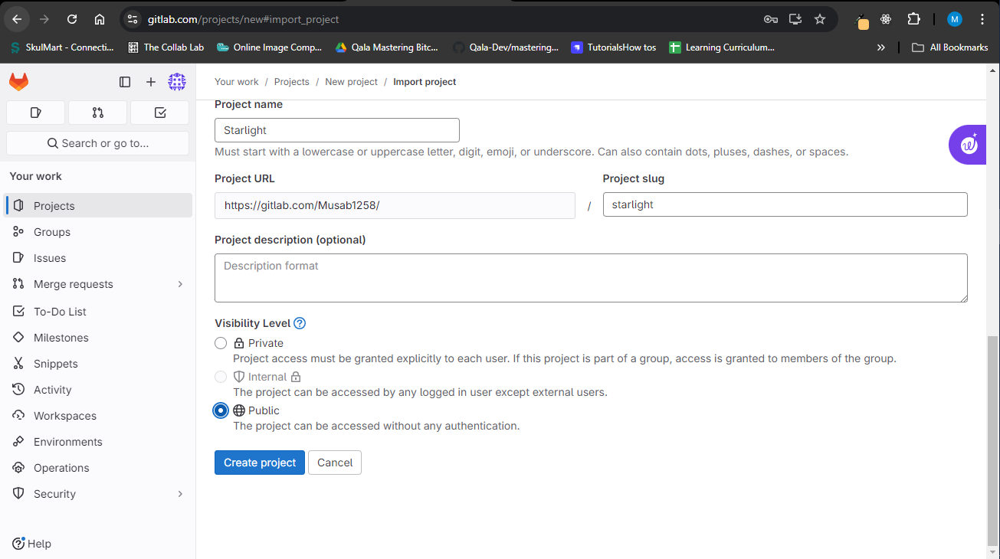

# Building a Codespace-like Experience with Daytona and GitLab

## Introduction

Software development is fast-paced and requires efficiency. Software development teams need a consistent and streamlined environment as they grow in size and their projects become more complex. Software developers spend significant time setting up their environments, configuring tools, and ensuring correct installation of dependencies. Setting up environments can be particularly challenging for new team members or those working across multiple projects with different requirements. However, automated [development environments](https://www.daytona.io/definitions/d/development-environment) solve the challenge of setting up environments. Some tools like Daytona help to automate and standardize environment setups, allowing developers to focus on writing code rather than configuring their tools. Daytona allows developers to create a [codespace](https://www.daytona.io/definitions/c/codespaces)-like experience when integrated with [GitLab](https://www.daytona.io/definitions/g/gitlab), which enables teams to spin up fully configured development environments with minimal effort.

In this article, you will learn how to build a codespace-like experience using Daytona and GitLab. This article will cover the steps to set up a development environment using Daytona’s powerful features with the Starlight project on GitLab. Developers can start writing code quickly and efficiently by automating the environment setup process without needing extensive setup knowledge or getting frustrated with troubleshooting configuration issues.

### TL;DR

- **Automated Development Environments**: *Automated environments save time and reduce errors by providing a consistent setup for all team members. Automated environments are crucial for agile development, enabling quick switching between projects and minimizing setup frustrations.*

- **Daytona Overview**: *Daytona automates environment setups using simple configuration files, supports multiple IDEs and integrates seamlessly with GitLab. Daytona allows teams to spin up standardized development environments tailored to project needs easily.*

- **Integrating Daytona with GitLab**: *Daytona can be integrated with GitLab to create development environments based on branches, tags, or merge requests. The integration of Daytona with Gitlab can be triggered manually or automated as part of the CI/CD pipeline.*

- **Methods for Setting Up Environments**: *Three methods of environment setup are covered: Using GitPod, the Daytona CLI, and the Daytona API. Each method offers flexibility in creating environments based on project requirements.*

- **Customizable and Collaborative Features**: *Daytona environments support custom configurations, public ports for sharing, and integration with various tools and services, enhancing collaboration and productivity.*

- **Conclusion**: *Integrating Daytona with GitLab creates a codespace-like experience that improves development efficiency, reduces errors, and supports agile workflows.*

## The Importance of Automated Development Environments

It is important to understand why automated development environments are crucial in today’s development landscape is important. Traditionally, setting up a development environment involves a series of manual steps: installing dependencies, configuring tools, setting up databases, and ensuring that components work together seamlessly. This process is not only time-consuming but also error-prone.

Different team members might use different versions of a dependency, leading to subtle bugs that are difficult to diagnose. Similarly, new developers in the team might struggle to get their environment up and running, which may delay their ability to contribute to the project. Automated development environments solve these problems by providing a consistent, repeatable setup process. The environment setup can be defined in a configuration file and automatically created whenever needed. This ensures that all team members work in the same environment, reducing the risk of errors and improving overall productivity.

Moreover, automated environments are particularly beneficial for teams working on multiple projects. Developers on those teams can switch between projects without worrying about conflicting dependencies or configurations. This flexibility is important in agile development environments, where teams may need to pivot quickly between different tasks.

## Introduction to Daytona and Its Integration with GitLab

### What is Daytona?

Daytona is a software tool designed to automate and standardize software teams’ development environments. Daytona allows developers to create isolated environments tailored to specific projects, ensuring everyone on the team works with the same setup. Daytona supports various programming languages, tools, and services, which makes it a versatile solution for teams working on diverse projects.

A key feature of Daytona is its ability to automate the environment creation process. Developers can define the environment configuration in a simple YAML file, which Daytona uses to create the environment automatically. It ensures a consistent environment with the project’s requirements without requiring manual setup steps.

Daytona also offers flexibility in how environments are accessed. Developers can choose their preference from browser-based IDEs, Visual Studio Code, JetBrains IDEs, or SSH access. This flexibility makes Daytona a great fit for teams with diverse toolchains and workflows.

### How Daytona Integrates with GitLab

Many development teams use GitLab. It is a popular version control system and CI/CD platform. You can automate the creation of development environments based on a project’s [repository](https://www.daytona.io/definitions/r/repository) by integrating Daytona with GitLab. This integration allows developers to quickly spin up environments for specific branches, tags, or merge requests, making it easier to work on different features or review changes.

To integrate Daytona with Gitlab, Daytona’s API can create environments based on a GitLab repository’s configuration. This can then be triggered manually via a command or automated as part of the CI/CD pipeline. For example, a developer can create an environment for a feature branch directly from GitLab’s interface or through a CLI command, allowing them to start working on the feature immediately.

This integration is particularly useful for teams working in an agile environment, where developers need to quickly switch between different tasks or projects. By automating the environment setup process, Daytona and GitLab ensure that developers can focus on writing code, rather than configuring their tools.

## Setting Up a Development Environment with Daytona and GitLab

You can set up your development environment with Daytona and Gitlab using different methods. In this article, you will learn three methods you can use to set up your development environment with Daytona and GitLab. The methods are:

- Setting up a development environment with Gitpod (daytona gp)
- Setting up a development environment with the Daytona CLI
- Setting up a development environment with Daytona API

### Setting up a Development Environment with Gitpod (daytona gp)

The Starlight project that will be used as an example is hosted on Github, here. You will have to fork the GitHub repository to your personal GitHub account, then, import it as a new project on your Gitlab account. You can then create a Daytona configuration file in the root folder of your Starlight Gitlab project. The Daytona configuration file defines the specifications of the development environment, such as the programming languages, tools, and dependencies required for the project, and is written in YAML, making it easy to read and modify.

You can create the Daytona configuration file by clicking on the plus icon at the top of the project, which displays a dropdown. Then click on "new file" in the options present in the dropdown to create a new file.


Name the file `.daytona.yml` and specify the following configuration in the file:

```yml
# .daytona.yml

image:
  file: .gitpod.Dockerfile  # Optional: If using a custom Dockerfile similar to the base image in .daytona.yml

# Commands to run at the beginning
tasks:
  - init: |
      npm install -g pnpm@8.7.4 # Install pnpm if not in Dockerfile
      pnpm install # Install dependencies
    command: |
      pnpm run format # Format code
      pnpm run typecheck # Type-checking using Astro

# Ports to expose
ports:
  - port: 3000
    onOpen: open-preview

# Environment variables
env:
  NODE_ENV: development

# Prebuild to speed up workspace start times
github:
  prebuilds:
    master: true
    branches: true
    pullRequests: true
```

The configuration above defines the commands, ports, images, and prebuilds to use when creating or running the environment for your project. The content of your `.daytona.yml` file will depend on your project's needs.


After adding the configurations to your Daytona configuration file, click the commit button beneath the input area to commit it to your project.


Next, create a file named `.gitpod.yml` that points Gitpod to the Daytona configuration file when setting up the environment. Add these configurations to your `.gitpod.yml` file:

```yml
tasks:
  - init: |
      cp .daytona.yml /workspace
      pnpm install
    command: pnpm start
```



After specifying the configurations for the Daytona and Gitpod, you can create the environment by opening the Gitlab project on Gitpod.


### Setting up a Development Environment with the Daytona CLI

Daytona has a CLI that provides an efficient way to manage environments, for developers who prefer working in the terminal. The CLI allows developers to create, delete, or switch between environments with a few simple commands. You can use the command below to create an environment with the Daytona CLI:

```bash
daytona create --repository https://gitlab.com/your-repo/starlight --branch main
```

You can use this command to switch between environments:

```bash
daytona switch --environment my-environment
```

The Daytona CLI is particularly useful for developers who work on multiple projects or need to quickly switch between different tasks.

### Setting up a Development Environment with Daytona API

Daytona provides an API that allows developers to create environments based on the project’s configuration. The Daytona API can be used to create environments from specific branches, tags, or even merge requests. This flexibility is particularly useful for teams working on multiple features or reviewing changes before merging them into the main branch.

To create a build (environment) using Daytona's API, you need to make a POST request to the /build endpoint. This request will include a `createBuildDto` in the body, which contains the necessary information, such as the repository and branch or merge request details, to define the build. You can use this command to create an environment from the main branch of the Starlight project:

```bash
curl -X POST [your_daytona_api_url/build] \
-H "Content-Type: application/json" \
-d '{
    "createBuildDto": {
        "repository": "https://gitlab.com/your-repo/starlight",
        "branch": "main"
    }
}'
```

The command above sends a POST request to Daytona’s API, specifying the repository and branch from which the environment should be created. Daytona will then automatically create the environment based on the configuration defined in the `.daytona.yml` file.

You can also create environments for different branches and merge requests. This is particularly useful when working on new features or reviewing changes, as it allows developers to test their code in an isolated environment without affecting the main branch.

You can use this command to create an environment for a feature branch:

```bash
curl -X POST [your_daytona_api_url/build] \
-H "Content-Type: application/json" \
-d '{
    "createBuildDto": {
        "repository": "https://gitlab.com/your-repo/starlight",
        "branch": "feature-branch"
    }
}'
```

Similarly, you can create an environment for a specific merge request, with this command:

```bash
curl -X POST [your_daytona_api_url/build] \
-H "Content-Type: application/json" \
-d '{
    "createBuildDto": {
        "repository": "https://gitlab.com/your-repo/starlight",
        "merge_request": "123"
    }
}'
```

In both cases, Daytona will create the environment based on the specified branch or merge request, ensuring the environment is consistent with the project’s requirements.

This feature is valuable for teams that use feature branches or have a rigorous code review process. Development teams can ensure their code is thoroughly tested before merging it into the main branch by creating isolated environments for each branch or merge requests.

## Exploring the Created Environment

After creating the environment, you can access it, explore its features, or customize the environment.

### Accessing the Environment

Developers can access the created environment using their preferred IDE or toolchain. Daytona supports a variety of access methods, including browser-based IDEs, Visual Studio Code, JetBrains IDEs, and SSH access.

For example, if you prefer working in Visual Studio Code, you can use the Remote - SSH extension to connect to the environment. This ensures that your code, dependencies, and tools are consistent with the project’s configuration, reducing the risk of errors.

You can connect to your created environment using Visual Studio Code by following these steps:

- Install the Remote - SSH extension in Visual Studio Code.
- Open the Command Palette `(Ctrl+Shift+P)` and select “Remote-SSH: Connect to Host…”.
- Enter the SSH address of the environment provided by Daytona.

After these steps, Visual Studio Code will connect to the environment, allowing you to start coding immediately.

### Exploring Environment Features

Daytona environments come with several features designed to enhance the development experience. Daytona environments can be configured to include pre-installed tools, services, and dependencies, ensuring that developers have everything they need to start working immediately.

Furthermore, Daytona supports using public ports, allowing developers to share their environment with teammates. This is particularly useful for collaborative development, pair programming, or demonstrating features to other team members.
You can share a public port with this command:

```bash
daytona share 8080
```

The command above makes Daytona generate a URL that allows teammates to access the environment in real-time. This feature is invaluable for teams that work remotely or have members in different time zones, as it facilitates seamless collaboration.

### Environment Customization

Daytona supports custom environment configurations. Developers can tailor the environment to meet the specific needs of their project, ensuring that all necessary tools and dependencies are included. You can add additional services, like Redis or MongoDB, required by your project to the `.daytona.yml` file. Daytona will automatically set up these services when the environment is created.

You can also include custom scripts in your `.daytona.yml` file to automate a specific build process or configuration step required by your project. This further reduces the time required to set up the environment and ensures that all developers follow the same setup procedure.

## Conclusion

In today’s fast-paced development environment, automating the setup and management of development environments is crucial for maintaining productivity and consistency across teams. Daytona, when integrated with GitLab, offers a powerful solution for creating codespace-like experiences that streamline the development process.

By automating the environment creation process, Daytona eliminates the need for manual configuration, reducing the risk of errors and ensuring that all team members work in a consistent setup. This is particularly beneficial for teams working on multiple projects or those that need to quickly switch between different tasks.

The integration with GitLab further enhances this process, allowing developers to create environments directly from the project’s repository. Whether working on a new feature, reviewing a merge request, or testing code in isolation, Daytona and GitLab provide the tools needed to create a seamless development experience.

The combination of Daytona and GitLab offers a flexible, powerful, and user-friendly solution for automating development environments. By following the steps outlined in this guide, teams can create a standardized, quick-to-setup development environment that enhances collaboration, reduces setup time, and improves overall productivity.

## References

Daytona Documentation - Explore the full range of Daytona’s features and its API by visiting the [Daytona Documentation.](https://www.daytona.io/docs/)

Visual Studio Code Remote - SSH Extension - Find out how to use the Visual Studio Code Remote - SSH extension for connecting to remote environments on the [Visual Studio Code documentation.](https://code.visualstudio.com/docs/remote/ssh)