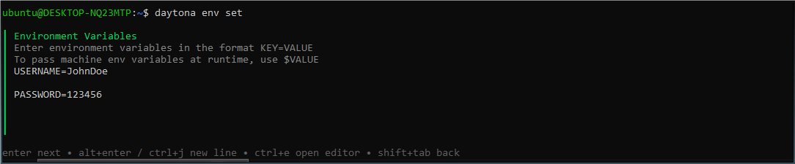

# Using Environmental Variables in Daytona

## Introduction

Environmental variables are important for configuring development environments and storing sensitive information. They provide a flexible way to control application behavior without hardcoding values directly into the source code.

Daytona offers a streamlined method for setting, managing, and using environmental variables across various workspaces using the `daytona env` command. This simplifies configuration and enhances security especially when collaborating on projects.

This article will explain using the `daytona env` command to set and manage [environmental variables]('/definitions/20241126_definition_environment_variables.md') within Daytona workspaces. You will learn how to set variables, create a workspace, and access these variables within a workspace.

### TL;DR

- Simplify credential management using daytona env Commands
- Manage workspace configurations securely without hardcoding
- Access environment variables across multiple containers and development tools
- Create flexible development environments with dynamic configuration

## Prerequisites

To successfully follow this tutorial, ensure the following tools are installed and properly set up on your system:

- [Daytona](https://github.com/daytonaio/daytona/blob/main/README.md): A tool for streamlined development workflows.
- [Docker](https://www.docker.com/products/docker-desktop/): For containerization and managing application dependencies.
- [Visual Studio Code](https://code.visualstudio.com/download): A code editor with support for extensions and debugging.

## Set Environmental Variables

Before adding an environment variable to Daytona, ensure that Docker and your server are running. Start your server using:

```bash
daytona server
```

Using the Command Line Interface (CLI), run the following command to define your environmental variables:

```bash
daytona env set USERNAME=JohnDoe PASSWORD=123456
```

This will allow you to set multiple environmental variables in a single operation. You can also use the Text User Interface (TUI) by running:

```bash
daytona env set
```
This command will launch the TUI interface. Proceed to enter your environment variables in the following format:

```bash
USERNAME=JohnDoe
PASSWORD=123456
```
After entering the variables, press Enter on your keyboard to save them.



### How `daytona env set` Works

The command stores environment variables at the workspace level. The variables are persistent across multiple workspaces and are accessible to all containers and development tools within the workspace. This provides a secure way to manage configuration without modifying project files.

You can verify that the environmental variables have been saved by running:

```bash
daytona env list
```

You should see an output similar to the image below:


## Create a New Workspace

You can create and open a new workspace using Daytona's create command:

```bash
daytona create https://github.com/bellatrick/python_starter.git
```

This command will clone the repository, set up the development environment, and open Visual Studio Code. The `python_starter` repository is a simple Python project pre-configured with a Dev Container.

### Using Environmental Variables in Your Project

In your development environment, create a Python script to demonstrate accessing environment variables:

`env_demo.py`:

```python
import os

def main():
    # Access environmental variables
    username = os.environ.get('USERNAME')
    password = os.environ.get('PASSWORD')

    if username and password:
        print(f"Logged in as: {username}")
        # Note: In a real application, never print passwords!
    else:
        print("Environmental variables not found")

if __name__ == "__main__":
    main()
```

Run the script using:

```bash
python env-demo.py
```

Your output should look like this:


### Best Practices

When working with environmental variables, it's important to follow best practices to protect sensitive information and maintain an organized development environment. The following guidelines will help you manage environmental variables more securely across your projects.

1. **Security**:

   - Avoid storing sensitive information like passwords directly in environmental variables
   - Use secure secret management tools for production credentials
   - Consider using environment-specific configurations

2. **Naming Conventions**:
   - Use clear, descriptive variable names
   - Follow your team's or project's naming standards
   - Use uppercase for global constants

### Troubleshooting

- Ensure Daytona is up to date
- Verify the environmental variables using `daytona env list`

## Conclusion

The `daytona env` command provides a simple and powerful method for managing environmental variables in your development workflow. Understanding how to set, list, and use these variables, developers can create more flexible and configurable development environments.

## References

- [Daytona Official Documentation](https://www.daytona.io/docs/)
- [Daytona CLI](https://www.daytona.io/docs/tools/cli/#daytona-env)
- [Dev Container Specification](https://containers.dev/)
