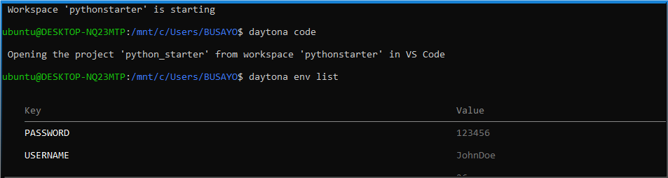
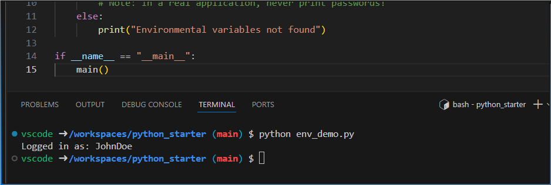

# Using Environmental Variables in Daytona

## Introduction

[Environmental variables]('/definitions/20241126_definition_environment_variables.md') are important for configuring development environments and storing sensitive information. They provide a flexible way to control application behavior without hardcoding values directly into the source code. Daytona offers a streamlined method for setting, managing, and using environmental variables across various workspaces using the `daytona env` command. This simplifies configuration and enhances security especially when collaborating on projects.

This article will explain using the `daytona env` command to set and manage environmental variables within Daytona workspaces. You will learn how to set variables, create a workspace, and access these variables within a workspace.

### TL;DR

- **What**: Learn to use `daytona env set` for managing workspace environmental variables

- **Why**: Simplify configuration and securely manage development environment settings

- **How**:
  - Set variables using `daytona env set key=value`
  - Create a workspace with `daytona create --code`
  - Verify variables with `daytona env list`

## Prerequisites

- Daytona installed on your system
- Docker
- Visual Studio Code (VSCode)

## Set Environmental Variables

Before adding an environment variable to Daytona, ensure that Docker and your server are running. Start your server using:

```bash
daytona server
```

Then use `daytona env set` to define environmental variables:

```bash
daytona env set USERNAME=JohnDoe PASSWORD=123456
```

This command allows you to set multiple environmental variables in a single operation.

### How `daytona env set` Works

The command stores environment variables at the workspace level. The variables are persistent across multiple workspaces and are accessible to all containers and development tools within the workspace. This provides a secure way to manage configuration without modifying project files.

You can verify that the environmental variables have been saved by running:

```bash
daytona env list
```

You should see an output similar to the image below:



## Create a New Workspace

You can create and open a new workspace using Daytona's create command with the `--code` flag:

```bash
daytona create --code
```

When prompted, choose to enter a GitHub URL. Let's use a simple Python project with a Dev Container configuration for this tutorial. Enter this URL in the input space: `https://github.com/bellatrick/python_starter.git`.

The command will clone the repository, set up the development environment, and open Visual Studio Code.

### Using Environmental Variables in Your Project

In your development environment, create a Python script to demonstrate accessing environment variables:

`env_demo.py`:

```python
import os

def main():
    # Access environmental variables
    username = os.environ.get('USERNAME')
    password = os.environ.get('PASSWORD')

    if username and password:
        print(f"Logged in as: {username}")
        # Note: In a real application, never print passwords!
    else:
        print("Environmental variables not found")

if __name__ == "__main__":
    main()
```

Run the script using:

```bash
python env-demo.py
```

Your output should look like this:



### Best Practices

1. **Security**:

   - Avoid storing sensitive information like passwords directly in environmental variables
   - Use secure secret management tools for production credentials
   - Consider using environment-specific configurations

2. **Naming Conventions**:
   - Use clear, descriptive variable names
   - Follow your team's or project's naming standards
   - Use uppercase for global constants

### Troubleshooting

- Ensure Daytona is up to date
- Verify the environmental variables using `daytona env list`

## Conclusion

The `daytona env` command provides a simple and powerful method for managing environmental variables in your development workflow. Understanding how to set, list, and use these variables, developers can create more flexible and configurable development environments.

## References

- [Daytona Official Documentation](https://www.daytona.io/docs/)
- [Daytona CLI](https://www.daytona.io/docs/tools/cli/#daytona-env)
- [Dev Container Specification](https://containers.dev/)
