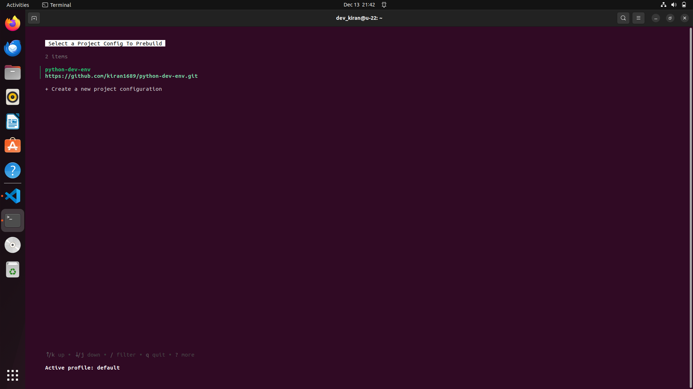

# Prebuilds in Daytona

# Introduction

Prebuilds are pre-configured [workspace](../definitions/20240819_definition_daytona%20workspace.md) environments that are built ahead of time based
on your project's configuration. They significantly reduce the time it takes to start a new workspace by having most of the setup work done in advance.

In this article, we will explore the process of setting up prebuilds in Daytona, how they work, and how they can help you streamline development workflows.

## TL;DR

- Overview of Prebuilds

- Setting up a Project Configuration

- Setting Up Prebuilds for your project

- Managing Prebuilds

- Benefits of Daytona Prebuilds

## Overview of Prebuilds

Prebuilds are designed to accelerate development by pre-building your Workspace.
When you start a Workspace, the prebuilt environment is used, ensuring that the
Workspace is initiated almost instantly. Prebuilds achieve this by setting up a
project configuration that monitors changes in the connected Git Provider’s repository.

Prebuilds work by registering a listener for webhook events from the Git Provider.
A public [API](../definitions/20241212_definition_api.md) endpoint is provided,
which the Git Provider uses to send these requests.

**Key Features of Prebuilds:**

- **Automatic Triggers**: Prebuilds can be automatically initiated based on repository events.
- **Customizable Configurations**: Tailor prebuild settings to your project's specific needs.
- **Build Retention**: Control how many prebuilds are retained to manage resources effectively.
- **Prebuild Status Monitoring**: Track the status of your prebuilds through the Daytona CLI.

**Note:** Daytona currently supports GitHub, GitLab, and GitLab Self-Managed as Git Providers for Prebuilds.

## Setting up a Project Configuration

Before setting up Prebuilds for your project, you must set up a [Project Configuration](https://www.daytona.io/docs/usage/projects/#project-configuration).

A project configuration contains all necessary properties to define and manage projects within a Workspace.
It stores information such as the repository URL, build configuration, and environment variables. 
This allows for easy reuse of previously set configurations, ensuring a consistent and reproducible
setup across multiple Workspaces.

Follow the below steps:

- **Step 1:** Start Daytona Server

Start the daytona server by running the command:

```bash
daytona server
```


- **Step 2:** Add a new Project Configuration

Run the following command to add a new Project Configuration:

```bash
daytona project-config add
```

- **Step 3:** Choose a Git Provider

You will be prompted to choose a provider. Select `GitHub` from
the list.


- **Step 4:** Select repository URL

Select the repository URL of the project you want to configure from your GitHub.

In my case, I've selected [pyhton-dev-env](https://github.com/Kiran1689/python-dev-env)
repository from my GitHub account for configuration.


- **Step 5:** Choose a build configuration

Choose your preferred builder for your project. Builders are responsible for creating 
a container image with the necessary tools and configurations for your Project.

Read more about Builders and how to choose one for your project [here](https://www.daytona.io/docs/usage/builders/)


- **Step 6:** Enter the environment variables

Enter environment variables in the format KEY=VALUE
To pass machine env variables at runtime, use $VALUE

Leave blank, if there are no environment variables for your project.


- **Step 7:** Provide name

Enter a name for the Project Configuration.


Now, you have successfully set up your project configurations.

You can check the list of Project Configurations you added by running the below command:

```bash
daytona project-config list
```


Now, let's move to setting up prebuild for your project.

## Setting Up Prebuilds

### Add a Prebuild

Run the following command to add a new Prebuild:

```bash
daytona prebuilds add
```

Upon running the above command, Select a project configuration you plan to work on.



After that, Daytona will prompt you to enter several configuration options. 
Here's an overview:

- **Commit interval**

Set the commit interval for triggering builds for your project.
For instance, if you specify a commit interval of 2, the Prebuild will run after every 2 commits to the repository.

- **Trigger Files**

Enter the file path whose changes you want to immediately trigger a Prebuild, without having to wait for the commit interval. 

- **Retention**

Define how many successful builds you want Daytona to remember (defaults to 3).

Select `Yes` to Run the build once submit.


Once you add a Prebuild, it becomes active immediately based on the project configuration you provided and 
a build process will automatically start in the background. 

You can check the progress of the build by running the command:

```bash
daytona build logs
```


Once the build process is complete, run the following command to create a Workspace using the configured project configuration:

```bash
daytona create [PROJECT_CONFIG_NAME]
```

Upon running this command, Daytona will detect the most recent Prebuild associated with the selected project configuration.
The Workspace will then use this Prebuild, significantly speeding up the setup process. 

Now, you have successfully configured Prebuild for your project. The Prebuild will automatically run whenever the specified
conditions are met, such as when the defined number of commits is reached or Trigger files are modified and subsequent 
`daytona create` calls will automatically detect the most recent existing build and use it to create the project.

## Managing Prebuilds

Daytona allows you to manage your Prebuilds through Daytona CLI.

### List Prebuilds

Daytona allows you to list all Prebuilds, providing you with an overview
of the properties stored within each Prebuild configuration.

```bash
daytona prebuilds list
```

Upon running this command, Daytona will display a list of your Prebuilds.
You will be able to view the project configuration, the branch it is linked to,
the commit interval, the trigger files, and the build retention.


### Prebuilds Information

Daytona allows you to view detailed information of a Prebuild, providing you with an overview of the properties stored within it.

Run the following command to view the details of a Prebuild:

```bash
daytona prebuilds info
```

It will prompt you to select the Prebuild you want to view. 


Upon selecting the Prebuild, Daytona will display the details of the selected Prebuild.
You will be able to view the Prebuild ID, the project configuration, the branch it is linked to,
the commit interval, the trigger files, and the build retention.


### Update Prebuilds

Daytona allows you to update a Prebuild, helping you manage and modify the Prebuild configuration.

- **Step 1:** Run the following command to update a Prebuild

```bash
daytona prebuilds update
```

- **Step 2:** Select the Prebuild you want to update


Upon selecting the Prebuild, Daytona will prompt you to update the Prebuild commit interval, trigger files, and build retention.


Upon updating the Prebuild configuration, Daytona will display a success message.

### Delete Prebuilds

Daytona allows you to delete Prebuilds, helping you manage and remove those that are no longer needed.

Run the following command to delete a Prebuild:

```bash
daytona prebuilds delete
```

It will prompt you to select the Prebuild you want to delete. 


Upon selecting the Prebuild, Daytona will delete that Prebuild.

## Benefits of Using Prebuilds

- **Faster Startup Times:** Dramatically reduce the time it takes to create new workspaces.

- **Improved Productivity:** Spend less time waiting and more time coding.

- **Consistent Environments:** Ensure all team members start with the same, up-to-date workspace configuration.

- **Resource Efficiency:** Optimize resource usage by having environments ready when you need them.

## Conclusion

Prebuilds in Daytona offer a powerful way to streamline workspace creation and boost development efficiency.
By setting up prebuilds, you can ensure faster, more consistent, and resource-efficient workflows.
To fully harness the power of prebuilds, start by configuring your projects, automating your build triggers, 
and optimizing your environment setup for success.

## References

- [GitHub Repository](https://github.com/Kiran1689/python-dev-env)

- [Daytona Documentation](https://www.daytona.io/docs)

