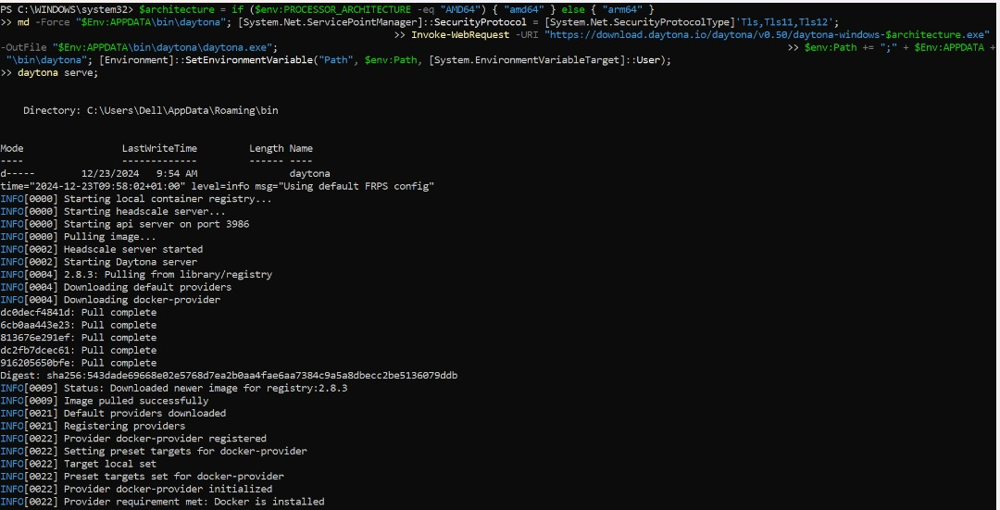
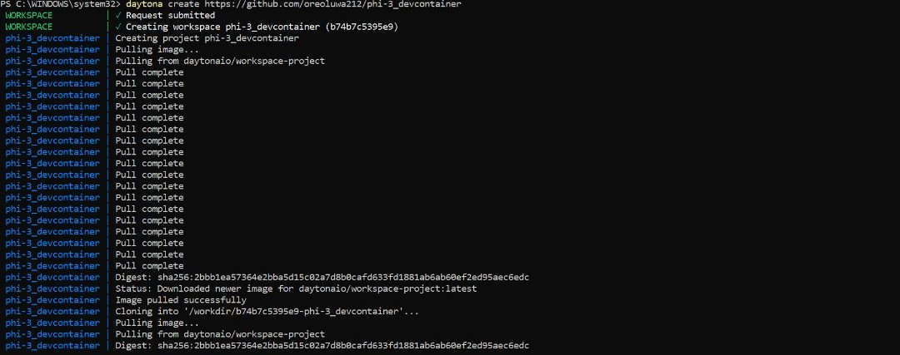
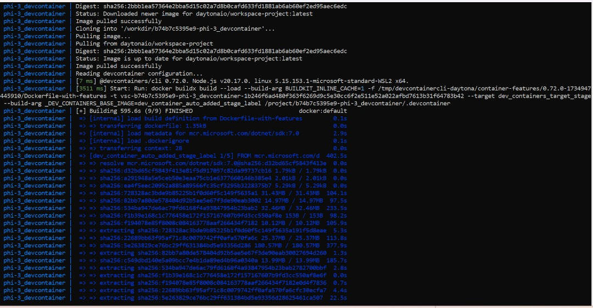

# Using Phi-3 and .NET Development in Daytona: A Comprehensive Guide

## Introduction

With the release of Phi-3.5, the Phi-3 Labs project has introduced advanced features and enhancements for AI and machine learning applications. The Phi-3.5 update brings significant improvements over its predecessors, offering enhanced capabilities for researchers and developers working with language models.

Daytona, a cloud-based development environment, provides a powerful platform for managing dependencies and configurations, making it ideal for developing, testing, and deploying AI models. This guide provides a comprehensive walkthrough for setting up and running Phi-3.5 Labs samples in a Daytona environment using .NET, ensuring a streamlined development experience.

### TL;DR

- **Set up Daytona with .NET**: Configure a complete Daytona development environment with .NET
- **Integrate Phi-3.5 Labs**: Incorporate the latest Phi-3.5 models into your development workflow.
- **Run and Test Samples**: Execute and test Phi-3.5 Labs samples within Daytona.
- **Best Practices**: Optimize your AI development workflow

## Overview of Daytona

Daytona is an open-source platform that transforms cloud-based development environments. It provides developers with consistent, reproducible, and efficient workspaces across various cloud providers.

### Key Benefits of Daytona

1. **Cloud Provider Flexibility**

   - Supports major cloud providers (AWS, GCP, Azure)
   - Local development support
   - Easy migration between providers

2. **Development Environment Management**

   - Automated environment setup
   - Consistent configurations across team members
   - Version-controlled development environments

3. **Resource Optimization**

   - Dynamic resource allocation
   - Cost-effective cloud usage
   - Efficient workspace management

4. **Enhanced Collaboration**
   - Shared development environments
   - Real-time collaboration features
   - Integrated version control

## Prerequisites and Initial Setup

### 1. Core Dependencies

Before proceeding, ensure you have the following installed:

```bash
# Verify Docker installation
docker --version

### 2. Daytona Installation and Configuration

Follow the [Daytona Installation Guide](https://daytona.io/docs) for your operating system.


## Setting Up the Development Environment

### 1. Project Initialization

```bash
# Create project directory
mkdir phi-3_devcontainer
cd phi-3_devcontainer
```

### 2. Development Container Setup

1. **Create Container Configuration Directory**

   ```bash
   mkdir .devcontainer
   cd .devcontainer
   ```

2. **Create Configuration Files**

   ```bash
   touch devcontainer.json
   touch Dockerfile
   touch setup.sh
   ```

3. **Configure devcontainer.json**

   ```json
   {
     "version": "2",
     "name": "Daytona .NET Environment",
     "dockerFile": "Dockerfile",
     "extensions": [
       "ms-dotnettools.csharp",
       "ms-vscode.vscode-node-azure-pack"
     ],
     "settings": {
       "terminal.integrated.shell.linux": "/bin/bash"
     },
     "postCreateCommand": ["dotnet restore", "./setup.sh"],
     "remoteUser": "vscode"
   }
   ```

4. **Create Dockerfile**

   ```dockerfile
   FROM mcr.microsoft.com/dotnet/sdk:7.0
   WORKDIR /app
   COPY . .
   RUN apt-get update && apt-get install -y \
    wget \
    libfoo-dev \
    libbar-dev && \
    rm -rf /var/lib/apt/lists/* && \
    dotnet restore
   RUN dotnet publish -c Release -o out
   WORKDIR /app/out
   CMD ["dotnet", "SampleProject.dll"]
   ```

5. **Download Phi-3.5 Models**: Use a script to download and set up Phi-3.5 models. Add below to the `setup.sh` script:

   ```bash
   #!/bin/bash
   mkdir -p /models/phi-3
   wget -O /models/phi-3/phi-3.5-model.bin https://example.com/phi-3.5-model.bin
   ```

### 3. Launch Daytona Environment

```bash
# Start the development environment
daytona serve
```

Daytona will now be ready to manage the project.


```bash
# Initialize Daytona project,
daytona create your-repo-url
# e.g daytona create https://github.com/oreoluwa212/phi-3_devcontainer
```





## Running and Testing Phi-3.5 Labs Samples

To run and test Phi-3.5 Labs samples:

1. **Execute the Sample Project**: Navigate to your project directory and run the sample project:

    ```bash
    dotnet run --project Samples/Phi3Sample.csproj
    ```

2. **Verify Execution**: Ensure that the samples run correctly and test various functionalities.

### Code Example

```csharp
// Phi3Sample.cs
using System;

class Program
{
    static void Main()
    {
        Console.WriteLine("Running Phi-3.5 Labs Sample");
    }
}
```
## Advantages for Collaborative Development

### 1. Consistent Environments

- Every team member works with identical configurations
- No "works on my machine" issues
- Simplified onboarding for new team members

### 2. Resource Optimization

- Cloud-based resources scale as needed
- No need for powerful local hardware
- Efficient model sharing and versioning

### 3. Enhanced Collaboration

- Real-time code sharing and pair programming
- Integrated version control
- Easy environment replication

### 4. Streamlined Workflow

- Automatic dependency management
- Integrated debugging tools
- Quick iteration cycles

## Best Practices

### 1. Resource Management

- Monitor memory usage when running models
- Use appropriate instance sizes
- Clean up unused resources

### 2. Version Control

- Keep models and code versioned
- Document environment changes
- Use branching for experiments

## Troubleshooting

Common issues and solutions:

### 1. Connectivity Issues
If your VPN is configured to handle all IP traffic or if your Firewall is configured to block certain IP addresses, they may prevent Daytona from successfully connecting to our reverse proxy service.

To work around this issue, you may need to add the following IP address exceptions to your VPN or Firewall:
 - <span style="color:green">35.198.165.62</span> - Europe-based reverse proxy  
 - <span style="color:green">34.133.75.4</span> - US-based reverse proxy

### 2. Model Loading Problems

- Check memory allocation
- Verify model path
- Update dependencies

## References

- [Daytona Documentation](https://daytona.io/docs)
- [.NET Installation Guide](https://learn.microsoft.com/en-us/dotnet/core/install/linux-ubuntu)
- [Microsoft Phi-3.5 Documentation](https://learn.microsoft.com/en-us/ai/phi-3.5)

## Conclusion

Integrating Phi-3 Labs with a Daytona environment using .NET can significantly enhance your development experience. By leveraging the power of Daytonas cloud-based development environment, you can streamline your projects, making it easier to manage dependencies and collaborate with team members.
