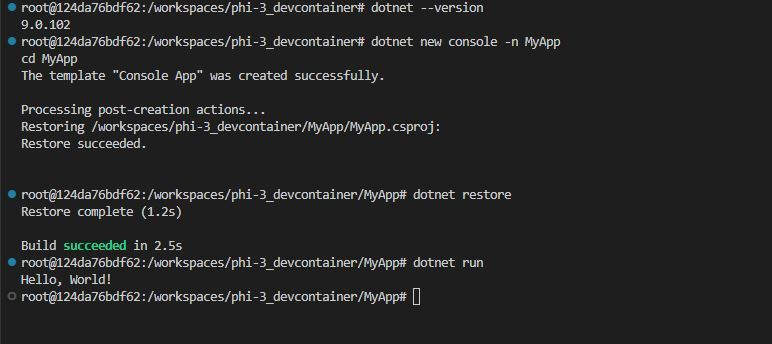
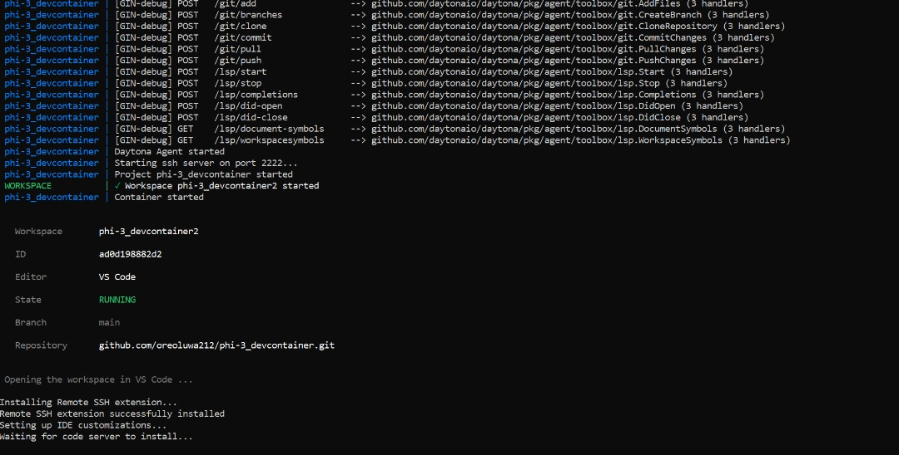

# Using Phi-3 and .NET Development in Daytona: A Comprehensive Guide

## Introduction

With the release of [Phi-3.5](https://techcommunity.microsoft.com/blog/azure-ai-services-blog/discover-the-new-multi-lingual-high-quality-phi-3-5-slms/4225280), the [Phi-3 Labs](https://github.com/microsoft/Phi-3CookBook) project has introduced advanced features and enhancements for [AI and machine learning](https://en.wikipedia.org/wiki/Artificial_intelligence). The Phi-3.5 update brings significant improvements over its predecessors, offering enhanced capabilities for researchers and developers working with [language models](https://en.wikipedia.org/wiki/Large_language_model).

[Daytona](https://www.daytona.io), a cloud-based development environment, provides a powerful platform for managing dependencies and configurations, making it ideal for developing, testing, and deploying AI models. This guide provides a comprehensive walkthrough for setting up and running Phi-3.5 Labs samples in a Daytona environment using .NET, ensuring a streamlined development experience.

### TL;DR

- **Set up Daytona with .NET**: Configure a complete Daytona development environment with .NET
- **Integrate Phi-3.5 Labs**: Incorporate the latest Phi-3.5 models into your development workflow.
- **Run and Test Samples**: Execute and test Phi-3.5 Labs samples within Daytona.
- **Best Practices**: Optimize your AI development workflow

## Overview of Daytona

Daytona is an open-source platform that transforms cloud-based development environments. It provides developers with consistent, reproducible, and efficient workspaces across various cloud providers.

### Key Benefits of Daytona

1. **Cloud Provider Flexibility**

   - Supports major cloud providers (AWS, GCP, Azure)
   - Local development support
   - Easy migration between providers

2. **Development Environment Management**

   - Automated environment setup
   - Consistent configurations across team members
   - Version-controlled development environments

3. **Resource Optimization**

   - Dynamic resource allocation
   - Cost-effective cloud usage
   - Efficient workspace management

4. **Enhanced Collaboration**
   - Shared development environments
   - Real-time collaboration features
   - Integrated version control

## Prerequisites and Initial Setup

Before proceeding with the setup, ensure you have Docker installed on your system. You can verify the installation by running:

```bash
docker --version
```

For detailed installation instructions, follow the [Daytona Installation Guide](https://daytona.io/docs) for your operating system.

## Setting Up the Development Environment

Let's walk through the process of setting up your development environment for Phi-3 and .NET development using `devcontainer.json`.

### 1. Project Initialization

First, create a new directory for your project:

```bash
# Create project directory, e.g,
mkdir phi-3_devcontainer
cd phi-3_devcontainer
```

### 2. Development Container Setup

The development container configuration involves creating necessary configuration files and setting up the environment.

1. **Create Container Configuration Directory:** In your project root, create a `.devcontainer` directory if it doesn’t already exist.

   ```bash
   mkdir .devcontainer
   cd .devcontainer
   ```

2. **Create the required configuration directories and files:**

   ```bash
   touch devcontainer.json
   touch Dockerfile
   ```

3. **Configure your development container by adding the following content to the `devcontainer.json`:**

   ```json
   {
     "name": "Daytona .NET Environment",
     "dockerFile": "Dockerfile",
     "customizations": {
       "vscode": {
         "extensions": [
           "ms-dotnettools.csharp",
           "ms-vscode.vscode-node-azure-pack"
         ],
         "settings": {
           "terminal.integrated.shell.linux": "/bin/bash"
         }
       }
     },
     "postCreateCommand": "dotnet restore"
   }
   ```

4. **Set up the `Dockerfile` with the necessary .NET configuration:** Define the base image and install necessary dependencies:

   ```dockerfile
   FROM mcr.microsoft.com/dotnet/aspnet:7.0
   WORKDIR /app
   COPY . .
   RUN dotnet restore
   ```

With the .NET environment in place, you need to configure it for Phi-3.5 Labs.

1. **Install Dependencies**: Add any required dependencies to your `Dockerfile` or install them manually in the Daytona container.

   ```dockerfile
   RUN apt-get update && apt-get install -y \
       libfoo-dev \
       libbar-dev
   ```

2. **Download Phi-3.5 Models**: Use a script to download and set up Phi-3.5 models. Create a `setup.sh` script:

   ```bash
   #!/bin/bash
   mkdir -p /models/phi-3
   wget -O /models/phi-3/phi-3.5-model.bin https://example.com/phi-3.5-model.bin
   ```

   Add this script to your `postCreateCommand` in `devcontainer.json`:

   ```json
   "postCreateCommand": "./setup.sh"
   ```

3. **Configure your project file by creating a `Phi3Sample.csproj` file and adding the following script:**

   ```xml
   <Project Sdk="Microsoft.NET.Sdk">
   <PropertyGroup>
    <OutputType>Exe</OutputType>
    <TargetFramework>net7.0</TargetFramework>
   </PropertyGroup>
   </Project>
   ```

4. **To run and test Phi-3.5 Labs samples, navigate to your project directory on your terminal and run the sample project:**:

   ```bash
   dotnet run --project Phi3Sample.csproj
   ```

Ensure that the samples run correctly and test various functionalities. Here's a basic sample to verify your setup:

```csharp
// Phi3Sample.cs
using System;

class Program
{
    static void Main()
    {
        Console.WriteLine("Running Phi-3.5 Labs Sample");
    }
}
```



### 3. Launch Daytona Environment

After setting up your configuration files and pushing to a new repository, you can now launch your Daytona environment by following these steps:

1. **Start the Daytona server:**

   ```bash
   daytona serve
   ```

2. **Initialize your project by creating a new Daytona workspace:**

   ```bash
   daytona create your-repo-url
   ```

   

## Advantages for Collaborative Development

#### 1. Consistent Environments

- Every team member works with identical configurations
- No "works on my machine" issues
- Simplified onboarding for new team members

#### 2. Resource Optimization

- Cloud-based resources scale as needed
- No need for powerful local hardware
- Efficient model sharing and versioning

#### 3. Enhanced Collaboration

- Real-time code sharing and pair programming
- Integrated version control
- Easy environment replication

#### 4. Streamlined Workflow

- Automatic dependency management
- Integrated debugging tools
- Quick iteration cycles

## Best Practices

#### 1. Resource Management

- Monitor memory usage when running models
- Use appropriate instance sizes
- Clean up unused resources

#### 2. Version Control

- Keep models and code versioned
- Document environment changes
- Use branching for experiments

## Troubleshooting

Here are common issues while setting up your Daytona project and possible solutions:

#### 1. Connectivity Issues

If your VPN is configured to handle all IP traffic or if your Firewall is configured to block certain IP addresses, they may prevent Daytona from successfully connecting to our reverse proxy service.

To work around this issue, you may need to add the following IP address exceptions to your VPN or Firewall:

- <span style="color:green">35.198.165.62</span> - Europe-based reverse proxy
- <span style="color:green">34.133.75.4</span> - US-based reverse proxy

#### 2. Model Loading Problems

- Check memory allocation
- Verify model path
- Update dependencies

## References

- [Daytona Documentation](https://daytona.io/docs)
- [.NET Installation Guide](https://learn.microsoft.com/en-us/dotnet/core/install/linux-ubuntu)
- [Microsoft Phi-3.5 Documentation](https://learn.microsoft.com/en-us/ai/phi-3.5)

## Conclusion

Integrating Phi-3 Labs with a Daytona environment using .NET can significantly enhance your development experience. By leveraging the power of Daytonas cloud-based development environment, you can streamline your projects, making it easier to manage dependencies and collaborate with team members.
