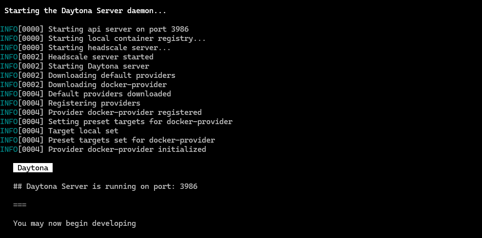

# Using Phi-3 and .NET Development in Daytona: A Comprehensive Guide

## Table of Contents

- [Introduction](#introduction)
- [Overview of Daytona](#overview-of-daytona)
- [Prerequisites and Initial Setup](#prerequisites-and-initial-setup)
- [Setting Up the Development Environment](#setting-up-the-development-environment)
- [Configuring Phi-3.5 Labs](#configuring-phi-35-labs)
- [Running and Testing](#running-and-testing)
- [Advantages for Collaborative Development](#advantages-for-collaborative-development)
- [Best Practices](#best-practices)
- [Troubleshooting](#troubleshooting)
- [References](#references)
- [Conclusion](#conclusion)

## Introduction

With the release of Phi-3.5, the Phi-3 Labs project has introduced advanced features and enhancements for AI and machine learning applications. The Phi-3.5 update brings significant improvements over its predecessors, offering enhanced capabilities for researchers and developers working with language models.

Daytona, a cloud-based development environment, provides a powerful platform for managing dependencies and configurations, making it ideal for developing, testing, and deploying AI models. This guide provides a comprehensive walkthrough for setting up and running Phi-3.5 Labs samples in a Daytona environment using .NET, ensuring a streamlined development experience.

### TL;DR

- **Set up Daytona with .NET**: Configure a complete Daytona development environment with .NET
- **Integrate Phi-3.5 Labs**: Incorporate the latest Phi-3.5 models into your development workflow.
- **Run and Test Samples**: Execute and test Phi-3.5 Labs samples within Daytona.
- **Best Practices**: Optimize your AI development workflow

## Overview of Daytona

Daytona is an open-source platform that transforms cloud-based development environments. It provides developers with consistent, reproducible, and efficient workspaces across various cloud providers.

### Key Benefits of Daytona

1. **Cloud Provider Flexibility**

   - Supports major cloud providers (AWS, GCP, Azure)
   - Local development support
   - Easy migration between providers

2. **Development Environment Management**

   - Automated environment setup
   - Consistent configurations across team members
   - Version-controlled development environments

3. **Resource Optimization**

   - Dynamic resource allocation
   - Cost-effective cloud usage
   - Efficient workspace management

4. **Enhanced Collaboration**
   - Shared development environments
   - Real-time collaboration features
   - Integrated version control

## Prerequisites and Initial Setup

### 1. Core Dependencies

Before proceeding, ensure you have the following installed:

```bash
# Verify Docker installation
docker --version

# Verify Git installation
git --version
```

### 2. Daytona Installation and Configuration
 Follow the [Daytona Installation Guide](https://daytona.io/docs) for your operating system.

## Setting Up the Development Environment

### 1. Project Initialization

```bash
# Create project directory
mkdir phi3-daytona-project
cd phi3-daytona-project

# Initialize git repository
git init

# Create .gitignore
echo "bin/
obj/
.vs/
.vscode/" > .gitignore
```

### 2. Development Container Setup

1. **Create Container Configuration Directory**

   ```bash
   mkdir .devcontainer
   cd .devcontainer
   ```

2. **Create Configuration Files**

   ```bash
   touch devcontainer.json
   touch Dockerfile
   ```

3. **Configure devcontainer.json**

   ```json
   {
     "name": "Daytona .NET Environment",
     "dockerFile": "Dockerfile",
     "customizations": {
       "vscode": {
         "extensions": [
           "ms-dotnettools.csharp",
           "ms-vscode.vscode-node-azure-pack"
         ],
         "settings": {
           "terminal.integrated.shell.linux": "/bin/bash"
         }
       }
     },
     "postCreateCommand": "dotnet restore"
   }
   ```

4. **Create Dockerfile**

   ```dockerfile
   FROM mcr.microsoft.com/dotnet/sdk:7.0
   WORKDIR /app
   RUN apt-get update && apt-get install -y \
    python3 \
    python3-pip \
    git
   COPY . .
   RUN dotnet restore
   ```

### 3. Launch Daytona Environment

```bash
# Initialize Daytona project, 
daytona create your-repo-url
# e.g daytona create https://github.com/oreoluwa212/phi-3_devcontainer

# Start the development environment
daytona serve
```
Daytona will now be ready to manage the project.



## Configuring Phi-3.5 Labs

### 1. Create .NET Project

```bash
# Create new .NET solution
dotnet new sln -n Phi3Demo

# Create console project
dotnet new console -n Phi3Demo.Console
dotnet sln add Phi3Demo.Console/Phi3Demo.Console.csproj
```

### 2. Set Up Phi-3.5 Integration

Create a basic C# program to test Phi-3.5:

```csharp
using Microsoft.SemanticKernel;
using Microsoft.SemanticKernel.Connectors.AI.Phi;

class Program
{
    static async Task Main(string[] args)
    {
        var kernelBuilder = new KernelBuilder();

        // Configure Phi-3.5
        kernelBuilder.WithPhi35TextGeneration(new PhiConfig
        {
            ModelPath = "microsoft/phi-3.5"
        });

        var kernel = kernelBuilder.Build();

        // Test prompt
        var result = await kernel.RunAsync("Explain quantum computing in simple terms.");
        Console.WriteLine(result);
    }
}
```

## Running and Testing

### 1. Build and Run

```bash
cd Phi3Demo.Console
dotnet run
```

### 2. Testing Features

```bash
# Run tests
dotnet test

# Execute sample prompts
dotnet run -- --prompt "Explain artificial intelligence"
```

<!--  -->

## Advantages for Collaborative Development

### 1. Consistent Environments

- Every team member works with identical configurations
- No "works on my machine" issues
- Simplified onboarding for new team members

### 2. Resource Optimization

- Cloud-based resources scale as needed
- No need for powerful local hardware
- Efficient model sharing and versioning

### 3. Enhanced Collaboration

- Real-time code sharing and pair programming
- Integrated version control
- Easy environment replication

### 4. Streamlined Workflow

- Automatic dependency management
- Integrated debugging tools
- Quick iteration cycles

## Best Practices

### 1. Resource Management

- Monitor memory usage when running models
- Use appropriate instance sizes
- Clean up unused resources

### 2. Version Control

- Keep models and code versioned
- Document environment changes
- Use branching for experiments

### 3. Security

- Follow least privilege principle
- Secure API keys and credentials
- Regular security updates

## Troubleshooting

Common issues and solutions:

### 1. Environment Creation Issues

```bash
daytona doctor
# Follow recommended fixes
```

### 2. Model Loading Problems

- Check memory allocation
- Verify model path
- Update dependencies

### 3. Daytona Connection Issues

```bash
# Restart Daytona service
daytona restart

# Check provider status
daytona provider status
```

## References

- [Daytona Documentation](https://daytona.io/docs)
- [Phi-3 Labs GitHub Repository](https://github.com/elbruno/phi3-labs)
- [.NET Installation Guide](https://learn.microsoft.com/en-us/dotnet/core/install/linux-ubuntu)
- [devcontainer.json Reference](https://code.visualstudio.com/docs/remote/devcontainerjson-reference)
- [Microsoft Phi-3.5 Documentation](https://learn.microsoft.com/en-us/ai/phi-3.5)

## Conclusion

Integrating Phi-3 Labs with a Daytona environment using .NET can significantly enhance your development experience. By leveraging the power of Daytona’s cloud-based development environment, you can streamline your AI projects, making it easier to manage dependencies and collaborate with team members.
