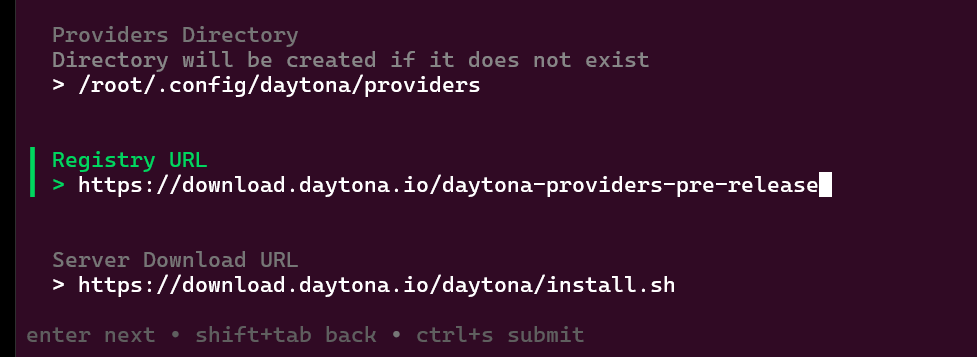
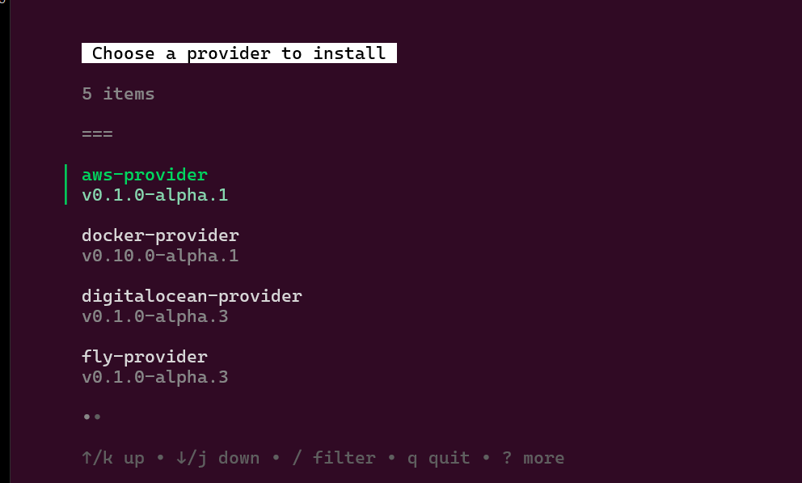
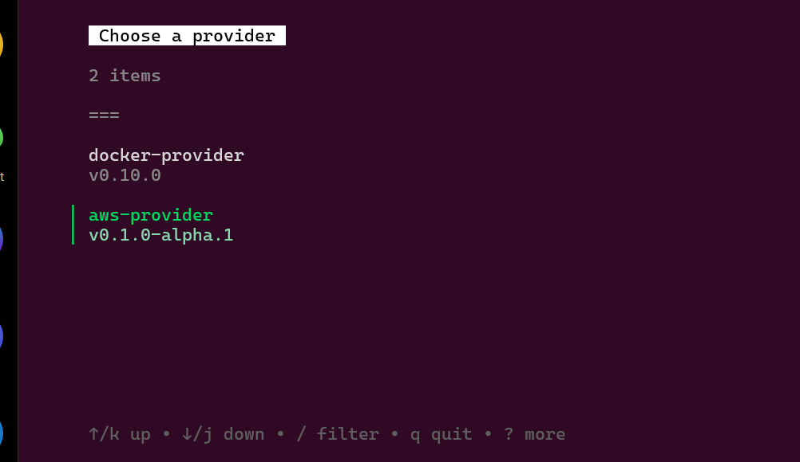
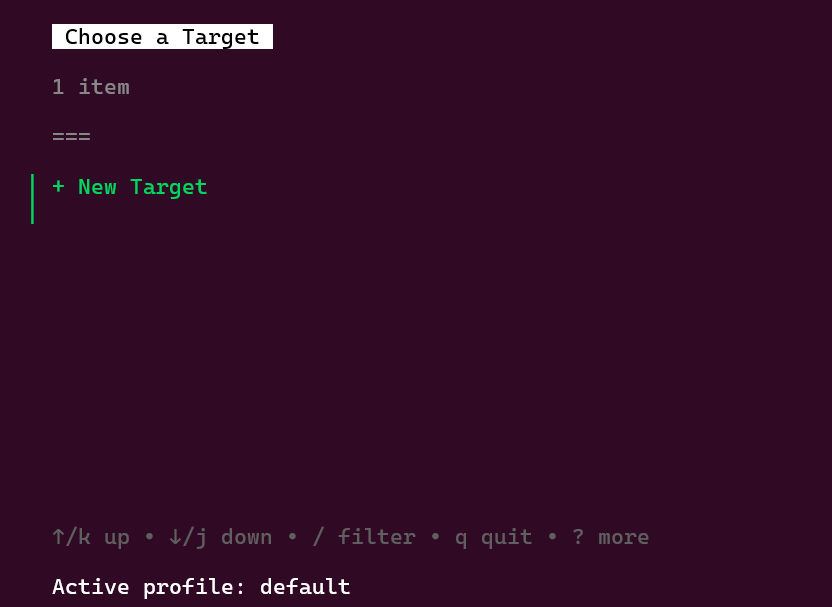
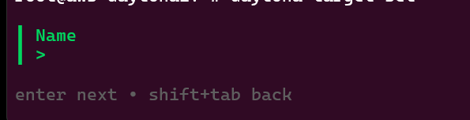
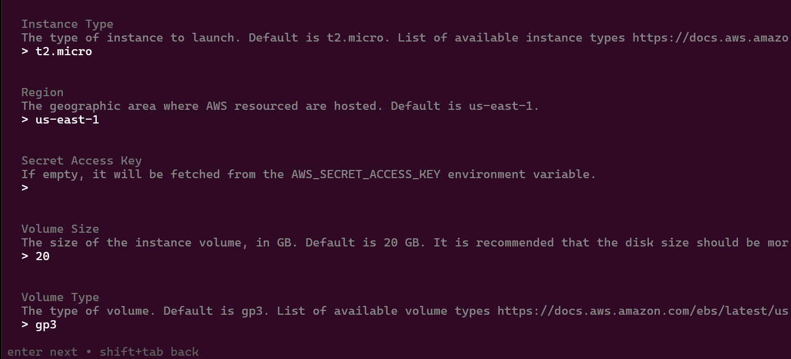
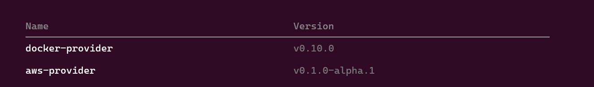

## Introduction

The Daytona AWS Provider is a significant addition to the Daytona ecosystem, enabling seamless integration with Amazon Web Services (AWS) for creating and managing workspace projects on EC2 instances. This provider empowers developers and DevOps engineers to leverage AWS infrastructure directly from Daytona, simplifying the setup and management of development environments in the cloud.

This guide will walk you through the process of setup and configuring the Daytona AWS Provider, discuss the available customization options, and provide troubleshooting tips for some of the issues that you might encounter.

> [!Note]
> Please note that the AWS Provider is currently in alpha release, and there may be limitations and caveats to consider. Check [here](https://github.com/daytonaio/daytona-provider-aws) for more details.

### TL;DR

- **Set up the AWS Provider in Daytona**
- **Customize target options for EC2 instances**
- **Troubleshoot common setup issues**
- **Understand the alpha release limitations**

## Prerequisites

Before diving into the setup, ensure you have the following prerequisites in place:

1. [Daytona](https://github.com/daytonaio/daytona) v0.26.1 installed.

2. **AWS Programmatic Access**: You need an [AWS IAM user](https://docs.aws.amazon.com/IAM/latest/UserGuide/id_users_create.html) with [programmatic access](https://docs.aws.amazon.com/IAM/latest/UserGuide/id_credentials_temp_use-resources.html) and the `AmazonEC2FullAccess` policy attached. This ensures that the Daytona AWS Provider can manage EC2 instances.

3. **Daytona Project Setup**: A Daytona project should already be initialized in your workspace. If not, you can create a new project with:

   ```bash
   daytona create --name <your-project-name>
   ```

## Setting Up the AWS Provider

To get started with the AWS Provider, follow these steps:

1. Change Daytona default Registry URL:

First, update the default registry URL to access pre-release providers. Run the following command in your terminal:

```bash
daytona server configure
```

An interactive prompt will appear. Navigate to the `Registry URL` field by pressing `Enter` and change the default url to `https://download.daytona.io/daytona-providers-pre-release`.



Press `ctrl + s` to save your change.

You should see the following message:

```text
Server configuration updated. You need to restart the
server for the changes to take effect.
```

Run the following command to restart the daytona server daemon.

```bash
daytona server restart
```

1. Install the AWS Provider:

Next, install the AWS provider

```bash
daytona provider install
```

In the interacive prompt, use the arrow keys to select the `aws-provider` from the list.



If the installation is successful, you should expect the following output:

```text
Provider aws-provider has been successfully installed
```

1. Add a new target:

Run the following command to add a new target for the newly installed AWS provider.

```bash
daytona target set
```

In the interactive prompt, select `aws-provider`.



Then select `+ New target`.



Enter a name for your target, such as `aws-provider-target` for example.



In the next interactive prompt, you will be prompted to configure the AWS provider target settings. You can either adjust them to your preferred values or press `Enter` to accept the default options.



If you have set the provider target options correctly you should expect the following output:

```text
Target set successfully
```

1. Verify installation:

List the available providers to confirm that the daytona AWS provider has been successfully installed.

```bash
daytona provider list
```

Expected Output:



## Customizing Target Options

The Daytona AWS Provider gives you the flexibility to customize various settings that define how your EC2 instances are launched and configured. These target options allow you to tailor your environment to meet specific application requirements, whether you're running development workloads or production deployments.. Below are some key settings you can adjust:

### Region

The `Region` setting decides where your AWS resources, like EC2 instances, will be located around the world. AWS has many regions to choose from, and picking the right one can affect speed, cost, and data rules. By default, it's set to `us-east-1`, but you can change it to any other region based on where you want your resources to be.

### Image ID

The `Image ID` (AMI ID) is the identifier for the Amazon Machine Image used to start your EC2 instances. An AMI is like a template with the operating system, server, and apps needed to run an instance.

### Instance Type

The `Instance Type` setting decides the hardware setup for your EC2 instance, like CPU, memory, and network speed. The default is `t2.micro`, which is a good mix of power and cost, perfect for low-traffic apps, testing, or development. But if you need more power for production or resource-heavy apps, you might want to choose something like `m5.large` or `c5.xlarge` for better performance.

### Device Name

The `Device Name` is the name of the storage device attached to your instance that holds the operating system and initial setup. The default name is `/dev/sda1`, which is common for Linux instances. If you need more storage or custom disk setups, you might need to change this setting.

### Volume Size

The `Volume Size` specifies the size of the root volume attached to your EC2 instance, measured in gigabytes (GB). By default, this is set to 20 GB, which is sufficient for most basic operating systems and lightweight applications. However, if your application demands more storage, such as for database management or file storage, you can increase this size to accommodate those needs.

### Volume Type

The `Volume Type` setting defines the type of Amazon EBS (Elastic Block Store) volume used for your root storage. The default is `gp3`, which offers a balance of cost and performance suitable for a wide range of workloads. `gp3` volumes provide consistent performance and can be adjusted in terms of IOPS and throughput. If you need higher performance, you could choose other volume types like `io1` or `io2`, which are optimized for IOPS-intensive tasks.

### Access Key ID

The `Access Key ID` is a unique code that lets your AWS account access AWS services. It's important to keep this key safe and never expose it in your source code. Daytona uses it to connect to AWS, so it's essential to handle it securely.

### Secret Access Key

The `Secret Access Key` works with the Access Key ID to verify your AWS requests. It’s important to keep this key secure to avoid unauthorized access to your AWS account. It's best to store these keys in environment variables or a secure vault.

## Troubleshooting Common Issues

When setting up the AWS Provider with Daytona, you may encounter some common issues. Below are troubleshooting tips to help resolve them:

### Invalid AWS Credentials

If you encounter an error related to AWS credentials, double-check your `access_key_id` and `secret_access_key`. Ensure that these credentials are correct and have the necessary permissions.

### Incorrect AMI ID

If you encounter errors related to the AMI ID, such as instances failing to launch, it's important to verify the `Image ID` you provided. An incorrect AMI ID could be due to a typo or referencing an AMI that doesn't exist in the specified region. You can cross-check this ID in the AWS Management Console under the AMIs section.

### Network Configuration Errors

Network problems can happen if your instances aren't set up right to connect to the internet or talk to other resources. Make sure your VPC, subnets, and security groups are properly configured. Check that your security group allows inbound SSH traffic on port 22, and that your instance has a public IP if it needs internet access.

### Daytona Provider Errors

If Daytona encounters errors while interacting with the AWS Provider, it could be due to bugs or limitations in the current alpha release. Checking the [Daytona AWS Provider GitHub repository](https://github.com/daytonaio/daytona-provider-aws) for any known issues or updates can help resolve these problems. Additionally, consider updating to the latest version if you're using an outdated release.

## Conclusion

The Daytona AWS Provider makes it much easier to manage development environments on AWS, streamlining the process of creating and customizing EC2-based workspaces. Although currently in alpha, this provider offers powerful functionality with room for future enhancements.

As you explore this integration, be mindful of its alpha status and the potential for updates or changes in future releases. For the latest information, refer to the official Daytona documentation and the [release notes](https://github.com/daytonaio/daytona/releases/tag/v0.25.2).

Feel free to ask if you have any questions or need further assistance!

## References

- [Officially Supported Providers - Daytona Docs](https://www.daytona.io/docs/configuration/providers/#officially-supported-providers)
- [Daytona AWS Provider GitHub Repository](https://github.com/daytonaio/daytona-provider-aws)
- [Daytona v0.25.2 Release Notes](https://github.com/daytonaio/daytona/releases/tag/v0.25.2)
