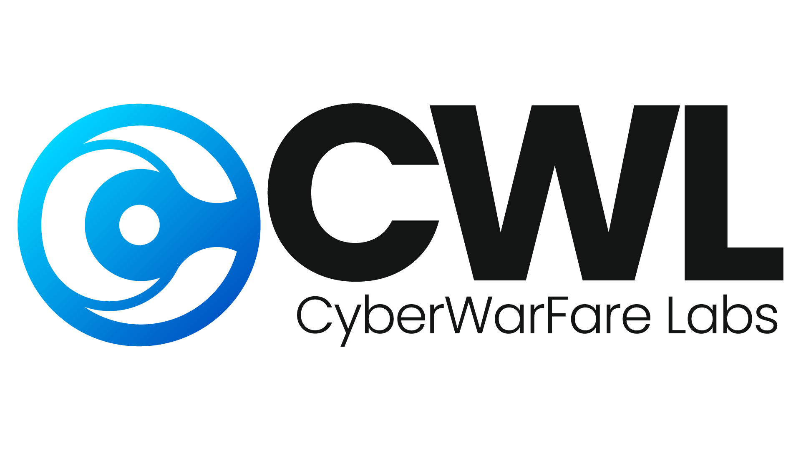

Author: Kiran Naragund Title: Full Stack Developer Description: Kiran Naragund
is a Full Stack Developer and Machine Learning Enthusiast with a strong passion
for Python, React.js, Node.js, Django, RDBMS, REST API, and Data Visualization.
Kiran enjoys sharing tech insights and content with the developer community,
helping others learn new technologies and enhance their efficiency and
productivity. In addition to being a developer, Kiran is a learner, explorer,
blogger, and open-source contributor who finds joy in collaborating on projects
that push the boundaries of technology. Author Image:
 Author LinkedIn:
[LinkedIn](https://www.linkedin.com/in/kiran-a-n) Author Twitter:
[Twitter](https://twitter.com/kiran__a__n) Company Name: CyberWarFare Labs
Company Logo Dark:
 Company Logo
White: 
