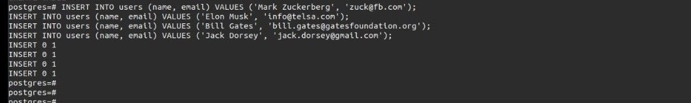
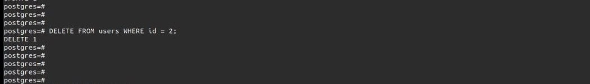

# How to Setup PostgreSQL Playground in Daytona

# Introduction

This guide will walk you through how to set up
[PostgresQL](definitions/20240823_definitions_postgresql.md) database playground
in a [Daytona workspace](definitions/20240819_definition_daytona workspace.md)
which is a development environment management platform. In a world where
companies want to increase development,
[productivity](definitions/20240819_definition_productivity.md) and individual
developers want to start coding immediately, Daytona is the best option.

## TL;DR

- What is needed to get started in this hands-on learning
- Overviews of both PostgreSQL and Daytona
- How to create a PostgreSQL dev container file
- Setup PostgreSQL playground workspace in Daytona
- Hands-on practice with PostgreSQL commands in the workspace
- Conclusion

## Prerequisites

To follow this guide, you’ll need the software installations below on your PC or
Mac.

- An [IDE](definitions/20240819*definition_integrated development environment
  \_ide*.md) like VS Code, link to install it
  [here](https://code.visualstudio.com/download) or just a terminal
- Docker, link to it [here](https://docs.docker.com/engine/install/)
- Daytona, link to install it
  [here](https://github.com/daytonaio/daytona#installing-daytona)

## Overview of PostgreSQL

[PostgreSQL](definitions/20240823_definitions_postgresql.md) also known as
Postgres is the world’s most advanced open-source relational database system
that has been in use by the developer community for over 35 years with so much
great love shown to it because of its strong reputation for reliability, feature
robustness and performance.

PostgreSQL has so many benefits as to why one should use it some are highlighted
below:

- [Open Source](definitions/20240819_definition_open source.md) and Free: It’s
  completely free software to install and use and also its source code is freely
  available online to see how it’s implemented under the hood. You don’t have to
  spend more to purchase a license which might be very expensive
- Cross-Platform Compatibility: PostgreSQL can be run in most of the major OSes
  in the world. It can run on most Linux distros, Windows, and MacOS making it a
  number one choice.
- Inexhaustive List of Features: Data Types, Data Integrity and Security. Many
  features can be found in the PostgreSQL website here with more being added in
  every major release.

## Overview of Daytona

Daytona is a self-hosted and secure [open
source](definitions/20240819_definition_open source.md) development environment
manager that uses configurations from a project's repository to build a
workspace and provision the workspace in a platform of your choice. It's
innovative and incredibly easy for all levels, including beginners, to get
started.

Daytona provides some interesting features that make it one of the best products
in simplifying development environments for both enterprise and individual
levels.

Some of the features it boasts of include:

- It has support for popular [IDE](definitions/20240819*definition_integrated
  development environment \_ide*.md) like VS Code and JetBrains
- It connects with repository providers like GitHub, GitLab, BitBucket, and
  Gitea
- It's very secure. It uses a VPN connection to make that possible
- It has reverse proxy support

For more info about Daytona and its features, check [here](https://daytona.io)

## Creating a DevContainer for PostgreSQL

A [development container](definitions/20240819_definition_development
container.md) (or a devcontainer for short) allows you to use a
[docker](definitions/20240819_definition_docker.md) container as a full-featured
development environment. It can be configured to meet your development
environment needs. It could include tools and runtimes like npm,
[git](definitions/20240819_definition_git.md), maven,
[Golang](definitions/20240819_definition_golang.md) compiler and others too.

For this guide, we will create a
[devcontainer](definitions/20240819_definition_development container.md) for
PostgreSQL using a config file. The file is always named `devcontainer.json` and
has code syntax following the correct config specifications. It is a norm to
keep the file in a hidden directory call `.devcontainer`

Let's get started. I will use the terminal to create mine in my Linux PC but the
commands should work fine on the Mac terminal or the Windows PowerShell.

### **Step 1**: Create a Directory

Create a directory with any name of your choice and go into it. I use the name
`postgresql-playground-in-daytona` and move into the directory.

```bash
mkdir postgresql-playground-in-daytona && cd postgresql-playground-in-daytona
```

### **Step 2**: Create the `.devcontainer` directory

Create a hidden directory called `.devcontainer` and enter it. This is where our
dev container config file will be stored.

```bash
mkdir .devcontainer && cd .devcontainer
```

### **Step 3**: Create `devcontainer.json` file

Now, create a file called `devcontainer.json` and paste the following code into
it, and then save it.

```json
{
  "name": "PostgreSQL Dev Container Playground",
  "image": "mcr.microsoft.com/devcontainers/base:ubuntu",
  "features": {
    "ghcr.io/itsmechlark/features/postgresql:1": {
      "version": "latest"
    }
  }
}
```

The `devcontainer.json` code content defines a configuration for a PostgreSQL
development container environment.

- **`name`:** Set the name of the development container environment to
  `PostgreSQL Dev Container Playground`.
- **`image`:** This uses a base Ubuntu image from Microsoft image repository.
- **`features`:** This configuration adds PostgreSQL setup in the environment.

Your directory structure should look like mine below if you follow along using
the same directory name as I did earlier.

```
postgresql-playground-in-daytona/
├── .devcontainer/
│   ├── devcontainer.json
```

### **Step 4:** Go back to the top level

Paste the code below to go back to the top level of the directory you created

```bash
cd ..
ls -al
```

And you should see this output in the terminal:

```
├── .
├── ..
├── .devcontainer
├── .git
```

### **Step 5:** Initialize and make commit

Paste the code below to initialize git and commit the changes you made to your
directory.

```bash
git init
git add .
git commit -m "inital commit"
```

### **Step 6:** Create a repository in GitHub

Create a repository without README, LICENSE, or .gitignore files from GitHub web
using the name of the directory you created. Mine is
`postgresql-playground-in-daytona`.

You should see a code block similar to this on your GitHub web page. Copy it and
paste it to your terminal or Windows Powershell for Windows PC users(Git must be
installed in it)

```bash
git remote add origin https://github.com/YOUR-GITHUB-USERNAME/YOUR-DIRECTORY-NAME.git
git branch -M main
git push -u origin main
```

After you run the code, you'll be prompted to input your GitHub username and
password.

You can find the GitHub repository where my devcontainer config is located which
I used for this guide
[here](https://github.com/c0d33ngr/postgresql-playground-in-daytona). I later
added a README and LICENSE files which weren't necessary to follow along with
this guide.

Now, we have successfully created the GitHub repository needed to spin up a dev
container for PostgreSQL using Daytona.

## Setting Up PostgreSQL in Daytona

Before starting this section be sure that `daytona` is installed on your PC

### Step 1

Run the code below to set up the `daytona` server.

```bash
daytona server
```

Your output should be similar to the screenshot below.


Choose "yes" and you should see a similar output in the screenshot below.


### Step 2

Run the command below to add your git provider if you haven't set one up before.

```bash
daytona git provider add
```

Follow the prompts after running the command to set up your provider. In our
case it's GitHub.

### Step 3

Run this command in the terminal to add your preferred IDE.

```bash
daytona ide
```

### Step 4

Modified the terminal command below to create the dev environment of the
repository you created in GitHub and follow the prompts after you run it. Don't
forget to use the correct GitHub URL, in my case it's
`https://github.com/c0d33ngr/postgresql-playground-in-daytona.git`

```bash
daytona create https://github.com/YOUR-USERNAME/YOUR-DIRECTORY-NAME.git
```

### Step 5

Run the code on your terminal to confirm that the workspace has been created for
the repository.

```bash
daytona ls
```

You should see that the workspace is running.

### Step 6

Run this command to open the workspace in the IDE you selected when setting up
your preferred one. The name of the workspace is usually the repository name if
you didn't modify it when prompted in the creation of the workspace. In my case,
it's `postgresql-playground-in-daytona`

```bash
daytona code WORKSPACE-NAME
```

Now, your preferred IDE should be open and you'll be prompted to reopen the
container. Click it and the IDE should restart. Now, you should be in the
workspace of the repository you created.

In my case, I used terminal SSH as the default IDE in my `daytona` installation.
So my workspace is opened in my terminal.


Follow the instructions in the next section to interact with the PostgreSQL
development environment.

## Performing Some Basic PostgreSQL CRUD Operations in the Workspace

### Login to PostgreSQL using `psql` and username `postgres`

```bash
psql -U postgres
```

Your output should look like this.


### Create a Table

**Example**: The SQL code below creates a table named `users`.

```sql
CREATE TABLE users (
    id SERIAL PRIMARY KEY,
    name VARCHAR(100) NOT NULL,
    email VARCHAR(255) UNIQUE NOT NULL,
    created_at TIMESTAMP DEFAULT CURRENT_TIMESTAMP
);
```

Your output should display something similar to mine.


### Insert a Record

**Example**: The SQL codes insert different records into the table `users` that
was created by us above

```sql
INSERT INTO users (name, email) VALUES ('Mark Zuckerberg', 'zuck@fb.com');
INSERT INTO users (name, email) VALUES ('Elon Musk', 'info@telsa.com');
INSERT INTO users (name, email) VALUES ('Bill Gates', 'bill.gates@gatesfoundation.org');
INSERT INTO users (name, email) VALUES ('Jack Dorsey', 'jack.dorsey@gmail.com');
```

You should have a similar screen to the one below.



### Read Data from Table

**Example**: This SQL query selects all records in the table `users` and returns
them.

```sql
SELECT * FROM users WHERE name = 'Mark Zuckerberg';
```

Your output should display something similar.


### Update a Table Record

**Example**: This SQL query updates the table `users` record where `id` is 1.

```sql
UPDATE users SET email = 'johndoe@email.com' WHERE id = 2;
```

Your output should be similar.


### Delete a Table Record

**Example**: This SQL code deletes the record where `id` is 2.

```sql
DELETE FROM users WHERE id = 2;
```

You should have a similar output.



Run the SQL code below to check the table.

```sql
SELECT * FROM users;
```

You should now see that the deleted record is gone.


Now we are done with performing some PostgreSQL queries in the playground
environment. To exit the PostgreSQL prompt, type the command below.

```sql
\q
```


## Conclusion

By following the steps above, you should have learned how to set up a working
PostgreSQL playground running on Daytona so you could start building or
practicing with PostgreSQL. From here, you could continue to explore the
opportunities of using Daytona as your [dev
environment](definitions/20240819_definition_development environment.md) that
suit your needs.

## References

_[Daytona](https://daytona.io)_

_[PostgreSQL](https://postgresql.org)_

_[DevContainer](https://containers.dev)_
