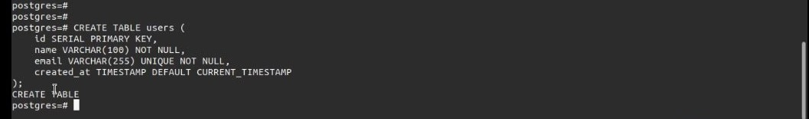

# How to Setup PostgreSQL Playground in Daytona

## Introduction

This guide will walk you through on how to set up PostgresQL database playground in a Daytona workspace which is a development environment management platform. In a world where companies what to increase development productivity and individual developers want to start coding right away, Daytona is the best option.

### TL;DR

- **Bullet Point Summary**: *[Summarize the key points in a few bullet points for quick reference.]*

## Prerequisities

In order to follow this guide, you’ll need the software installations below on your PC or Mac.
- An IDE like VS Code, link to install it [here](https://code.visualstudio.com/download)
- Docker, link to it [here](https://docs.docker.com/engine/install/)
- Daytona, link to install it [here](https://github.com/daytonaio/daytona#installing-daytona)

## Overview of PostgreSQL

PostgreSQL or also known as Postgres is the world’s most advanced open source relational database system that has been in use by the developer community for over 35 years with so much great love shown to it because of its strong reputation for reliability, feature robustness and performance.

PostgreSQL has some much benefits on to why one should use it some are highlighted below:
- Open Source and Free: It’s a completely free software to install and use and also its source code is freely available online to see how it’s implemented under the hood. You don’t have to spend more to purchase license which might be very expensive
- Cross-Platform Compatibility: PostgreSQL can be run in most of the major OSes in the world. It can run on most Linux distros, Windows, and MacOS making it to be a number one choice.
- In-Exhaustive LIst of Features: Some of the features are Data Types, Data Integrity and Security. Lots of features can be found in the PostgreSQL website here with more being added in every major release.

## Overview of Daytona

Daytona is a self hosted and secure open source development environment manager that uses configurations from a project's repository to build workspace and provision the workspace in a platform of your choice. It's innovative and incredibly easy for all levels including beginners to get started with it.

Daytona provides some interesting features which make it one the best products in the area of simplifying development environments for both enterprise and individual levels.

Some of those features it boast of include:
- It has support for popular IDE like VS Code and JetBrains
- It connect with repository providers like GitHub, GitLab, BitBucket and Gitea
- It's very secure. It uses VPN connection to make that possible
- It has reverse proxy support

For more info about Daytona and it's features, check [here](https://daytona.io)

## Creating a DevContainer for PostgreSQL

A development container (or a devcontainer for short) allows you to use a docker container as a full-featured development environment. It can be configured to meet your development environment needs. It could include tools and runtimes like npm, git, maven, Golang compiler and others too.

For this guide we're going to create a devcontainer for PostgreSQL using a config file. The file is always named `devcontainer.json` with code syntax in it following the correct config specifications. Its a norm to keep the file in an hidden directory call `.devcontainer`

Let's get started. I will use the terminal to create mine in my linux PC but the commands should work fine on Mac terminal or the Windows powershell.

- ### **Step 1**: Create a Directory

  Create a directory with any name of your choice and go into it. I use the name `postgresql-playground-in-daytona` and move into the directory.

  ```bash
  mkdir postgresql-playground-in-daytona && cd postgresql-playground-in-daytona
  ```

- ### **Step 2**: Create the `.devcontainer` directory

  Create a hidden directory called `.devcontainer` and enter it. This is where our devcontainer config file will be stored.

  ```bash
  mkdir .devcontainer && cd .devcontainer
  ```

- ### **Step 3**: Create `devcontainer.json` file

  Now, create a file called `devcontainer.json` and paste the following code into it and then save it.

  ```json
  {
      "name": "PostgreSQL Dev Container Playground",
      "dockerComposeFile": "docker-compose.yml",
      "workspaceFolder": "/workspaces/${localWorkspaceFolderBasename}",
      "service": "postgres",
      "forwardPorts": [5432],
      "customizations": {
        "vscode": {
            "extensions": ["streetsidesoftware.code-spell-checker"]
        }
      },
      "postCreateCommand": "psql -U ${POSTGRES_USER} -c 'SELECT 1;'"
  }
  ```

  The `devcontainer.json` code content defines a configuration for a PostgreSQL development container environment using Docker Compose

  - **`name`:** Set the name of the development container environment to ``PostgreSQL Dev Container Playground``.
  - **`dockerComposeFile`:** Specifies the Docker Compose file (`docker-compose.yml`) that defines the services and their configurations.
  - **`workspaceFolder`:** Determine the location of the workspace folder within the container, using the base name of the local workspace folder.
  - **`service`:** Indicate that the development container will primarily interact with the ``postgres`` service defined in the Docker Compose file.
  - **`forwardPorts`:** Forwards the container's port ``5432`` to the host machine, allowing local access to the PostgreSQL database.
  - **`customizations`:** Defines additional customizations for the development environment:
      - **`vscode`:** Specifies customizations for Visual Studio Code:
          - **`extensions`:** Installs the ``streetsidesoftware.code-spell-checker`` extension to enable spell checking within the code editor.
  - **`postCreateCommand`:** Executes the specified command after the development container is created:
      - `psql -U ${POSTGRES_USER} -c 'SELECT 1;'`: Connects to the PostgreSQL database using the environment variable `POSTGRES_USER` and executes a simple query to verify the database connection.

- ### **Step 4**: Create `docker-compose.yml` file

  While still in the same directory, create another file named `docker-compose.yml` and paste the code below into it. Save it

  ```yml
  services:
   postgres:
      container_name: postgres
      image: postgres:latest
      volumes:
        - postgres-data:/var/lib/postgresql/data
      env_file:
        - .env
      ports:
        - "5432:5432"
      restart: unless-stopped

  volumes:
    postgres-data
  ```

  The `docker-compose.yml` code content defines a service named `postgres` that runs a PostgreSQL database container. Here is the breakdown:

  - **container_name:** Set the name of the container to `postgres`.
  - **image:** Specifies the PostgreSQL image to use, which is the latest version here.
  - **volumes:** Mounts a local directory named `postgres-data` to the container's data directory.
  - **env_file:** Loads environment variables from the `.env` file.
  - **ports:** Exposes port `5432` on the host machine to port `5432` inside the container.
  - **restart:** Restarts the container unless it's manually stopped.

  The `volumes` section at the end defines the local directory `postgres-data` for data persistence.


- ### **Step 5**: Create `.env` file

  In the same directory, create the last file named `.env` and paste the environment variables below into the new file being created by you. Save the file.

  ```
  POSTGRES_USER=postgres
  POSTGRES_PASSWORD=postgres
  ```

  **POSTGRES_USER**: Set the database username to `postgres`

  **POSTGRES_PASSWORD**: Set the database password to `postgres`

  Your directory structure should look like mine below if you follow along using the same directory name as I did earlier.

  ```
  postgresql-playground-in-daytona/
  ├── .devcontainer/
  │   ├── .env
  │   ├── docker-compose.yml
  │   └── devcontainer.json
  ```

- ### **Step 6:** Go back to the top level

  Paste the code below to go back to the top level of the directory you created

  ```bash
  cd ..
  ls -al
  ```

  and you should see this output in the terminal:
  
  ```
  ├── .
  ├── ..
  ├── .devcontainer
  ├── .git
  ```

- ### **Step 7:** Initialize and make commit

  Paste the code below to initialize git and commit the changes you made to your directory.

  ```bash
  git init
  git add .
  git commit -m "inital commit"
  ```

- ### **Step 8:** Create a repository in GitHub

  Create a repository without README, LICENSE or .gitignore files from GitHub web using the name of the directory you created. Mine is `postgresql-playground-in-daytona`.

  You should see a code block similar to this from your GitHub web. Copy it and paste in your terminal or Windows Powershell for Windows PC users(Git must be installed in it)

  ```bash
  git remote add origin https://github.com/YOUR-GITHUB-USERNAME/YOUR-DIRECTORY-NAME.git
  git branch -M main
  git push -u origin main
  ```

  After you run the code, you'll be prompted to input your GitHub username and password.

  You can find the GitHub repository where my devcontainer config is located which I used for this guide [here](https://github.com/c0d33ngr/postgresql-playground-in-daytona). I later added a README and LICENSE files which wasn't neccessary to follow along with this guide.

Now, we have successfully created a GitHub repository needed to spin up a devcontainer for PostgreSQL using Daytona.

## Setting Up PostgreSQL in Daytona

Before starting this section be sure `daytona` is installed in your PC

- ### Step 1

  Run the code below to setup `daytona` server

  ```bash
  daytona server
  ```

  Your output should be similar to the screenshot below

  

  Choose yes and should see similar output in the screenshot below

  
  
- ### Step 2

  Run the command below to add your git provider if you haven't setup one

  ```bash
  daytona git provider add
  ```

  Follow the prompts after running the command to setup your provider. In our case it's GitHub

- ### Step 3

  Run this command in terminal to add your preferred IDE.

  ```bash
  daytona ide
  ```

- ### Step 4

  Modified the terminal command below to create the dev environment of the repository you created in GitHub and follow the prompts after you run it. Don't forget to use the correct GitHub URL, in my case it's `https://github.com/c0d33ngr/postgresql-playground-in-daytona.git`

  ```bash
  daytona create https://github.com/YOUR-USERNAME/YOUR-DIRECTORY-NAME.git
  ```

- ### Step 5

  Run this command to open in the IDE you selected when setting up your preferred one

  ```bash
  daytona code
  ```

Now, your preferred IDE should be open and you'll be prompted to open in it in a devcontainer. Click it and you should see PostgreSQL prompt in your IDE terminal.

Follow the set of instructions in the next section to interact with the PostgreSQL development environment.

## Performing Some Basic PostgreSQL CRUD Operations in the Workspace

- ### Login to PostgreSQL using `psql` and username `postgres`

  ```bash
  psql -U postgres
  ```

  Your output should look this

  
  
- ### Create a Table
  **Example**: The SQL code below creates a table named `users`.

  ```sql
  CREATE TABLE users (
      id SERIAL PRIMARY KEY,
      name VARCHAR(100) NOT NULL,
      email VARCHAR(255) UNIQUE NOT NULL,
      created_at TIMESTAMP DEFAULT CURRENT_TIMESTAMP
  );
  ```

  Your output should display similar one as mine

  


- ### Insert a Record
  **Example**: The SQL codes insert different records into the table `users` that was created by us above

  ```sql
  INSERT INTO users (name, email) VALUES ('Mark Zuckerberg', 'zuck@fb.com');
  INSERT INTO users (name, email) VALUES ('Elon Musk', 'info@telsa.com');
  INSERT INTO users (name, email) VALUES ('Bill Gates', 'bill.gates@gatesfoundation.org');
  INSERT INTO users (name, email) VALUES ('Jack Dorsey', 'jack.dorsey@gmail.com');
  ```

  You should have similar screen like this below

  

- ### Read Data from Table
  **Example**: This SQL query selects all records in the table `users` and return them.

  ```sql
  SELECT * FROM users WHERE name = 'Mark Zuckerberg';
  ```

  Your output should display something similar

  

- ### Update a Table Record
  **Example**: This SQL query updates the table `users` record where `id` is 1.

  ```sql
  UPDATE users SET email = 'johndoe@email.com' WHERE id = 2;
  ```

  You output should be similar

  

- ### Delete a Table Record
  **Example**: This SQL code deletes the record where `id` is 2.

  ```sql
  DELETE FROM users WHERE id = 2;
  ```

  You should have similar output

  

  Run the SQL code below to check the table

  ```sql
  SELECT * FROM users;
  ```

  You should now see the deleted record is gone

  

## Conclusion

By following the steps above you should have learned how to set up a working PostgreSQL playground running on Daytona for you to start building or practice with PostgreSQL. From here, you could continue to explore the opportunities of using Daytona as your dev environment that suits your needs.

## References

*[Daytona](https://daytona.io)*

*[PostgreSQL](https://postgresq.ort)*

*[DevContainer](https://containers.dev)*

<!-- Note on Definitions -->
<!-- Throughout this guide, link relevant terms to their definitions using inline Markdown links. -->
<!-- Format: [term](/definitions/term.md) -->
<!-- If a definition doesn't exist, create it in the definitions directory and link to it. -->
