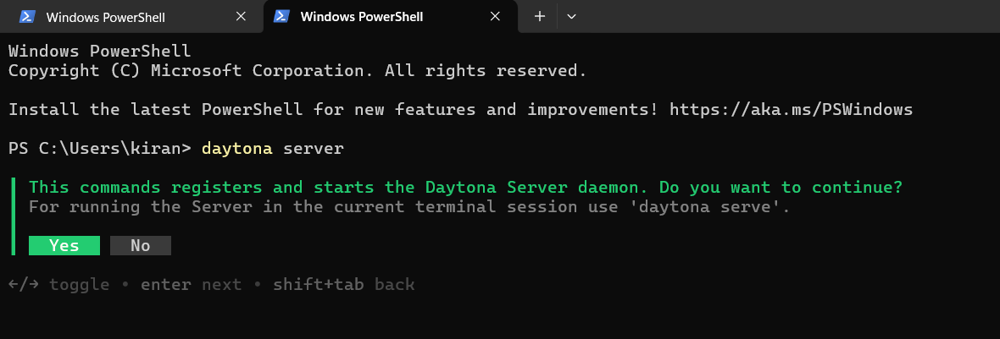
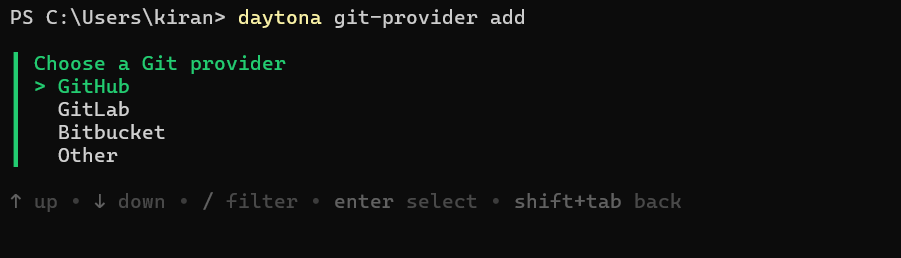
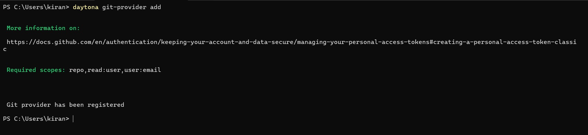
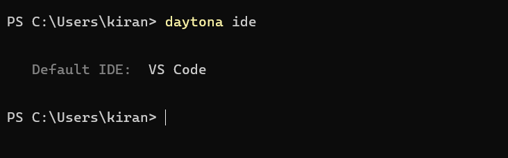
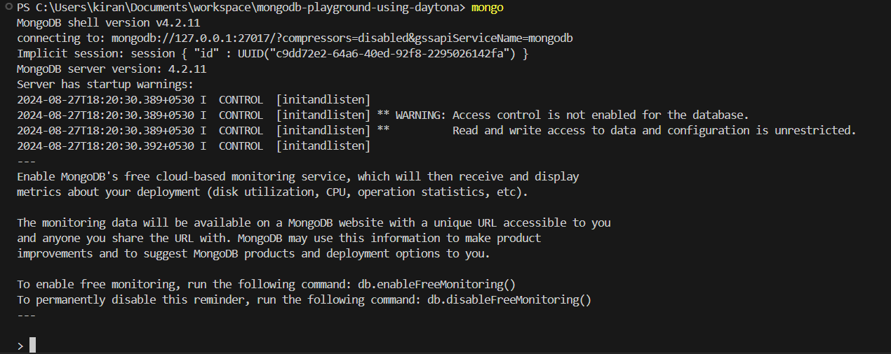
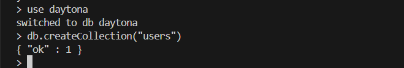
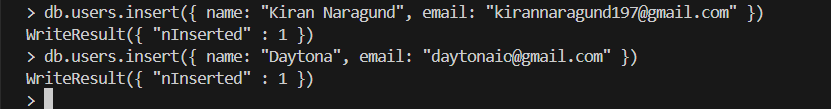
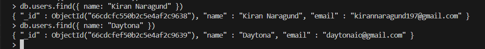
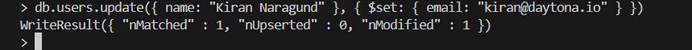
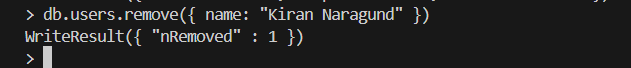

# How to Setup a MongoDB Playground in Daytona

## Introduction
This guide will walk you through setting up a MongoDB playground in a Daytona workspace, a powerful development environment management platform. Whether you're a backend developer or someone new to databases, Daytona makes it easy to start working with MongoDB right away.

### TL;DR
- Overview of what you'll need to get started
- Introduction to MongoDB and Daytona
- How to create a MongoDB devcontainer file
- Setting up the MongoDB playground in Daytona
- Hands-on practice with MongoDB commands
- Conclusion

## Prerequisites
To follow this guide, you'll need to have the following software installed on your machine:

- An IDE (like [VS Code](https://code.visualstudio.com/))
- Docker (download from [here](https://www.docker.com/))
- Daytona (install it from [here](https://www.daytona.io/docs/installation/installation/))

## Overview of MongoDB
MongoDB is a popular open-source NoSQL database known for its flexibility, scalability, and ease of use. It's widely used for building modern applications, allowing developers to store and query data in a JSON-like format.

**Key Benefits of MongoDB:**

- **Flexible Schema:** Unlike traditional relational databases, MongoDB allows for a flexible, schema-less design.
- **Scalability:** MongoDB is designed to scale out horizontally, making it ideal for large-scale applications.
- **Community and Support:** With a large community and robust documentation, MongoDB is well-supported by developers worldwide.

> [!Note]
> For more info about MongoDB and it's features, check [here](https://www.mongodb.com/)

## Overview of Daytona
Daytona is an open-source development environment manager that uses configuration files from a project's repository to build and provision workspaces. It simplifies the process of setting up consistent development environments across teams or for individual developers.

**Key Features of Daytona:**

- **IDE Support:** Works seamlessly with popular IDEs like VS Code and JetBrains.
- **Repository Integration:** Supports GitHub, GitLab, BitBucket, and Gitea.
- **Security:** Daytona ensures secure development environments with VPN support.
- **Reverse Proxy:** Simplifies the setup of development environments behind proxies.

> [!Note]
> For more info about Daytona and it's features, check [here](https://daytona.io)

## Overview of DevContainers

DevContainers, short for Development Containers, are a way to configure portable and reproducible development environments using Docker containers. Dev containers are isolated, lightweight environments that allow developers to work inside a containerized version of a build environment. 

**Key Features of DevContainers:**

- **Pre-configured Build Environments**: Dev containers come with a base image that has all the software, tools, and dependencies pre-installed, so you can get started coding right away.
- **Isolated Environments**: Each dev container has its own isolated filesystem, networking, memory, and CPU, so there are no conflicts with other projects or software on your local machine.
- **Reproducible Builds**: Dev containers provide the exact same environment every time they're launched, ensuring consistent build results. No more "it works on my machine!" issues.
- **Less Setup Time**: Starting a new project with dev containers means you can skip the lengthy setup and configuration process. Just open your project in the container and everything is ready to go.
- **Flexibility**: You can choose a base image with the software and tools you want or build your own custom base image, meeting your specific needs.

> [!Note]
> For more info about Daytona and it's features, check [here](https://containers.dev/)

## Creating a DevContainer configuration for MongoDB
Now, we're going to create a devcontainer for MongoDB using a **devcontainer.json** configuration file.

By defining a `devcontainer.json` file in your project, you can specify the exact environment configuration, including operating system, tools, and dependencies needed for development. This ensures that every developer on your team can work in the same environment, regardless of their local machine setup.

Here is the step-by-step guide:

- ### **Step 1: Create a new Directory**
 Create a directory with any name of your choice and move into the directory. I use the name `mongodb-playground-using-daytona`.

  ```bash
  mkdir mongodb-playground-using-daytona && cd mongodb-playground-using-daytona
  ```

- ### **Step 2: Create the .devcontainer Directory**
 Create a hidden directory called `.devcontainer` and enter it. This is where our devcontainer config file will be stored.

  ```bash
  mkdir .devcontainer && cd .devcontainer
  ```

- ### **Step 3: Create devcontainer.json file**

  Now, create a file called `devcontainer.json` and paste the following code into it and then save it.

  ```json
  {
    "name": "MongoDB Dev Container Playground",
    "dockerComposeFile": "docker-compose.yml",
    "service": "mongodb",
    "forwardPorts": [27017],
    "customizations": {
      "vscode": {
          "extensions": ["mongodb.mongodb-vscode"]
      }
    },
    "postCreateCommand": "mongo --eval 'db.runCommand({ connectionStatus: 1 })'"
  }
  ```

  Let's take a deep look into this devcontainer.json file for your better understanding

  - **name:** Sets the name of the development container environment.
  - **dockerComposeFile:** Specifies the Docker Compose file to be used.
  - **service:** Points to the MongoDB service defined in the Docker Compose file.
  - **forwardPorts:** Forwards the container’s port 27017 to the host machine.
  - **customizations:** Adds the MongoDB extension for VS Code.
  - **postCreateCommand:** Runs a MongoDB command to verify the connection.

- ### **Step 4: Create docker-compose.yml file**

  Create another file named `docker-compose.yml` in the same directory and paste the below code into it. Save it

  ```yml
  services:
  mongodb:
    container_name: mongodb
    image: mongo:latest
    volumes:
      - mongo-data:/data/db
    ports:
      - "27017:27017"
    restart: unless-stopped

  volumes:
    mongo-data:
  ```

  The `docker-compose.yml` code content defines a service named `mongodb` that runs a MongoDB database container. Here is the breakdown:

  - **container_name:** Set the name of the container to `mongodb`.
  - **image:** Specifies the MongoDB image to use, which is the latest version here.
  - **volumes:** Mounts a local directory named `mongo-data` to the container's data directory.
  - **ports:** Exposes port `27017` on the host machine to port `27017` inside the container.
  - **restart:** Restarts the container unless it's manually stopped.

  The `volumes` section at the end defines the local directory `mongodb-data` for data persistence.

- ### **Step 5: Initialize and make commit**

  Now initialize git and commit all the changes you made to your directory.

  ```bash
  git init
  git add .
  git commit -m "inital commit"
  ```

- ### **Step 6: Create a repository in GitHub**

  Create a new repository in GitHub. I created `mongodb-playground-using-daytona` repository.

  Now push your directory to this repository by using the below commands

  ```bash
  git remote add origin https://github.com/YOUR-GITHUB-USERNAME/YOUR-DIRECTORY-NAME.git
  git branch -M main
  git push -u origin main
  ```

  After you run the code, you'll be prompted to input your GitHub username and password.

  You can checkout my repository [here](https://github.com/Kiran1689/mongodb-playground-using-daytona).

Now, we have successfully created a DevContainer configuration file for MongoDB and pushed all the files to GitHub.


## Setting up a MongoDB playground in Daytona

Before starting this section, make sure that `daytona` is installed in your PC.

- ### Step 1

  Run the below command to setup `daytona` server

  ```bash
  daytona server
  ```

  Your output should be similar to the screenshot below

  

  Choose **yes** and it will start the server.
  
- ### Step 2

  Run the below command to add your git provider if you haven't setup one

  ```bash
  daytona git-provider add
  ```
  Your output should be similar to the screenshot below

  

  Follow the prompts after running the command to setup your provider. In our case it's GitHub

  

- ### Step 3

  Run this command in terminal to add your preferred IDE.

  ```bash
  daytona ide
  ```

  Your output should be similar to the screenshot below, I've selected VS Code

  

- ### Step 4

  Modify and run the below command to create the dev environment of the repository you created in GitHub and follow the prompts after you run it. Don't forget to use the correct GitHub URL, in my case it's `https://github.com/Kiran1689/mongodb-playground-using-daytona.git`

  ```bash
  daytona create https://github.com/YOUR-USERNAME/YOUR-DIRECTORY-NAME.git
  ```

- ### Step 5

  Run this command to open in the IDE you selected when setting up your preferred one

  ```bash
  daytona code
  ```

Now, your preferred IDE should be open and you'll be prompted to open in it in a devcontainer. Click it.

Follow the set of instructions in the next section to interact with the MongoDB development environment.

## Basic MongoDB operations and queries within the playground

- ### Start mongoDB
  Start the mongo shell using the below command

  ```bash
  mongo
  ```

  Your output should look like this

  

- ## Create a Database and Collection:
  create a newdatabase, I named it as `daytona` and collection `users`

  ```javascript
  use daytona
  db.createCollection("users")
  ```
  Your output:

  

- ## Insert a Document:
  Insert documents to users collection
  ```javascript
  db.users.insert({ name: "Kiran Naragund", email: "kirannaragund197@gmail.com" })
  ```
  Your output:
  
  

- ## Read Documents:
  Read the inserted documents by running
  ```javascript
  db.users.find({ name: "Kiran Naragund" })
  ```
  Your output:

  
  
- ## Update a Document:
  Update any document by running
  ```javascript
  db.users.update({ name: "Kiran Naragund" }, { $set: { email: "kiran@daytona.io" } })
  ```
  Your output:

  
  
- ## Delete a Document:
  Delete any document by running
  
  ```javascript
  db.users.remove({ name: "Kiran Naragund" })
  ```
  Your output:

  

## Conclusion
By following this guide, you’ve set up a MongoDB playground in Daytona and learned how to perform basic CRUD operations. Explore further to see how Daytona can streamline your development process.

## References
- [MongoDB Documentation](https://docs.mongodb.com/)

- [Daytona Documentation](https://daytona.io/docs)

- [DevContainer Specification](https://containers.dev/)
  
