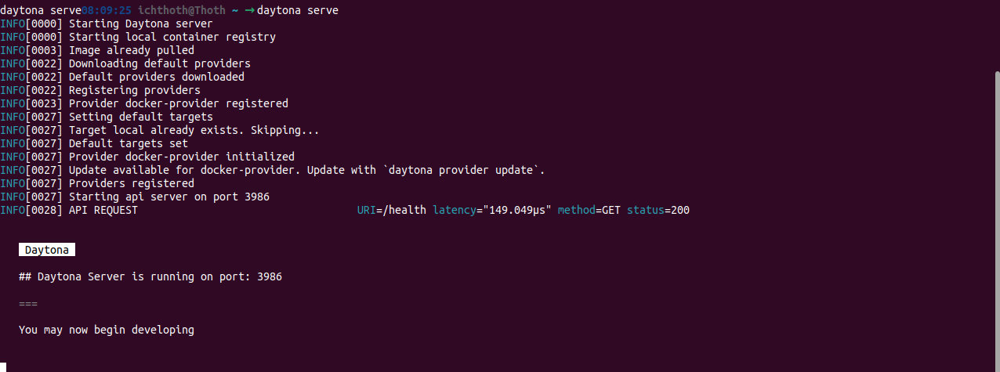
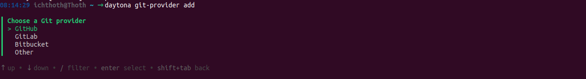
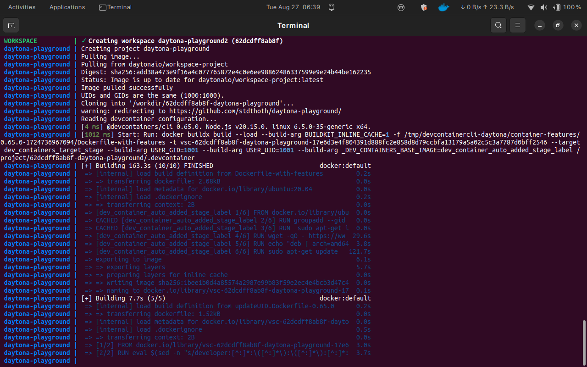
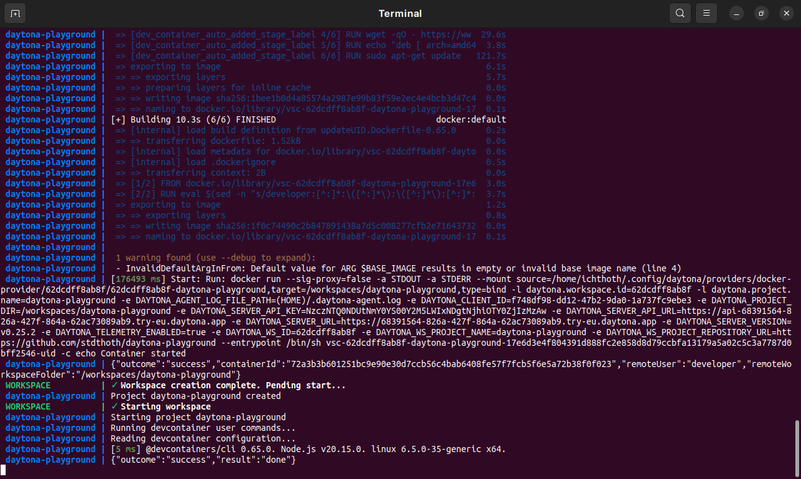
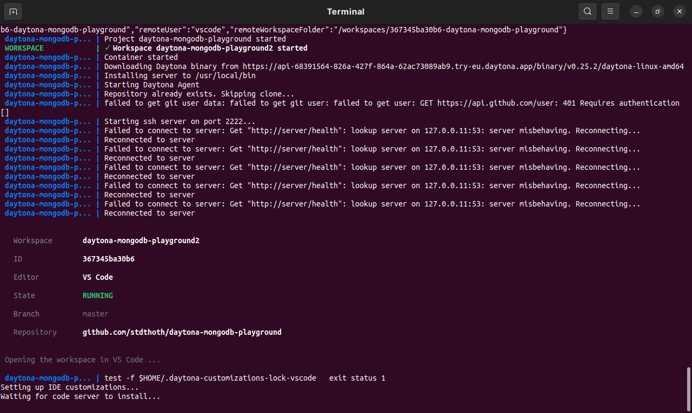
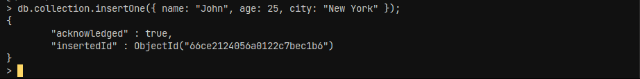
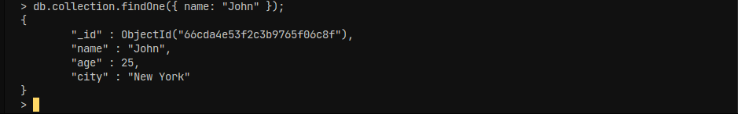
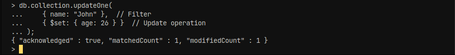
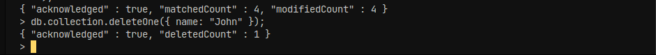
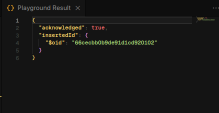

# Setting Up a MongoDB Playground with Daytona

# Introduction

Developer playgrounds are isolated environments where developers can safely
experiment, test code, and explore new technologies without impacting their main
projects or production environments. They offer a controlled space for
prototyping, learning, and debugging. While creating a basic developer
playground is usually straightforward, the complexity increases with the level
of customization and specific requirements. However, with the right tools and
platforms, even more complex playgrounds can be made relatively easy to set up
and manage. This is where Daytona shines.

Daytona's Workspaces are isolated, meaning developers can experiment freely
without the risk of affecting their main projects or production environments.
This isolation is crucial for safe testing and debugging. Daytona. simplifies
the management of development environments, making it easy to spin up, tear
down, or share playgrounds. This convenience enhances productivity and
collaboration among teams.

In this guide, you will find out how to build a playground using Daytona to set
up a MongoDB environment. We will walk you through the steps to create a
reproducible and isolated development workspace, configure it with MongoDB, and
customize it to suit your project needs. Before getting started, make sure you
have [Docker](https://docs.docker.com/get-started/get-docker/) installed, an IDE
like [VS Code](https://code.visualstudio.com/download) or
[JetBrains](https://www.jetbrains.com/idea/download/), and
[Daytona](https://www.daytona.io/docs/installation/installation/) set up on your
system. By the end of this guide, you'll have a fully functional MongoDB
playground ready for testing, experimentation, and development.

## TL;DR

- Developer playgrounds are isolated environments where developers can safely
  experiment, test code, and explore new technologies without impacting their
  main projects.
- Developer playgrounds boost software development by providing a risk-free
  space to test, learn, and innovate without affecting main projects.
- Daytona simplifies setting up developer playgrounds by providing reproducible,
  isolated environments with easy management and flexible configuration options.
- Prerequisites to follow this guide: Docker, IDE(VS Code or JetBrains) and
  Daytona.

You can find the Github repository where my devcontainer configuration files
which i used for this guide
[here](https://github.com/stdthoth/daytona-mongodb-playground).

## Overview of MongoDB

MongoDB is a popular NoSQL database that is designed for storing and retrieving
large amounts of unstructured or semi-structured data. Unlike traditional
relational databases (SQL databases) that store data in tables with fixed
schemas (rows and columns), MongoDB stores data in a more flexible, JSON-like
format called BSON (Binary JSON). You can find out more about MongoDB and its
core features [here](https://docs.mongodb.com/)

## Overview of Daytona

Daytona is a platform that simplifies the development environment setup by
offering dev environments for software developers. It enables users to create
and share fully configured development environments, allowing for faster
onboarding, collaboration, and consistent setups across teams.Daytona enables
you to manage and deploy Workspaces, which are reproducible development
environments built on standard OCI containers, and it includes native support
for the Dev Container standard. The architecture of Daytona is designed to
potentially support other configuration standards in the future, such as
Dockerfiles, Docker Compose, Nix, and Devfile.

**Features of Daytona**

- **Pre-configured Environments**: You can create environments with all
  dependencies, tools, and configurations pre-installed, so developers can start
  coding immediately without having to spend time configuring their setups.
- **Collaborative Workspaces**:The platform enables team collaboration by
  allowing multiple developers to work on the same environment. This can be
  particularly useful for pair programming, code reviews, or troubleshooting.
- **Containerized Environments**:Each development environment can be
  containerized, ensuring that the setup is consistent, reproducible, and
  isolated from other environments. This helps avoid the common "works on my
  machine" problem.
- **Reverse Proxy Support**:Daytona integrates a reverse proxy allowing you to
  access a workspace on a public or restricted network.

For more information about Daytona check out its [docs](https://daytona.io/docs)

## Setup a Daytona configuration for MongoDB

Here, you're going to create a dev container using a `devcontainer.json` file, a
`Dockerfile` and a `docker-compose.yml` file. One of Daytona's remarkable
qualities is the ability to a build a project image according to the dev
container standard. You can find out more about Daytona Builders
[here](https://www.daytona.io/docs/usage/builders/)

- **Step 1**: Create a new directory

  You will create a file directory with any name and move inside of it.

  ```bash
  mkdir daytona-mongodb-playground && cd daytona-mongodb-playground
  ```

- **Step 2**: Create a .devcontainer directory

  This is where your devcontainer.json and dockerfiles will live

  ```bash
  mkdir .devcontainer && cd .devcontainer
  ```

- **Step 3**: Create a `devcontainer.json` file

  You are going to create a `devcontainer.json` file with the following code.
  This is the configuration file for the dev environment specifying settings and
  dependencies.

  ```json
  {
  "name": "mongo Dev Container Playground",
  "dockerComposeFile": "docker-compose.yml",
  ```

  "service": "mongodb_playground", "workspaceFolder":
    "/workspaces/${localWorkspaceFolderBasename}", "forwardPorts": [27017],
    "customizations": { "vscode": { // Add the IDs of extensions you want installed
    when the container is created. "extensions": [ "mongodb.mongodb-vscode" ] } } }

    ```
    Let's breakdown the `devcontainer.json` file

- **name**: Specifies the name of the development environment.
- **dockerComposeFile**: points to the `docker-compose.yml` file we are going to
  use
- **service**: Refers to the service name in the `docker-compose.yml` file that
  represents the MongoDB container or environment to be used.
- **workspaceFolder**:Maps the local workspace folder (where the code is stored)
  to the /`workspaces/` directory inside the container. The variable
  `${localWorkspaceFolderBasename}` automatically resolves to the name of the
  local workspace folder.
- **forwardPorts**: Exposes MongoDB's default port (`27017`) so that it is
  accessible from the host system or other containers for interaction with the
  MongoDB service.
- **customizations**:Allows customization of the development environment,
  specifically for VS Code.
- **vscode**: Automatically installs the MongoDB extension for VS Code, enabling
  MongoDB-related features (e.g., interacting with MongoDB directly from VS
  Code). Declares a persistent volume for storing MongoDB data.
- **Step 4**: Create a `Dockerfile`

  You will create a `Dockerfile` in the same directory

  ```dockerfile
  FROM mcr.microsoft.com/devcontainers/base:focal
  RUN  sudo apt-get install -y gnupg wget curl
  RUN wget -qO - https://www.mongodb.org/static/pgp/server-4.4.asc | sudo apt-key add -
  RUN echo "deb [ arch=amd64,arm64 ] https://repo.mongodb.org/apt/ubuntu focal/mongodb-org/4.4 multiverse" | sudo tee /etc/apt/sources.list.d/mongodb-org-4.4.list
  RUN sudo apt-gUpdates the package list and installs MongoDB.et update && export DEBIAN_FRONTEND=noninteractive \
  && sudo apt-get install -y mongodb-org
  ```

  Let's breakdown this Dockerfile for you

  - `FROM mcr.microsoft.com/devcontainers/base:focal`:Uses the Microsoft
    DevContainers base image based on Ubuntu 20.04 LTS (Focal Fossa). This
    provides a standard environment for development containers.
  - `RUN sudo apt-get install -y gnupg wget curl`:These utilities are necessary
    for managing GPG keys and downloading files. `gnupg` is used for key
    management, while `wget` and `curl` are used for downloading files.
  - `RUN wget -qO - https://www.mongodb.org/static/pgp/server-4.4.asc | sudo apt-key add -`:
    Ensures that the packages from the MongoDB repository can be verified and
    trusted. The `-qO -` option makes `wget` output the file to stdout, which is
    then piped to `apt-key add` for key addition.
  - `RUN echo "deb [ arch=amd64,arm64 ] https://repo.mongodb.org/apt/ubuntu focal/mongodb-org/4.4 multiverse" | sudo tee /etc/apt/sources.list.d/mongodb-org-4.4.list`:
    Configures the system to use MongoDB’s official repository for version 4.4.
    This allows `apt-get` to retrieve MongoDB packages for installation.
  - `RUN sudo apt-get update && export DEBIAN_FRONTEND=noninteractive && sudo apt-get install -y mongodb-org`:
    Updates the package list and installs MongoDB.

- **Step 5** Create a docker-compose.yml file:

  You are going to create `docker-compose.yml` file in the same directory

  ```yml
  version: '3.8'

  services:
    mongodb_playground:
      build:
        context: .
        dockerfile: Dockerfile
        volumes: -../..:/workspaces:cached
        network_mode: service:db
        command: sleep infinity

    db:
      image: mongo:4.4
      restart: unless-stopped
      ports:
        - '27017:27017'
      volumes:
        - mongodb-data:/data/db
  volumes:
    mongodb-data:
  ```

  Let's breakdown the ``docker-compose.yml` file for you

  - **version**: Ensures compatibility with Docker Compose features and syntax
    defined in version 3.8.
  - **services**: Defines the containers (services) that will be run as part of
    this Compose setup.
  - **mongodb_playground**: Defines a service named `mongodb_playground`.
  - **context**: Sets the build context to the current directory.
  - **dockerfile**: Specifies the Dockerfile to use for building this service.
  - **volumes: ../..:/workspaces:cached**: Mounts a directory from the host (two
    levels up to /workspaces in the container. The cached option optimizes
    performance by indicating that changes in the host are less likely to affect
    the container.

  - **network_mode: service:db**: Allows mongodb_playground to communicate with
    the db container using the same network. This is useful for sharing network
    settings between containers.
  - **command: sleep infinity**: Keeps the container running indefinitely,
    preventing it from stopping after its initial command finishes.
  - **db**: Defines a service named `db`.
  - **image: mongo:4.4**:Uses the official MongoDB image version 4.4.
  - **restart: unless-stopped**: Restarts the container unless it is explicitly
    stopped by the user. This helps ensure the MongoDB service remains
    available.
  - **ports**: Exposes MongoDB’s default port for external access. This makes
    MongoDB accessible from the host machine.
  - **volumes**:

    - `mongodb-data:/data/db`: Mounts a named volume `mongodb-data` to
      /`data/db` in the container.

  - **volumes**: This volume is used by the db service to store its database
    files.

- **Step 6** Initialize,Commmit and Create a GitHub repository: You will
  initialize and commit the code in your current directory

  ```bash
  git init
  git add .
  git commit -m "inital commit"
  ```

  After commiting your code you will push it to a remote repository of your
  choice.

  ```bash
  git remote add origin https://github.com/YOUR-GITHUB-USERNAME/YOUR-DIRECTORY-NAME.git
  git branch -M main
  git push -u origin main
  ```

## Creating the MongoDB playground in Daytona

Here you are going to use Daytona to build the playground using Github as a
Provider and open a workspace in VS Code. You should ensure `daytona` is
installed on you machine before proceeding.

- **Step 1** Start the Daytona Server daemon :

  Execute the command provided below to start the `daytona` server daemon. when
  prompted to start the server in the current terminal session click `yes`

  ```bash
  daytona server
  ```

  Your output should look like the image below

  
  the container.

- **Step 2** Setup your Git Provider :

  Daytona integrates with your preferred Git provider, streamlining your
  workflow by allowing direct access to repositories, and simplifying workspace
  creation from existing projects. Execute the command provided below to add
  your git provider. Github is one of the most popular developer tools. Daytona
  also has support for other git providers like Bitbucker and Gitlab. You can
  learn more about Daytona Providers [here]()

  ```bash
  daytona git-provider add
  ```

  Your output should be similar to the image below

  

  Select GitHub and provide your personal access token.

- **Step 3** Choose your preferred IDE :

  Run this command in terminal to choose your
  [IDE](https://www.daytona.io/docs/usage/ide/).

  ```bash
  daytona ide
  ```

- **Step 4** Create a Daytona Workspace :

  Substitute the `USERNAME/REPO-NAME` from the code below with the Github
  username and the repository where the devcontainer is stored.

  ```bash
  daytona create https://github.com/USERNAME/REPONAME
  ```

  Ideally but optional you should add the `--code` flag at the end. This will
  automatically open your preferred editor after building the devcontainer

  ```bash
  daytona create https://github.com/USERNAME/REPONAME --code
  ```

  Your output before your IDE opens should be similar to these images

  

  

  

# Interacting with the MongoDB playground using Mongo Shell

Your Preferred IDE should have opened up, you will be instructed to open a
Remote SSH connection.You should see that your `devcontainer.json`, `Dockerfile`
and `docker-compose.yml` files have been downloaded.Navigate to your terminal
after creating the connection by clicking `Ctrl + Shift +` ` . In the terminal
execute the following code to start a mongo shell and carry out operations in .

```bash
 mongo
```

- **Step 1** Create a MongoDB Database:

  ```bash
      use test
  ```

- **Step 2** Create MongoDB Collection:

  ```bash
  db.createCollection("collection")
  ```

- **Step 3**: Create a document into test collection:

  ```bash
  db.collection.insertOne({ name: "John", age: 25, city: "New York" });
  ```

  Your output should look like the image below

  

- **Step 4**: Read (Query) a document from the collection:

  ```bash
  db.collection.findOne({ name: "John" })
  ```

  Your output should look like the image below

  

- **Step 5**: Update a document:

  ```bash
  db.collection.updateOne(
  { name: "John" },  // Filter
  { $set: { age: 26 } }  // Update operation
  );
  ```

  Your output should look like the image below

  

- **Step 6**: Delete the Collection

  ```bash
  db.collection.deleteOne({ name: "John" });
  ```

  Your output should look like the image below

  

## Using the MongoDB playground extension (Optional)

Alternatively you can use the official MongoDB extensions playground since you
provided `"mongodb.mongodb-vscode"` as a extension in the `devcontainer.json`
file.

- **Step 1** Create a connection:

  Click on the **Connect to MongoDB** in the MongoDB view, then enter the
  connection string below

  ```bash
  mongodb://localhost:27017
  ```

- **Step 2** Connect to Playground:

  Connect to the MongoDB playground, which is a built-in interactive environment
  for running MongoDB queries. Navigate to the MongoDB extension and click on
  the **Create MongoDB Playground**.

- **Step 3** Run Queries : Inside the playground you can write queries just like
  you did in the MongoDB Shell. For example

  ```javascript
  use('test');
  db.collection.insertOne({ name: 'Eliza', age: 40 });
  ```

  You should get the same output below

  

## Common Issues and Troubleshooting

**Connection Refused on Port 3896**: If you are experiencing this, check what
service is running on that port and close it. Check out how to find and close a
port connection
[here](https://www.cyberciti.biz/faq/unix-linux-check-if-port-is-in-use-command/)

**Cannot Start the Daytona Docker Registry**: If you cant start the Daytona
Docker registry don't panic, just re-run the `daytona create` command and it
should run as expected.

**IDE doesn't open after building Workspace** : If your IDE doesnt start
immediately after building the devcontainer, open your terminal and type the
`daytona list` command,select your running workspace and you're good to go.

**Image Compatibilty Issues** : There could be a few issues regarding
compatibility for the base Ubuntu image. You can fix it by opening `Dockerfile`
and changing `FROM mcr.microsoft.com/devcontainers/base:focal` to
`FROM ubuntu:focal`.

**Build Target** : The build target may need to be set to docker manually. You
can set it with `daytona target set`

## Conclusion

In conclusion, by following this guide, you've successfully set up a MongoDB
playground using Daytona. With a reproducible and isolated environment at your
disposal, you can now experiment, test, and develop, knowing your main projects
remain unaffected. This setup not only streamlines your workflow but also allows
you to explore new ideas and technologies.

## References

- [MongoDB Documentation](https://docs.mongodb.com/)

- [Daytona Documentation](https://daytona.io/docs)

- [DevContainer Specification](https://containers.dev/)
