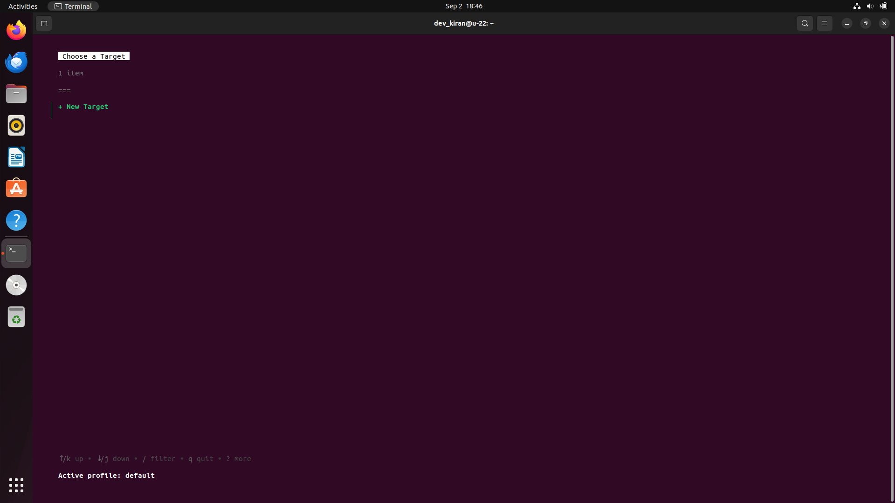
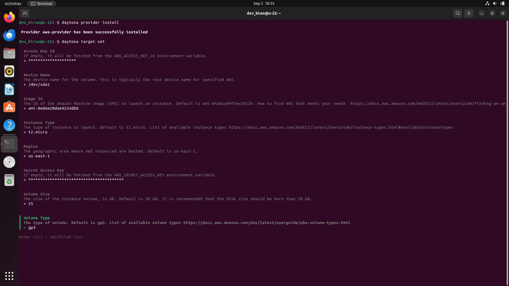

# Setting Up Daytona AWS Provider

# Introduction

The AWS Provider allows Daytona to create and manage workspace projects on
Amazon EC2 instances. The provider integrates Daytona with AWS, enabling you to
manage workspaces in a scalable and flexible cloud environment. To use the AWS
Provider, you need an AWS programmatic access user with AmazonEC2FullAccess
permissions. This policy grants the necessary permissions to manage EC2
instances, which is crucial for Daytona’s workspace project creation and
management.

In this guide, we will walk you through the setup and configuration of the
Daytona AWS Provider, as well as creating an IAM user with the necessary
permissions.

## Prerequisites

To follow along with this guide, you should have:

- A basic understanding of [AWS](../definitions/20240904_definition_aws.md),
  [AWS IAM](../definitions/20240904_definition_aws_iam.md) and
  [EC2 Instances](../definitions/20240904_definition_ec2_instances.md).
- Access to an AWS account with programmatic access and appropriate permissions.
- installed Daytona latest version [install from
  [here](https://www.daytona.io/docs/installation/installation/)]

**Note:** _[In this guide, Daytona v0.29.1 is used]_

## TL;DR

- Create an AWS IAM user with AmazonEC2FullAccess permissions.

- Install and configure the Daytona AWS Provider for managing EC2 workspaces.

- Set up AWS targets, including configuring access keys, instance type, region,
  and more.

- Troubleshooting tips for common issues like invalid AWS credentials, IAM
  permission errors, and EC2 instance launch failures.

## Step 1: Preparations

### Setting Up an AWS IAM User

Before configuring the Daytona AWS Provider, create an IAM user in AWS with
programmatic access and assign the `AmazonEC2FullAccess` permission. This user
will allow Daytona to manage EC2 instances. Follow the below steps to create

- **Step 1.1**: Go to the IAM Management Console.

  

- **Step 1.2**: Click on Users on the left-hand menu and then Create user.

  

- **Step 1.3**: Enter a username of your choice and click Next.

  

- **Step 1.4**: Under Permission options, choose "Attach policies directly".
  Under Permission policies, search and select `AmazonEC2FullAccess`, then click
  Next.

  

- **Step 1.5**: Review the details and click "Create user."

  

You successfully create a user. Now, You need to create ACCESS_KEY and SECRET
for that user.


- **Step 1.6**: Click on the username and Go to Security credentials

  

- **Step 1.7**: Scroll down and click "Create access key."

  

- **Step 1.8**: Copy your credentials or you can download the csv file.

Now, you are ready to setup Daytona AWS Provider.

## Step 2: Main Process

### Step 2.1: Start Daytona Server

Start the daytona server by running the command

```bash
daytona server
```


### Step 2.2: Install the AWS Provider

Run the below command, You will be prompted to choose a provider. Select
`aws-provider` from the list

```bash
daytona provider install
```


### Step 2.3: Set the AWS Target

Run the following command to initiate the target setup process:

```bash
daytona target set
```

#### Step 2.3.1: Select the AWS Provider

You will be prompted to choose a provider. Select aws-provider from the list


#### Step 2.3.2 :Create a New Target

After selecting the AWS provider, choose to create a new target and enter a
unique and descriptive name for your AWS target (e.g., `daytona-aws-target`).



#### Step 2.3.3: Configure AWS target options

You will be prompted to enter several configuration options specific to AWS.
Daytona AWS Provider offers a range of target options that can be customized
according to your requirements. Here’s a detailed overview:

- **Access Key Id**:

  Provide your Access Key Id you created for the user earlier.

  Note: If you left empty, Daytona will fetch it from the AWS_SECRET_ACCESS_KEY
  environment variable.

- **Device Name**:

  The device name for the volume. This is typically the root device name for
  specified AMI, you can either adjust this to your preferred values or press
  `Enter` to accept the default options. Get list of device names
  [here](https://docs.aws.amazon.com/AWSEC2/latest/UserGuide/device_naming.html)

- **Image Id**:

  The ID of the Amazon Machine Image (AMI) to launch an instance. Default is
  ami-04a81a99f5ec58529. Click
  [here](https://docs.aws.amazon.com/AWSEC2/latest/UserGuide/finding-an-ami.html)
  to find AMI that meets your needs.

- **Instance type**:

  The type of instance to launch. Default is t2.micro. Get the list of available
  instance types
  [here](https://docs.aws.amazon.com/AWSEC2/latest/UserGuide/instance-types.html#AvailableInstanceTypes)

- **Region**:

  The geographic area where AWS resources are hosted. Default is us-east-1. Get
  the list of available regions
  [here](https://docs.aws.amazon.com/general/latest/gr/rande.html)

- **Secret Access Key**:

  Paste your Secret Access Key of the IAM user you created earlier. If empty, it
  will be fetched from the AWS_SECRET_ACCESS_KEY environment variable.

- **Volume Size**:

  The size of the instance volume, in GB. Default is 20 GB. Get the list of
  volume size limits
  [here](https://docs.aws.amazon.com/AWSEC2/latest/UserGuide/volume_limits.html)

- **Volume Type**:

  The type of volume. Default is gp3. Get the list of available volume types
  [here](https://docs.aws.amazon.com/ebs/latest/userguide/ebs-volume-types.html)

  

Click enter after filling all the details.

Congratulations, You have successfully setup and configured Daytona AWS Provider
to create and manage workspace on your AWS EC2 instance.

To verify daytona AWS provider has been successfully installed or not, run the
below command you will get provider and target configuration information you
have configured.

```bash
daytona provider list
```


## Common Issues and Troubleshooting

While setting up and configuring the AWS Provider with Daytona, you may
encounter some common issues. Below are troubleshooting tips to help resolve
them:

1. **Problem:** Daytona Provider Errors

   **Solution:** If Daytona encounters errors while interacting with the AWS
   Provider, it could be due to bugs or limitations in the recent release.
   Checking the
   [Daytona AWS Provider GitHub repository](https://github.com/daytonaio/daytona-provider-aws)
   for any known issues or updates can help resolve these problems.
   Additionally, consider updating to the latest version if you're using an
   outdated release.

2. **Problem:** Invalid AWS Credentials

   **Solution:** If you encounter an error related to AWS credentials,
   double-check your `access_key_id` and `secret_access_key`. Ensure that these
   credentials are correct and have the necessary permissions.

3. **Problem:** Insufficient IAM Permissions

   **Solution:** If you encounter "Access Denied" errors, verify that the IAM
   user has the necessary permissions, such as AmazonEC2FullAccess. You can
   update the user’s permissions via the IAM Management Console by attaching the
   required policies or creating a custom policy with the needed permissions.

4. **Problem:** EC2 Instance Launch Failure

   **Solution:** This issue might occur due to incorrect instance type, AMI ID,
   or security group configurations. Ensure the AMI ID matches the region you
   are deploying to, and the instance type is supported in that region. Also,
   verify that the security group allows necessary inbound and outbound traffic.

5. **Problem:** Region-Specific Issues

   **Solution:** AWS services and resources availability can vary by region. If
   you face issues related to resource availability, check if the service or
   instance type is available in the selected region. You might need to switch
   to a different region where the resource is supported.

## Conclusion

By following this guide, you have successfully set up and configured the Daytona
AWS Provider to manage EC2 workspaces. This setup allows you to leverage AWS’s
powerful infrastructure for your development and deployment tasks.

For the latest information, refer to the official Daytona
[documentation](https://www.daytona.io/docs/).

## References

- [Daytona Docs - Configuration Providers](https://www.daytona.io/docs/configuration/providers/#officially-supported-providers)
- [Daytona.io AWS Provider Repository](https://github.com/daytonaio/daytona-provider-aws)

<!-- Note on Definitions -->
<!-- Throughout this guide, link relevant terms to their definitions using inline Markdown links. -->
<!-- Format: [term](/definitions/term.md) -->
<!-- If a definition doesn't exist, create it in the definitions directory and link to it. -->
