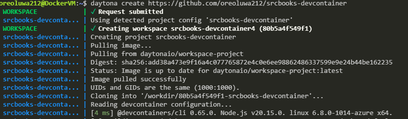
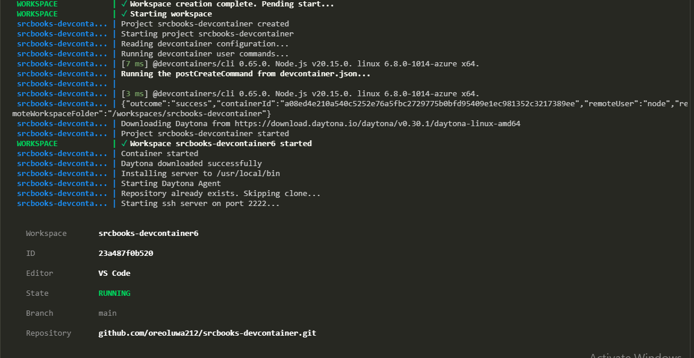

# Interactive TypeScript Notebooks in Daytona with Srcbook

## Introduction

This guide will demonstrate how to integrate Srcbook, an interactive TypeScript notebook environment, with Daytona, a development environment management tool. This integration provides an efficient cloud-based interactive development environment for TypeScript projects. You'll learn how to set up and run Srcbook within a Daytona-managed container.

### TL;DR

- Set up a Daytona-managed development environment.
- Configure the development environment to auto-launch Srcbook.
- Run TypeScript notebooks interactively using Srcbook.
- Integrate Daytona and Srcbook for seamless project management.

## Step 1: Preparations

Before getting started, ensure you have the following prerequisites:

- Docker installed and running on your system. [Install Docker](https://docs.docker.com/get-docker/)
- Daytona installed. You can follow the [Daytona Installation Guide](https://www.daytona.io/docs/install).
- Basic familiarity with `devcontainer.json` for setting up development containers. Learn more [here](https://code.visualstudio.com/docs/remote/create-dev-container).

### Example Preparations

- **Step 1.1**: Install Docker and verify it's running.
   ```bash
   docker --version
   ```
   Confirm Docker is installed by running the above command. The output should display the Docker version.

- **Step 1.2**: Install Daytona by running:
   ```bash
   curl -sf -L https://download.daytona.io/daytona/install.sh | sudo bash
   ```
   Ensure that Daytona is properly installed by verifying the `daytona` command is recognized.

## Step 2: Main Process

This section covers creating a starter repository, setting up a `devcontainer.json` file, and configuring Daytona to launch Srcbook.

### Step 2.1: Creating a Starter Repository

1. **Create a GitHub Repository**: Start by creating a new GitHub repository for your Srcbook project.
2. **Clone the Repository** to your local machine:
   ```bash
   git clone https://github.com/your-username/srcbook-project.git
   cd srcbook-project
   ```

### Step 2.2: Setting Up the `devcontainer.json` File

In the root of your repository, create a `.devcontainer` directory and add the `devcontainer.json` file:
```bash
mkdir .devcontainer
touch .devcontainer/devcontainer.json
```

Now, open the `devcontainer.json` file and add the following configuration:
```json
{
  "name": "Srcbook Development",
  "image": "mcr.microsoft.com/devcontainers/typescript-node:1-20",
  "postCreateCommand": "npm install -g srcbook",
  "postAttachCommand": "srcbook start",
  "forwardPorts": [2150]
}
```

- **Post Commands**: Automatically install necessary packages and start Srcbook after the container is created.
- **Forward Ports**: Ensures Srcbook runs on `localhost:2150` as specified in the devcontainer.json file.

### Step 2.3: Launching the Devcontainer and Daytona

1. **Launch the Container**: Open the repository in VSCode, and it will prompt you to reopen the folder in a container. This will create the dev environment using the `devcontainer.json` configuration.

2. **Start Daytona**:
   Once inside the development container, start Daytona by running:
   ```bash
   daytona serve
   ```
   Daytona will now be ready to manage the Srcbook project.


### Step 2.4: Creating a New Srcbook Project

With Daytona running and the environment set up, you can now create a repository with a devcontainer for Srcbook:

# Example
```bash
daytona create https://github.com/oreoluwa212/srcbooks-devcontainer
```


This command will generate a new TypeScript notebook for interactive coding.

### Step 2.5: Running Srcbook

Once your interactive TypeScript notebook environment, you can proceed to open with your preferred IDE following this [daytona IDE docs](https://www.daytona.io/docs/usage/ide)
 


## Step 3: Confirmation

To confirm that your setup is correct, ensure the following:
- Docker engine is up and running.
- Daytona server is running, and you can check status at `localhost:3986/health`
- Your interactive notebook is up and ready for use.

**Tip**: If you see any errors, review your `devcontainer.json` for misconfigurations, or restart Daytona using:
```bash
daytona serve
```

## Common Issues and Troubleshooting

### Problem 1: Container Fails to Start

**Solution**: Ensure that Docker is running on your machine. Run `docker ps` to verify the status.

### Problem 2: Daytona Unable to Connect

**Solution**: Check that Daytona is running correctly by using:
```bash
daytona
```

## Conclusion

By following this guide, you’ve successfully integrated Srcbook with Daytona, creating an efficient cloud-based TypeScript notebook environment. This setup allows for seamless interactive coding, project management, and environment control.

Explore more advanced Srcbook features by visiting the [Srcbook Documentation](https://srcbook.com) and continue to refine your Daytona setup by reading through the [Daytona Documentation](https://www.daytona.io/docs).


## References

- [Srcbook GitHub Repository](https://github.com/srcbookdev/srcbook)
- [Srcbook Website](https://srcbook.com)
- [Daytona Documentation](https://www.daytona.io/docs)

---