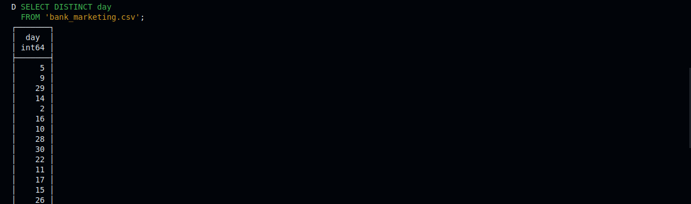

# Building a DuckDB Playground with Daytona

## Introduction

This is a comprehensive hands-on guide in using [DuckDB](20240922_definition_duckdb.md) database to perform a real-world data project in a containerized [workspace](20240819_definition_daytona%20workspace.md) using Daytona.
You'll follow me along from setup to actually working with DuckDB cli and even with [Python](20240820_defintion_python.md) via its Client API. So it's a long ride and you can get a coffee nearby.

In this comprehensive guide, you will learn how to prepare personal loan marketing campaign data for importation into a DuckDB database and analyze the dataset. Your tasks will include collecting and reviewing the data, cleaning and structuring it according to a specification, handling errors and inconsistencies, and transforming and splitting it into multiple CSV files. The CSV file you'll work on is called `bank_marketing.csv`, download from GitHub [here](https://github.com/c0d33ngr/playground-duckdb/blob/main/bank_marketing.csv)

## TL;DR

- What you need to follow along with the guide.
- What's DuckDB and Why Use it
- Set up a Daytona Workspace with DuckDB [environment](20240819_definition_development%20environment.md)
- Hands-on practice using DuckDB as a CLI Tool
- Hands-on practice using DuckDB client API with [Python](20240820_defintion_python.md)
- Conclusion

## Prerequisites

To follow along with a hands-on guide about DuckDB Playground in Daytona, you'll need to have the following;

- An [IDE](20240819_definition_integrated%20development%20environment%20_ide_.md)(It could be VS Code, or JetBrains) or just a terminal.
- [Docker](20240819_definition_docker.md) installation on your PC or Mac. Click here for more info.
- Daytona installation on your PC or Mac. Click here for more info.
- A GitHub account to create a [repository](20240819_definition_repository.md). Link here to create one, if you don’t have one.
- Basic knowledge of [Git](20240819_definition_git.md) and GitHub.

## What's DuckDB and Why Use it

### DuckDB

[DuckDB](20240922_definition_duckdb.md) is a fast in-process data analytical database with support of feature-rich SQL dialect complemented with deep integrations into client APIs. It's designed to perform highly complex queries against large databases in embedded configuration, such as combining tables with hundreds of columns and billions of rows. It's specialized for [online analytical processing (OLAP)](20240922_definition_online_analytical_processing_olap.md) workloads.

### Features of it

DuckDB has many features that make it stand out among other databases focusing on [OLAP](20240922_definition_online_analytical_processing_olap.md). Some of the features are:

- **Simple:** It's straightforward to install and perform embedded in-process operations.
- **Portable:** Since it has no external dependencies, it's extremely portable and can be compiled for all major operating systems and CPU architectures.
- **Feature-Rich:** DuckDB has some interesting features such as extensive support for SQL complex queries, integrations to languages like [Python](20240820_defintion_python.md), R and Java, and data can be stored as persistent, single-file databases.
- **Speed:** It's faster as it uses a columnar-vectorized query execution engine which improves performance to run [OLAP](20240922_definition_online_analytical_processing_olap.md) workloads.
- **Free:** Lastly, it's a free [open source](20240819_definition_open%20source.md) database system which anyone can use because of its permissive MIT License.

## Setting up Daytona Workspace for DuckDB Playground

Alright, that's enough reading, now let us start writing codes. To do so you will need to set up a DuckDB [environment](20240819_definition_development%20environment.md) in a [Daytona workspace](20240819_definition_daytona%20workspace.md). Let’s begin.

### Step 1: Create a GitHub Repository

First head to the GitHub website and create a [repository](20240819_definition_repository.md) with the name of your choice. For my repository name, I’ll use `playground-duckdb`. The full URL path to the repository is `https://github.com/c0d33ngr/playground-duckdb`

### Step 2: Clone the repository using Git

After creating the repository, the next step is to clone the repository into your local PC or Mac. To clone the repository, open your terminal and run this command `git clone https://github.com/USERNAME/REPOSITORY-NAME` but replace the placeholders with your GitHub username and repository name you chose in step 1.

In my case, it’s `git clone https://github.com/c0d33ngr/playground-duckdb`

### Step 3: Prepare your `devcontainer.json` file and dataset in CSV format

Run the command to move into your cloned repository but don’t forget to replace `playground-duckdb` with the repository name you created if yours isn’t the same as mine.

```bash
cd playground-duckdb
```

Download the bank campaign dataset you are going to perform data tasks on which is in CSV format, from the GitHub repo [here](https://github.com/c0d33ngr/playground-duckdb/blob/main/bank_marketing.csv).

Note: It has to be in the directory of your clone repository. In my case, it's inside `playground-duckdb`.

Now, let us proceed to the next step.

Create a hidden directory named `.devcontainer` where our `devcontainer.json` file will be. Let’s do so and move into it.

Run the command to do so

```bash
mkdir .devcontainer && cd .devcontainer
```

Let’s create our devcontainer.json file in the `.devcontainer` directory.

I use `nano` to create my `.devcontainer.json` file using this command.

```bash
nano devcontainer.json
```

Paste this code into your `devcontainer.json` file.

```yaml
{
    "name": "DuckDB Playground",
    "image": "mcr.microsoft.com/devcontainers/base:ubuntu",
    "features": {
        "ghcr.io/eitsupi/devcontainer-features/duckdb-cli:1": {},
        "ghcr.io/devcontainers/features/python:1": {}
    },
    "postCreateCommand": "pip install duckdb matplotlib pandas"
}
```

The `devcontainer.json` content contains configurations to start your DuckDB environment in a [Daytona workspace](20240819_definition_daytona%20workspace.md).

- `name`: This sets the name of the development container environment to `DuckDB Playground`.
- `image`: This uses a base Ubuntu image from the Microsoft image repository.
- `features`: This configuration adds DuckDB installation and Python setups in the Daytona workspace
- `postCreateComand`: This installs the Python packages needed for this guide into the workspace.

After creating and saving the `devcontainer.json` file, move up back to the root directory of your clone [repository](20240819_definition_repository.md). For me, I run the command below.

```bash
cd ../..
```

### Step 4: Commit and Push Changes to GitHub

Run these commands to push your changes to GitHub.

```bash
git add .
git commit -m “add devcontainer.json file”
git push
```

Now, you have successfully pushed our updated repository, which contains our configuration file (`devcontainer.json`) for our DuckDB environment.

### Step 5: Verify Daytona Installation

Run this command to check `daytona` is properly installed on your PC or Mac.

```bash
daytona –-version
```

You should see your version of `daytona` installed.

### Step 6: Create a Daytona Workspace with DuckDB Playground Environment in it

Let’s start the daytona server by running the command.

```bash
daytona serve
```

You should see logs like my screenshot.

Open a new tab in your terminal, for Linux its `Shift + Ctrl + T`

Run the command below in a new tab of your terminal and follow the prompt instructions. It would ask you for a [workspace](20240819_definition_daytona%20workspace.md) name to use, choose the default.

Replace `USERNAME` and `REPOSITORY-NAME` with your username for GitHub and the repository name you created earlier.

```bash
daytona create https://github.com/USERNAME/REPOSITORY-NAME
```

In my case, it's this.

```bash
daytona create https://github.com/c0d33ngr/playground-duckdb
```

After you successfully run the above command you should see a screenshot like mine showing your Daytona workspace that contains the DuckDB environment is running.

You can now run this command to open the DuckDB [environment](20240819_definition_development%20environment.md) in your default [IDE](20240819_definition_integrated%20development%20environment%20_ide_.md) you choose when installing Daytona (Replace `WORKSPACE-NAME` with the name you used when creating the workspace above, in my case it's `playground-duckdb`).

```bash
daytona code WORKSPACE-NAME
```

That’s it. Daytona will create a DuckDB playground environment for you and open it in the default IDE you set.

## Using DuckDB as a Command Line Interface (CLI) Tool

In this section, you'll learn how to work with [DuckDB](20240922_definition_duckdb.md) by creating a database from a CSV file, examining its structure, retrieving distinct values, and exporting data to separate CSV files for client, campaign, and economics data. Finally, you'll verify the exported data, gaining hands-on experience with DuckDB's querying and data manipulation capabilities. Let us get started.

### Step 1: Enter DuckDB Interactive Shell

By now, you should be in your default IDE set up using `daytona`. In your IDE terminal, type the command below to enter into the DuckDB database shell in interactive mode where you'll run some SQL-based queries that conform to the DuckDB database.

```sql
duckdb
```

You should have a similar screenshot to the one below.


### Step 2: Create Database from CSV file

Let's create a database named `bank_marketing` from the CSV file you downloaded earlier. Run the DuckDB SQL in the database shell to do so.

```sql
CREATE TABLE bank_marketing AS
FROM 'bank_marketing.csv';
```


### Step 3: Check Database Structure

To check the database table schema run this SQL in the shell.

```sql
DESCRIBE bank_marketing;
```


### Step 4: Export Client Data to CSV

Run the following SQL query to export client data to a CSV file named `client.csv`.

```sql
COPY (
    SELECT 
        client_id,
        age,
        REPLACE(job, '.', '_') AS job,
        marital,
        REPLACE(education, '.', '_') AS education,
        CASE 
            WHEN credit_default = 'yes' THEN 1 
            ELSE 0 
        END AS credit_default,
        CASE 
            WHEN mortgage = 'yes' THEN 1 
            ELSE 0 
        END AS mortgage
    FROM 
        bank_marketing
) TO 'client.csv' (DELIMITER ',', HEADER TRUE);
```


### Step 5: Retrieve the List of Distinct Records in `day` Column

Run the following SQL query to retrieve a list of distinct days from the bank_marketing table. The results would be useful in preparing the SQL query for step 7. We need to know the unique records in the `day` column.

```sql
SELECT DISTINCT day
FROM 'bank_marketing.csv';
```



### Step 6: Retrieve the List of Distinct Records in `month` Column

Run the following SQL query to retrieve the list of distinct months from the `bank_marketing` table. The results are also needed for the creation of a new column called `last_contact_date` later in step 7.

```sql
SELECT DISTINCT month
FROM 'bank_marketing.csv';
```


### Step 7: Export Campaign Data to CSV

Run the following SQL query to export campaign data to a CSV file named `campaign.csv`

```sql
COPY (
  SELECT 
      client_id,
      number_contacts,
      contact_duration,
      previous_campaign_contacts,
      CASE
          WHEN previous_outcome = 'success' THEN 1
          ELSE 0
      END AS previous_outcome,
      CASE
          WHEN campaign_outcome = 'yes' THEN 1
          ELSE 0
      END AS campaign_outcome,
      MAKE_DATE(
          2022,
          CASE 
            WHEN LOWER(month) = 'jan' THEN 1
            WHEN LOWER(month) = 'feb' THEN 2
            WHEN LOWER(month) = 'mar' THEN 3
            WHEN LOWER(month) = 'apr' THEN 4
            WHEN LOWER(month) = 'may' THEN 5
            WHEN LOWER(month) = 'jun' THEN 6
            WHEN LOWER(month) = 'jul' THEN 7
            WHEN LOWER(month) = 'aug' THEN 8
            WHEN LOWER(month) = 'sep' THEN 9
            WHEN LOWER(month) = 'oct' THEN 10
            WHEN LOWER(month) = 'nov' THEN 11
            WHEN LOWER(month) = 'dec' THEN 12
            ELSE NULL  -- default value if the month is unknown
          END,
          CAST(day AS BIGINT)
      ) AS last_contact_date
  FROM bank_marketing
) TO 'campaign.csv' (DELIMITER ',', HEADER TRUE);
```


### Step 8: Export economic data to CSV

Run the following SQL query to export economics data to a CSV file named `economics.csv`

```sql
COPY (
    SELECT 
        client_id,
        cons_price_idx,
        euribor_three_months
    FROM bank_marketing
) TO 'economics.csv' (DELIMITER ',', HEADER TRUE);
```


### Step 9: Read Data from Exported CSV files

Run the following SQL queries to read data from the `client.csv`, `campaign.csv`, and `economics.csv` files.

```sql
SELECT *
FROM 'client.csv';
```


```sql
SELECT *
FROM 'campaign.csv';
```


```sql
SELECT *
FROM 'economics.csv';
```


Now, our three CSV files have been prepared for analysis using DuckDB Client API via Python. Let's head to the next section for the analysis.

## Using DuckDB with Python through its Client API

In this section, you'll learn how to analyze and visualize data using [DuckDB](20240922_definition_duckdb.md) and [Matplotlib](20240922_definition_matplotlib.md). You'll calculate the campaign success rate, create a bar chart to compare average client age by education level and generate a scatter plot to explore the relationship between contact duration and campaign outcome. We'll use the cleaned and transformed CSV files split from our `bank_marketing.csv` in this section.

### Step 1: Analysis of Customer Campaign Success Rate

Create a file name `campaign_success_rate.py`. Paste the following Python code in it and save.

```python
import duckdb

result = duckdb.sql(
    """
    SELECT AVG(campaign_outcome) AS campaign_outcome_mean
    FROM 'campaign.csv';
    """
).fetchall()

success_rate = result[0][0]  # Access the value directly

print(f"Campaign success rate: {success_rate:.2%}")
```

Run the `campaign_success_rate.py` file in your IDE terminal using `python3 campaign_success_rate.py` and see the campaign success rate of the `campaign.csv` output in your IDE terminal.


### Step 2: Analysis and Visualization of Client Age by Educational Level

Create another file name `client_age_by_education.py`. Paste the following Python code in it and save.

```python
import duckdb
import matplotlib.pyplot as plt

result = duckdb.sql(
    """
    SELECT
        education,
        AVG(age) AS average_age
    FROM
      'client.csv'
    GROUP BY
        education
    ORDER BY
        education;
    """
).fetchdf()


# Plot the results
plt.figure(figsize=(8, 6))
plt.bar(result['education'], result['average_age'])
plt.xlabel('Education Level')
plt.ylabel('Average Age')
plt.title('Average Client Age by Education Level')
plt.xticks(rotation=45)  # Rotate x-axis labels for better readability
plt.tight_layout()
plt.savefig('plot-1.png')
```

Run the file in your IDE terminal using `python3 client_age_by_education.py` and you should see the visualization plot saved as `plot-1.png`.

### Step 3: Analysis and Visualization of Contact Duration and Campaign Outcome through Correlation

And lastly, create a new file name `contact_duration_vs_outcome.py`. Paste the following code and save it.

```python

import duckdb
import matplotlib.pyplot as plt

result = duckdb.sql(
    """
    SELECT 
        contact_duration,
        campaign_outcome
    FROM 'campaign.csv';
    """
).fetchdf()


plt.figure(figsize=(8, 6))
plt.scatter(result['contact_duration'], result['campaign_outcome'])
plt.xlabel('Contact Duration')
plt.ylabel('Campaign Outcome')
plt.title('Relationship Between Contact Duration and Campaign Outcome')
plt.yticks([0, 1])  # Set y-axis ticks to 0 and 1
plt.savefig('plot-2.png')
```

Run the file in the IDE terminal using `python3 contact_duration_vs_outcome.py` and you should also see another visualization plot saved as `plot-2.png`.

That's it. You have done lots of data tasks using [DuckDB](20240922_definition_duckdb.md) in a [daytona workspace](20240819_definition_daytona%20workspace.md).

## Conclusion

In this comprehensive guide, you have explored the capabilities of using DuckDB in a Daytona Workspace with no stress through hands-on examples.
Throughout this guide, you have gained practical experience in:

- Creating and managing a database with DuckDB in memory
- Perform SQL queries for data cleaning, transformation, and splitting
- Integration of DuckDB using its Client API with Python for data analysis.

## References

- [DuckDB Documentation](https://duckdb.org/docs/)
- [Daytona Documentation](https://daytona.io/docs)
- [DuckDB Tricks](https://duckdb.org/2024/08/19/duckdb-tricks-part-1.html)
- [DuckDB CLI Data Processing](https://duckdb.org/2024/06/20/cli-data-processing-using-duckdb-as-a-unix-tool.html)
- [DuckDB Python Examples](https://github.com/duckdb/duckdb/blob/main/examples/python/duckdb-python.py)
- [DuckDB Wikipedia Page](https://en.wikipedia.org/wiki/DuckDB)
- [DataCamp Data Project](https://www.datacamp.com/projects/1613)
