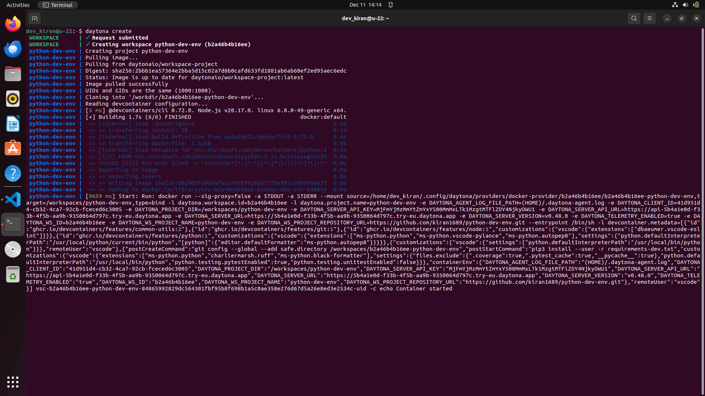

# Setting Up a Python Dev Environment with Dev Containers and Daytona

# Introduction

In modern Python development, managing dependencies, Python versions,
and conflicting libraries can often be cumbersome and time-consuming.
Traditional tools like `venv`, `virtualenv`, and `pipenv` have helped manage
these issues, but there's a better way to simplify and streamline your
workflow using Dev Containers with Daytona.

This guide walks you through setting up a Python development environment
using Daytona's containerized workspaces and the Dev Container.

## TL;DR

- Required tools and knowledge for hands-on learning.
- Overview of both Dev Containers and Daytona.
- Setting up a Python project template.
- Creating a Python project workspace in Daytona.
- Conclusion

## Prerequisites

To follow this guide, you'll need to have the following:

- Basic understanding of [Python](definitions/20240820_defintion_python.md) and [Development Environment](definitions/20240819_definition_development environment.md)
- An IDE (like [VS Code](https://code.visualstudio.com/))
- Docker (download from [here](https://www.docker.com/))
- Daytona latest version (install from [here](https://www.daytona.io/docs/installation/installation/))

## Overview of Daytona

Daytona is an open-source development environment manager that uses configuration
files from a project's repository to build and provision workspaces. It simplifies
the process of setting up consistent development environments across teams or for
individual developers.

**Key Features of Daytona:**

- **Containerized Environments**: Keep your laptop clean by using separated and containerized dev environments.
- **Portability**: Move your environments with you or host them on a remote server.
- **Consistency**: Ensure all team members work in identical environments, eliminating "it works on my machine" issues.
- **Easy Setup**: Create a fully configured development environment with a single command.
- **IDE Integration**: Seamlessly works with popular IDEs like VS Code and JetBrains products.
- **Git Provider Integration**: Easily connect with GitHub, GitLab, Bitbucket, and more for smooth workflow integration.
- **GPU Support**: Leverage GPU acceleration directly within your Daytona workspaces, ideal for machine learning and data science projects.

For more info about Daytona and its features, check [here](https://daytona.io)

## Overview of Dev Containers

Dev Containers, short for Development Containers, are a way to configure portable
and reproducible development environments using Docker containers. Dev containers
are isolated, lightweight environments that allow developers to work inside a
containerized version of a build environment.

**Key Features of Dev Containers:**

- **Pre-configured Build Environments**: Dev containers come with a base image that has all the software, tools, and dependencies pre-installed, so you can get started coding right away.
- **Isolated Environments**: Each dev container has its own isolated filesystem, networking, memory, and CPU, so there are no conflicts with other projects or software on your local machine.
- **Reproducible Builds**: Dev containers provide the exact same environment every time they're launched, ensuring consistent build results. No more "it works on my machine!" issues.
- **Less Setup Time**: Starting a new project with dev containers means you can skip the lengthy setup and configuration process. Just open your project in the container and everything is ready to go.
- **Flexibility**: You can choose a base image with the software and tools you want or build your own custom base image, meeting your specific needs.

For more info about Dev Containers and its features, check [here](https://containers.dev/)

## Setting Up Your Python Development Environment

Now, we're going to create a dev container for the Python dev environment using a **devcontainer.json** configuration file also,
writing essential project files like `main.py` and `requirements-dev.txt`.

By defining a `devcontainer.json` file in your project, you can specify the exact environment configuration, including the operating system, tools, and dependencies needed for development.
This ensures that every developer on your team can work in the same environment, regardless of their local machine setup.

Here is the step-by-step guide:

- **Step 1**: Create a new directory

  Create a directory with any name of your choice and move into the directory.

  ```bash
  mkdir python-dev-env && cd python-dev-env
  ```

- **Step 2**: Create a .devcontainer directory

  This is where your devcontainer.json file will live.

  ```bash
  mkdir .devcontainer && cd .devcontainer
  ```

- **Step 3**: Create a `devcontainer.json` file

  You are going to create a `devcontainer.json` file with the following code. This is the configuration file for the Python dev environment specifying settings and dependencies.

  ```json
  {
    "name": "Python 3",
    "image": "mcr.microsoft.com/devcontainers/python:3.11-bullseye",
    "customizations": {
      "vscode": {
        "settings": {
          "python.defaultInterpreterPath": "/usr/local/bin/python",
          "python.testing.pytestEnabled": true,
          "python.testing.unittestEnabled": false,
          "files.exclude": {
            ".coverage": true,
            ".pytest_cache": true,
            "__pycache__": true
          }
        },
        "extensions": [
          "ms-python.python",
          "charliermarsh.ruff",
          "ms-python.black-formatter"
        ]
      }
    },
    "postStartCommand": "pip3 install --user -r requirements-dev.txt",
    "remoteUser": "vscode"
  }
  ```

  Let's break down the `devcontainer.json` file.

  - **name**: Specifies the name of the development environment.
  - **image**: Points to the Docker image used for the container, `mcr.microsoft.com/devcontainers/python:3.11-bullseye`, a Python 3.11 environment based on Debian Bullseye.
  - **customizations**: Allows customization of the development environment, specifically for Visual Studio Code.
  - **vscode**: AContains VS Code-specific configurations.
  - **settings**: Defines default VS Code settings for the container.
  - **python.defaultInterpreterPath**: Specifies the Python interpreter path inside the container (`/usr/local/bin/python`).
  - **python.testing.pytestEnabled**: Enables the use of `pytest` for testing.
  - **python.testing.unittestEnabled**: Disables unittest as the testing framework.
  - **files.exclude**: Hides specified files and folders (e.g., `.coverage`, `.pytest_cache`, `__pycache__`) from the VS Code file explorer.
  - **extensions**: Lists extensions to be installed automatically in the container.
  - **ms-python.python**: Python language support for VS Code.
  - **charliermarsh.ruff**: A Python linter.
  - **ms-python.black-formatter**: Formatter for Python code using Black.
  - **postStartCommand**: Installs Python packages from requirements-dev.txt ("pip3 install --user -r requirements-dev.txt").
  - **remoteUser**: sets `vscode` as the non-root default user.

    By including a `devcontainer.json` file in your project repository, you can specify not just
    the Python version and dependencies, but also any required system packages, VS Code extensions,
    environment variables, and even custom scripts to run during setup.

- **Step 4**: Create a `main.py` file

  Create a simple main.py file in the root of your project directory. This file will act as the
  entry point for your application.

  ```python
  def add_numbers(a, b):
  return a + b
  ```

  This code defines a simple function `add_numbers` to add two numbers.

- **Step 5**: Create a `requirements-dev.txt` file

  Add a requirements-dev.txt file to specify development dependencies. Include the following content:

  ```
  ruff
  black
  pytest
  coverage
  pytest-cov
  ```

- **Step 6**: Create a `tests` directory

  Inside your project directory, create a tests folder to store your test cases.

  ```bash
  mkdir tests
  ```

  Inside the tests folder, create a test file named `test_main.py` and add the following code:

  ```python
  from main import add_numbers


  def test_add_numbers():
      assert add_numbers(2, 2) == 4
  ```

  This test imports the `add_numbers` function from `main.py` and verifies that it returns the correct sum when given 2 and 2 as inputs.

- **Step 7**: Initialize, Commit and Create a GitHub repository

  Now initialize git and commit all the changes you made to your directory.

  ```bash
  git init
  git add .
  git commit -m "inital commit"
  ```

  After committing your code you will push it to a remote repository of your choice.

  ```bash
  git remote add origin https://github.com/YOUR-GITHUB-USERNAME/YOUR-DIRECTORY-NAME.git
  git branch -M main
  git push -u origin main
  ```

  You can check out my repository [here](https://github.com/Kiran1689/python-dev-env).

## Creating the Python dev environment in Daytona

Here you are going to use Daytona to build the python dev environment using Github as a Provider and
open a workspace in VS Code. You should ensure `daytona` is installed on your machine before proceeding.

### Step 1: Start Daytona Server

Start the daytona server by running the command.

```bash
daytona server
```

Your output should be similar to the screenshot below.


Choose "yes" and you should see a similar output in the screenshot below.


### Step 2: Add Git Provider

Daytona integrates with your preferred Git provider, streamlining your workflow
by allowing direct access to repositories, and simplifying workspace creation
from existing projects.

Execute the command provided below to add your git provider. Daytona also has
support for other Git providers like Bitbucket and GitLab. You can learn more
about Daytona Git Providers [here](https://www.daytona.io/docs/configuration/git-providers/)

```bash
daytona git-provider add
```

Your output should be similar to the image below.


Select GitHub and provide your personal access token.


### Step 3: Choose your preferred IDE

Run this command in the terminal to choose your [IDE](https://www.daytona.io/docs/usage/ide/).

```bash
daytona ide
```


### Step 4: Create a Daytona Workspace

Now create a dev environment of the repository you created in GitHub(by forking) and
follow the prompts after you run it.

```bash
daytona create
```

Choose GitHub as a provider and select the python-dev-env repository.

#### Step 4.1: Provide workspace name

The name of the workspace is usually the repository name if you didn't modify it when
prompted in the creation of the workspace.


#### Step 4.2: Choose the target

Now it will ask you to choose the target, select `local`, and enter.


Daytona will now start creating a workspace by pulling your project and installing all
required dependencies, once done it will open your project in your default IDE.




Now, your Python dev environment is ready to use.

### Confirmation

In your VS Code, run the test cases using the command below, and you will see all the test cases passed.
This means the Python dev environment has been successfully setup for your project.

```bash
python3 -m pytest
```


## Conclusion

By following this guide, you've set up a fully containerized Python development environment using
Daytona and Dev Containers. This setup ensures that your projects are reproducible, isolated, and
consistent across machines, enabling smooth collaboration and effortless debugging.

## References

- [Daytona Documentation](https://www.daytona.io/dotfiles/the-ultimate-guide-to-managing-python-environments)
