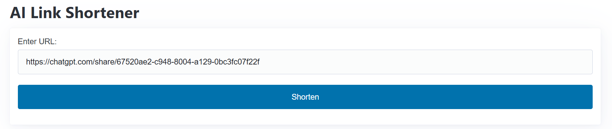

# Building a Link Shortener with FastHTML and Dub.co

# Introduction

Development environments play a crucial role in software development. Developers need development environments to experiment
with new ideas and debug them without impacting existing products. When working on web applications, the ability to rapidly prototype,
isolate dependencies, and seamlessly integrate APIs can significantly enhance productivity.

This guide focuses on **Daytona**, a powerful tool for managing development environments. Daytona provides isolated,
containerized workspaces that ensure consistency, reduce setup overhead, and simplify team collaboration. By leveraging Daytona,
developers can streamline their workflows, avoid common configuration issues, and focus on building impactful solutions.

In this tutorial, you'll learn how to set up a robust link shortener using **FastHTML**, a Python library for server-rendered applications, and the **Dub.co API**, a service for creating and managing shortened links. You’ll gain hands-on experience in:

- Configuring a Daytona workspace.
- Building a landing page with FastHTML.
- Integrating external APIs.
- Deploying the finished application to a production environment.

Before diving in, make sure you have the following:

- **[Daytona](https://docs.daytona.dev/getting-started)** installed: Follow the official documentation to set up Daytona for managing your development environments.
- **[Docker](https://docs.docker.com/get-docker/)** running: Install Docker to enable containerized workspaces.
- **[Python 3.10](https://www.python.org/downloads/)** or later: Download and install the latest compatible version of Python.
- An **Integrated Development Environment (IDE)**: Use an IDE to write, debug, and manage your code efficiently. Examples include **[VS Code](https://code.visualstudio.com/)**, **[PyCharm](https://www.jetbrains.com/pycharm/)** and **[Atom](https://atom-editor.cc/)**.
- **[GitHub](https://github.com/)** account: Use GitHub to manage your project's version control and collaborate effectively.
- Basic familiarity with **[Python](https://docs.python.org/3/tutorial/)** and **[web development concepts](https://developer.mozilla.org/en-US/docs/Learn)** (helpful but not strictly required).
- The code for this guide is available on GitHub. You can find it [here](https://github.com/Titre123/fast-link-shortner).

Let's get started!

---

## TL;DR

### 1. Daytona Setup

Learn how to configure a Daytona workspace for isolated and efficient development.

### 2. FastHTML Integration

Build a clean and responsive landing page using FastHTML with server-rendered output.

### 3. Dub.co API Integration

Incorporate external API calls to generate and manage shortened links.

### 4. Deployment

Deploy the final application to a production-ready environment, such as **Render**.

---

With this guide, you'll have a working link shortener in no time while mastering the tools to create efficient, collaborative development workflows.

## Overview of Daytona

Daytona is a powerful development environment manager that streamlines the process of creating, managing, and sharing isolated workspaces.
Built on containerization technology, Daytona eliminates the "it works on my machine" problem, ensuring consistency across development environments.
It is particularly useful for collaborative teams and individual developers who want to focus on coding rather than dealing with setup complexities. Daytona integrates seamlessly with Docker to provide efficient, lightweight workspaces that are easy to set up and share.

**Key Features**:
- **Dependency Isolation**: Ensures that each workspace has its own set of dependencies, avoiding conflicts.
- **Quick Startup**: Launch ready-to-use environments in seconds.
- **Collaboration**: Share reproducible environments across teams with ease.
- **Integration**: Works seamlessly with Docker and other container-based tools.
- **Flexibility**: Suitable for prototyping, debugging, and production environments.

Learn more: [Daytona Documentation](https://www.daytona.io/docs)

---

## Overview of FastHTML

FastHTML is a Python-based lightweight framework for building server-rendered web applications. It focuses on delivering
clean and responsive HTML with minimal overhead, making it ideal for small to medium-sized projects. FastHTML allows developers to
utilize Python's robust ecosystem while simplifying the creation of web pages. Its templating engine and server-side rendering
capabilities ensure fast page load times and improved SEO, making it a great choice for developers seeking speed and simplicity.

**Why Choose FastHTML?**:
- **Minimalistic Design**: Reduces complexity, focusing on speed and efficiency.
- **Server-Side Rendering (SSR)**: Delivers pre-rendered HTML for better performance and SEO.
- **Clean Templating System**: Makes creating dynamic, responsive pages intuitive.
- **Python Ecosystem**: Integrates smoothly with Python libraries and frameworks.
- **Fast Prototyping**: Perfect for quickly building and deploying MVPs.

Explore FastHTML: [FastHTML Documentation](https://docs.fastht.ml/)

---

## Overview of Dub.co

Dub.co is a robust link management platform that allows developers and businesses to create, manage, and track shortened URLs.
It provides a powerful API for seamless integration, enabling developers to add advanced link management functionality to their applications.
Dub.co supports custom branding, analytics, and scalability, making it a top choice for marketing campaigns, content sharing, and app integrations.

**Core Features**:
- **Link Creation**: Easily generate shortened, branded URLs.
- **Analytics**: Track link performance with insights into clicks, geographic data, and device types.
- **Custom Branding**: Add personalized domains or custom slugs for professional link sharing.
- **Scalability**: Handles high traffic and integrates with large-scale applications.
- **API Access**: Integrate with external tools and workflows effortlessly.

**Use Cases**:
- Marketing campaigns to measure user engagement.
- Building link shorteners with custom branding.
- Managing links in applications and content delivery.

Check out Dub.co: [Dub.co API Documentation](https://dub.co/docs/quickstart/python)


**Setting Up Your Project Environment**

Before diving into the development of your link shortener, it's essential to set up a proper project environment.
This includes creating a project directory, managing dependencies, and configuring your development container. In this section,
we will guide you through the steps to set up your project environment from scratch, ensuring you have a solid foundation for your project.

**Step 1: Create a Project Directory**:
   Open your terminal and create a new directory for your project using the following command:
   ```bash
   mkdir dub-fasthtml-shortener
   ```

**Step 2: Change into the Project Directory**:
   Navigate into the newly created directory:
   ```bash
   cd dub-fasthtml-shortener
   ```

**Step 3: Create a requirements.txt File**:
   Create a `requirements.txt` file to manage project dependencies. You can use the following command:
   ```bash
   touch requirements.txt
   ```
   For Windows users using WSL, use `wsl touch requirements.txt`.

**Step 4: Add Dependencies to requirements.txt**:
   Open the `requirements.txt` file and add the necessary dependencies for your project.
   ```
   python-fasthtml
dub
python-dotenv
   ```

**Step 5: Create a main.py File**:
   Create a `main.py` file to serve as the entry point for your application:
   ```bash
   touch main.py
   ```
   For Windows users using WSL, use `wsl touch main.py`.

**Step 6: Create a .env File**:
   Create a `.env` file to manage environment variables:
   ```bash
   touch .env
   ```
   For Windows users using WSL, use `wsl touch .env`.

**Step 7: Create a .devcontainer Folder and devcontainer.json File**:
   Create a `.devcontainer` folder and a `devcontainer.json` file to configure your development container:
   ```bash
   mkdir .devcontainer
   touch .devcontainer/devcontainer.json
   ```
   For Windows users using WSL, use `mkdir .devcontainer` and `wsl touch .devcontainer/devcontainer.json`.

**Step 8: Add Devcontainer Configuration**:
   Add the following configuration to the `devcontainer.json` file:
   ```json
   {
       "name": "Python - fasthtml Project",
       "image": "mcr.microsoft.com/devcontainers/python:3.11",
       "features": {},
       "postCreateCommand": "pip install --no-cache-dir -r requirements.txt",
       "forwardPorts": [8000],
       "remoteUser": "vscode",
       "customizations": {
           "vscode": {
               "extensions": [
                   "ms-python.python",
                   "ms-python.vscode-pylance",
                   "ms-toolsai.jupyter"
               ]
           }
       }
   }
   ```

**Step 9: Create a GitHub Repository and Push Your Project**:
   Create a GitHub repository for your project and push your local project to the remote repository:
   ```bash
   # Initialize a git repository
   git init

   # Create a .gitignore file and add .env and .sesskey to it
   touch .gitignore 
   # For powershell, you can use this command
   wsl touch .gitignore
  
  # Add the variable that you don't ant pushed to the git ignore file
  .env
  .sesskey

   # Add all files to the staging area
   git add .

   # Commit the changes
   git commit -m "Initial commit"

   # Add the remote repository
   git remote add origin <your_github_repository_url>

   # Push the changes to the remote repository
   git push -u origin master
   ```

By following these steps, you have successfully set up your project from scratch.


# Setting up Daytona development environment

To set up your Daytona development environment and integrate it with your IDE (such as VSCode, IntelliJ, or Cursor) and Git providers
(including Bitbucket and GitHub), follow these steps:

**Step 1: Create a GitHub Repository**:
   Start by creating a GitHub repository for your project. This repository will be used to create your Daytona workspace.

**Step 2: Start the Daytona Server**:
   Open your terminal and run the following command to start the Daytona server and Docker desktop:
   ```bash
   daytona serve
   ```
   

**Step 3: Set the Target to Local Docker Provider**:
   Once the server is running, set up a target to your local Docker provider by executing:
   ```bash
   daytona target set
   ```
   

**Step 4: Add Git Provider**:
   Next, set up your Git provider using the command:
   ```bash
   daytona git-providers add
   ```
   Select your preferred Git provider from the options presented.
   

**Step 5: Set Up IDE for Development**:
   Use the following command to set up your IDE for development:
   ```bash
   daytona ide
   ```
   Choose any IDE you prefer, such as Visual Studio Code or IntelliJ.
   

**Step 6: Create a Workspace**:
   Finally, create a workspace using your GitHub repository URL with the command:
   ```bash
   daytona create <github_url>
   ```
   
   

The workspace will be opened in your ide using SSH from daytona. You can start experimenting in your development environment

# Setting Up Dub.co and Obtaining API Key

In this section, you will create a Dub.co account and obtain an API key for our application.

**Step 1: Register on Dub.co**

Click on [dub.co](https://dub.co) and follow the sign-up process to create an account.


**Step 2: Obtain API Key**

After successfully registering, you will be directed to the dashboard. In the sidebar, there is a tab to obtain the API key for your application.


# Setting Up the Project

In this section, we will install the necessary dependencies for our project and set up the environment variables required for integration with the Dub.co API. We will also create a main entry point for our application.

**Step 1: Create a .env File and Add the Environmental Variable**

2. Add the following line to the file, replacing `your_api_key_here` with your actual API key:
   ```
   DUB_API_KEY=your_api_key_here
   ```

# Integrating the Dub.co API for a simple FastHml landing page

In this section, we will guide you through the process of building a link shortener using FastHTML and Dub.co. This will involve setting up the project structure, implementing the main application logic, and explaining each step in detail.

**Step 1: Create the Application Structure**

Organize your project as follows:
```
dub-fasthtml-shortener/
│
├── .devcontainer/
│   └── devcontainer.json
├── .env
├── .gitignore
├── main.py
└── requirements.txt
```

**Step 2: Implement main.py**

The following code implements the main application logic for the link shortener. It begins by importing necessary modules and loading environment variables.

```python
from fasthtml.common import *
import dub
from dotenv import load_dotenv
import os

# Load environment variables
load_dotenv()

# Initialize Dub with the API key from the environment variables
d = dub.Dub(token=os.getenv('DUB_API_KEY'))

# Initialize the FastHTML app
app, rt = fast_app()

@rt("/")
def index():
    # This function defines the home page of the application, which includes a form to input URLs for shortening.
    return Titled(
        "AI Link Shortener",
        Article(
            Form(method="post", action="/shorten")(
                Label("Enter URL: ", Input(name="url", type="url", required=True)),
                Button("Shorten", type="submit")
            ),
            Div(id="result")
        )
    )

@rt("/shorten")
async def shorten(url: str):
    # This function handles the shortening of URLs. It attempts to shorten the URL using Dub.co and returns the result.
    try:
        response = d.links.create(request={"url": url})
        short_link = response.short_link
    except Exception as e:
        short_link = f"Error: {e}"

    # This returns the result of the shortening process, including the original URL, the shortened URL, and a link to shorten another URL.
    return Titled(
        "Shortened Link",
        Article(
            P(f"Original URL: {url}"),
            P(f"Shortened URL: ", A(href=short_link)(short_link)),
            A(href="/")("Shorten another link")
        )
    )

# This starts the FastHTML application server.
serve()
```

**Step 3: Testing and debugging the application**

To run the project, use the following command in your terminal:
```bash
python main.py
```
If you are using Python 3, use the following command instead:
```bash
python3 main.py
```
Once the project is running, open [http://127.0.0.1:5001](http://127.0.0.1:5001) in your browser to access the interface.

 

To test the link shortening functionality, enter an AI artefact link and click the "Shorten" button to see the shortened link.

 

# Deploying the Application to Render

Once your link shortener application is complete, you can deploy it to a production environment using Render. Render is a cloud platform
that allows you to deploy web applications quickly and easily. It supports a wide range of technologies and provides a simple,
intuitive interface for managing your deployments.

To deploy your application to Render, follow these steps:

**Step 1: Create a Render account and log in to the dashboard.**

To begin, navigate to the Render website and sign up for an account. Once you've completed the registration process, log in to your account to access the dashboard. This is where you'll manage your deployments.

**Step 2: Click on the "New Web Service" button and select "Python" as the runtime.**

In the Render dashboard, click on the "New Web Service" button to start the deployment process. You will be prompted to select the runtime environment for your application. Choose "Python" as the runtime environment, as it is the language used for this project.


**Step 3: Connect your GitHub repository containing the link shortener application.**

Next, you need to connect your GitHub repository that contains the link shortener application. This allows Render to access your code and deploy it. Follow the instructions provided by Render to link your GitHub account and select the repository containing your project.


**Step 4: Configure the deployment settings as needed, such as the environment variables and the command to run the application.**

In this step, you'll need to configure the deployment settings for your application. This includes setting environment variables and
specifying the command to run your application. Ensure that you set the environment variables required by your application,
such as the Dub.co API key. Additionally, specify the command to run your application, which in this case is `python main.py`.


**Step 5: Click "Deploy" to start the deployment process.**

Once you've completed the configuration, click the "Deploy" button to start the deployment process. Render will then build and deploy your application to a production environment. This process may take a few minutes to complete.


After deployment, your link shortener application will be accessible at a public URL provided by Render. You can then share this URL with others, allowing them to use your application to shorten links.


## Common Issues and Troubleshooting

During the process of building and deploying your link shortener application, you may encounter some common issues. This section aims to address these problems and provide solutions to help you troubleshoot and resolve them efficiently.

**Problem 1: Daytona Serve Error**
The Daytona serve is giving an error, and you are unable to start the development server.

**Solution 1**
Make sure Docker Desktop is running. This is a common issue that can be resolved by ensuring that Docker is up and running.

**Problem 2: Unable to Create a Workspace**
You are unable to create a new workspace in Daytona, and you are encountering errors during the setup process.

**Solution 2**
Try updating your Daytona version to the latest release, as bugs were discovered in previous versions that have since been fixed. Additionally, you can try deleting the file in AppData/Roaming and reinstalling Daytona. If the issue persists, check if Daytona target and Git providers are set.

**Problem 3: Dub API Key Error**

If you are getting an error relating to the Dub API key, such as `d = dub.Dub(token=os.getenv('DUB_API_KEY'))`

**Solution 3**
If you are encountering an error related to the Dub API key, such as `d = dub.Dub(token=os.getenv('DUB_API_KEY'))`, it is likely that your environmental variables are not set. To resolve this issue, ensure that you have set the `DUB_API_KEY` environmental variable.

## Conclusion

In this guide, we have successfully set up a robust link shortener using Daytona, FastHTML, and the Dub.co API.
We have learned how to configure a Daytona workspace, build a landing page with FastHTML, integrate external APIs,
and deploy the finished application to a production environment. By following this guide, you have gained hands-on experience in managing development environments, building server-rendered web applications, and integrating external APIs.

Optionally, you can explore further by customizing the landing page, adding more features to the link shortener, or integrating other APIs. You can also check out the documentation for Daytona, FastHTML, and the Dub.co API for more advanced usage and best practices.

## References

- [Daytona Documentation](https://www.daytona.io/docs)
- [Dub.co API Documentation](https://dub.co/docs/quickstart/python)
- [Render documentation](https://render.com/docs)
- [FastHTML doumentation](https://docs.fastht.ml/)
