# Run LLM with Ollama inside Daytona workspace

# Introduction

Large Language Models (LLMs) are revolutionizing industries with their powerful capabilities.
Using Ollama to harness these models in a robust, reproducible development environment can significantly improve productivity. 

This guide demonstrates how to set up and run LLM with Ollama inside Daytona workspace.

## TL;DR

- Required tools and knowledge for hands-on learning.
- Setting up a project template.
- Creating a project workspace in Daytona.
- Conclusion

## Prerequisites

To follow this guide, you'll need to have the following:
- Understanding of [Python](../definitions/20240820_defintion_python.md), [Ollama](../definitions/20241219_definition_ollama.md), [LLMs](../definitions/20241219_definition_llm.md) and [Development Environment](definitions/20240819_definition_development environment.md)
- An IDE (like [VS Code](https://code.visualstudio.com/))
- Docker (download from [here](https://www.docker.com/))
- Daytona latest version (install from [here](https://www.daytona.io/docs/installation/installation/))

## Setting up a project template

Now, we're going to create a dev container using a **devcontainer.json** configuration file also, 
writing project files like `ollama_chat.py` and `requirements-dev.txt`.

By defining a `devcontainer.json` file in your project, you can specify the exact environment configuration, including the operating system, tools, and dependencies needed for development. 
This ensures that every developer on your team can work in the same environment, regardless of their local machine setup.

Here is the step-by-step guide:

- **Step 1**: Create a new directory

Create a directory with any name of your choice and move into the directory.

```bash
mkdir ollama-llm-env && cd ollama-llm-env
```

- **Step 2**: Create a .devcontainer directory

This is where your devcontainer.json file will live.

```bash
mkdir .devcontainer && cd .devcontainer
```

- **Step 3**: Create a `devcontainer.json` file

You are going to create a `devcontainer.json` file with the following code. This is the configuration file for the Python dev environment specifying settings and dependencies.

```json
{
"name": "Ollama LLM Environment",
"image": "mcr.microsoft.com/devcontainers/python:3.11-bullseye",
"features": {
    "ghcr.io/prulloac/devcontainer-features/ollama:1": {}
},
"customizations": {
    "vscode": {
        "settings": {
            "python.defaultInterpreterPath": "/usr/local/bin/python",
            "files.exclude": {
                "__pycache__": true
            }
        },
        "extensions": [
            "ms-python.python",
            "ms-toolsai.jupyter",
            "ms-toolsai.ai-tools",
            "10nates.ollama-autocoder"
        ]

    }
},
"postStartCommand": "pip3 install --user -r requirements-dev.txt",
"remoteUser": "vscode"
}
```
Let's break down the `devcontainer.json` file.

- **name**: Specifies the name of the development environment.
- **features**: Specifies additional functionality or tools to be included in the development container. In this file, the feature `ghcr.io/prulloac/devcontainer-features/ollama:1` adds configurations or dependencies specifically for using Ollama in the dev environment.
- **image**: Points to the Docker image used for the container, `mcr.microsoft.com/devcontainers/python:3.11-bullseye`, a Python 3.11 environment based on Debian Bullseye.
- **customizations**: Allows customization of the development environment, specifically for Visual Studio Code.
- **vscode**: AContains VS Code-specific configurations.
- **settings**: Defines default VS Code settings for the container.
- **python.defaultInterpreterPath**: Specifies the Python interpreter path inside the container (`/usr/local/bin/python`).
- **files.exclude**: Hides specified files and folders (e.g., `__pycache__`) from the VS Code file explorer.
- **extensions**: Lists extensions to be installed automatically in the container.
- **postStartCommand**: Installs Python packages from requirements-dev.txt (`pip3 install --user -r requirements-dev.txt`).
- **remoteUser**: sets `vscode` as the non-root default user.

By including a `devcontainer.json` file in your project repository, you can specify not just
the Python version and dependencies, but also any required system packages, VS Code extensions,
environment variables, and even custom scripts to run during setup.

- **Step 4**: Add the Chat Script `ollama_chat.py`

Create an ollama_chat.py file in the root of your project directory. 

```python
#import openai
import openai

#You can change the model here
MODEL_NAME = "phi3:mini"

#Model Client Set up
client = openai.OpenAI(
    base_url="http://localhost:11434/v1",
    api_key="nokeyneeded",
)

#Set context of the conversation
messages = [
    {"role": "system", "content": "You are a chat assistant that helps people with their questions."},
]

while True:
    question = input("\nYour question: ")
    print("Sending question...")

    messages.append({"role": "user", "content": question})
    response = client.chat.completions.create(
        model=MODEL_NAME,
        messages=messages,
        temperature=1,
        max_tokens=400
    )
    bot_response = response.choices[0].message.content
    messages.append({"role": "assistant", "content": bot_response})

    print("Answer: ")
    print(bot_response)
```

This code sets up an interactive chatbot using an AI model `phi3:mini`.
It allows the user to type questions in a loop, sends these questions to the AI model, and displays the AI's responses.
If you want to run a model other than `phi3:mini`, change the `MODEL_NAME`

You can check the available Ollama models [here](https://ollama.com/search)


- **Step 5**: Create a `requirements-dev.txt` file

Add a requirements-dev.txt file to specify development dependencies. Include the following content:
```
openai
ollama
```

- **Step 6**: Initialize, Commit, and Create a GitHub repository

Now initialize git and commit all the changes you made to your directory.

```bash
git init
git add .
git commit -m "inital commit"
```

After committing your code you will push it to a remote repository of your choice.

```bash
git remote add origin https://github.com/YOUR-GITHUB-USERNAME/YOUR-DIRECTORY-NAME.git
git branch -M main
git push -u origin main
```

You can check out my repository [here](https://github.com/Kiran1689/ollama-llm-env).

## Running LLM with Ollama in Daytona

Here you are going to use Daytona to run LLM, using GitHub as a Provider, and 
open a workspace in VS Code. You should ensure `daytona` is installed on your machine before proceeding.

### Step 1: Start Daytona Server

Start the daytona server by running the command.

```bash
daytona server
```

Your output should be similar to the screenshot below.
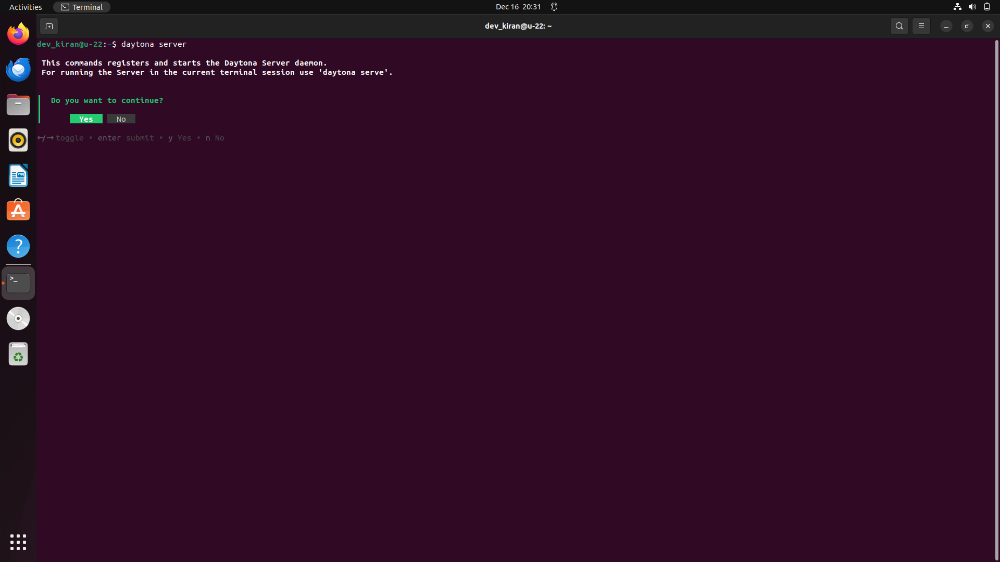

Choose "yes" and you should see a similar output in the screenshot below.
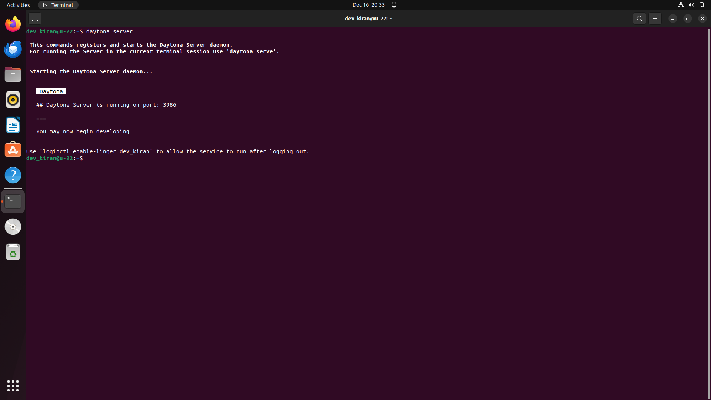

### Step 2: Add Git Provider

Daytona integrates with your preferred Git provider, streamlining your workflow
by allowing direct access to repositories, and simplifying workspace creation
from existing projects.

Execute the command provided below to add your git provider. Daytona also has
support for other Git providers like Bitbucket and GitLab. You can learn more
about Daytona Git Providers [here](https://www.daytona.io/docs/configuration/git-providers/)

```bash
daytona git-provider add
```

Your output should be similar to the image below.

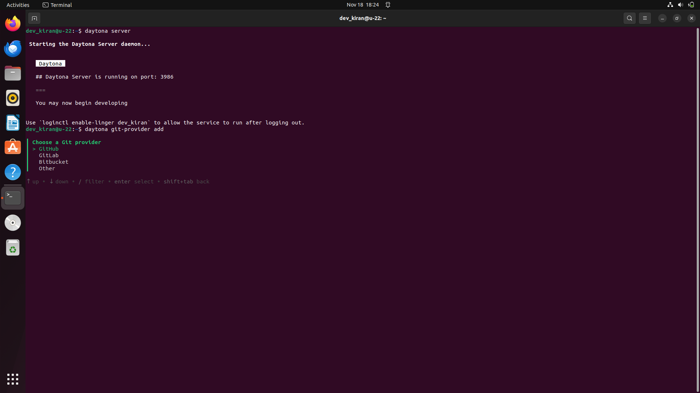

Select GitHub and provide your personal access token.

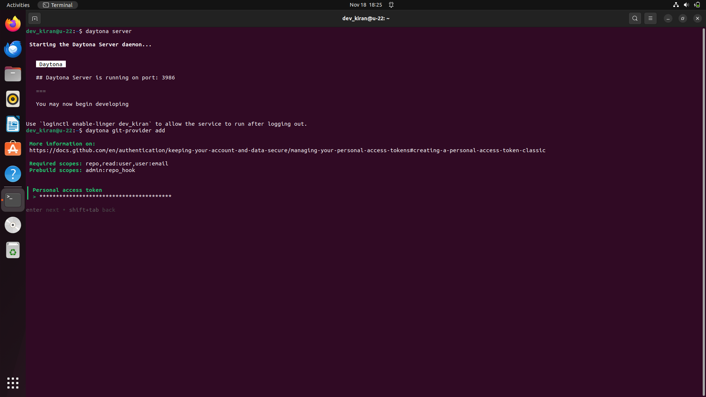

### Step 3: Choose your preferred IDE

Run this command in the terminal to choose your [IDE](https://www.daytona.io/docs/usage/ide/).

```bash
daytona ide
```

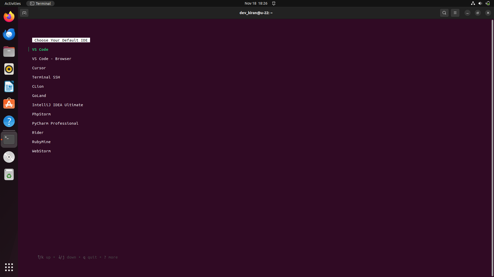

### Step 4: Create a Daytona Workspace

Now create a dev environment of the repository you created in GitHub and
follow the prompts after you run it.

```bash
daytona create
```

Choose GitHub as a provider and select the `ollama-llm-env` repository.

#### Step 4.1: Provide workspace name

The name of the workspace is usually the repository name if you didn't modify it when
prompted in the creation of the workspace.

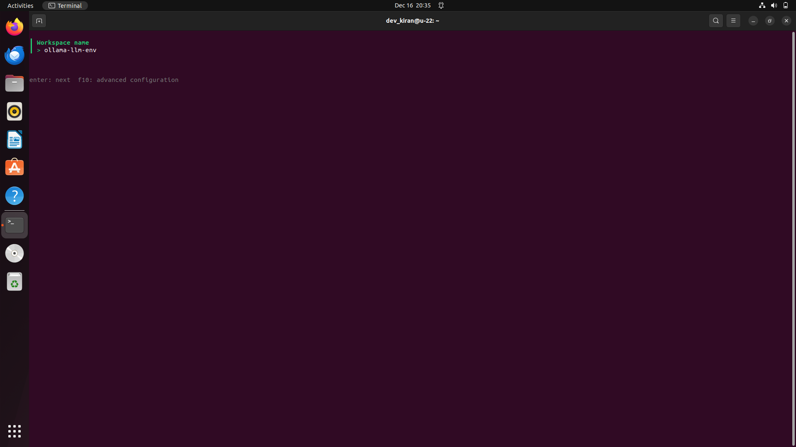

#### Step 4.2: Choose the target

Now it will ask you to choose the target, select `local`, and enter.

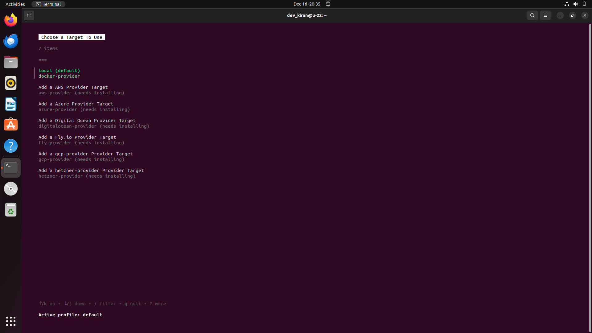

Daytona will now start creating a workspace by pulling your project and installing all
required dependencies, once done it will open your project in your default IDE.

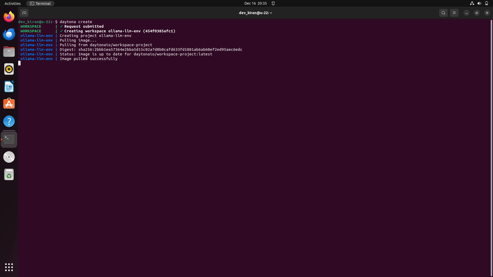

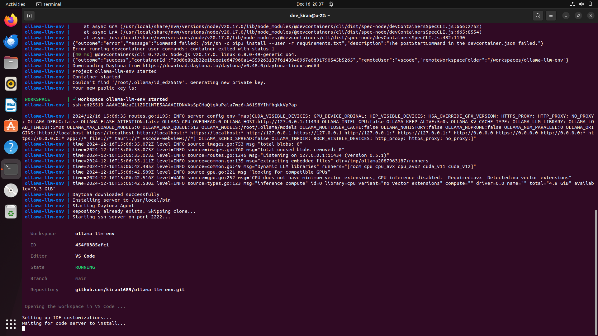

Now, you are ready to run the LLM within your workspace.

### Confirmation

Test the setup by running the LLM model in your VS Code:

Ask Ollama to run the LLM of your choice. In our case the `phi3:mini` model:

```
ollama run phi3:mini
```

This will take a few minutes to download the model.

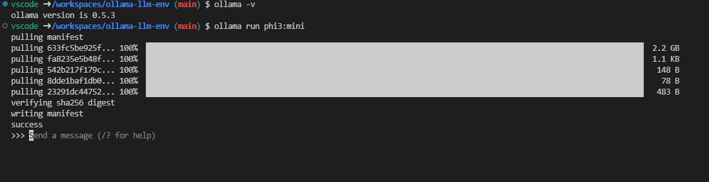

Once you see `success` in the output, you can send a message to that model from the prompt.

Example:
```
>>> Write a haiku about hungry hippos
```
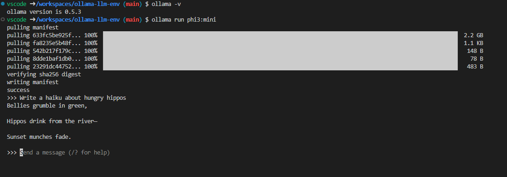

To have a conversation with a model from Python, run the Python file `ollama_chat.py`
You can change the `MODEL_NAME` at the top of the file as needed, and you can also modify the system message.

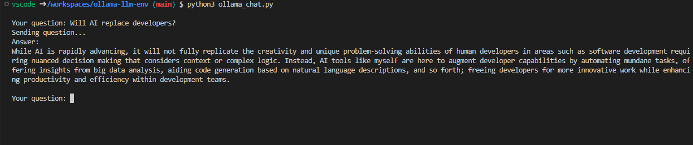

## Conclusion

You've successfully set up a fully containerized development environment for running LLMs with Ollama inside Daytona.
This workflow ensures consistency, simplicity, and efficiency in managing Python-based AI projects.

## References

- [Daytona Documentation](https://www.daytona.io/dotfiles/the-ultimate-guide-to-managing-python-environments)

