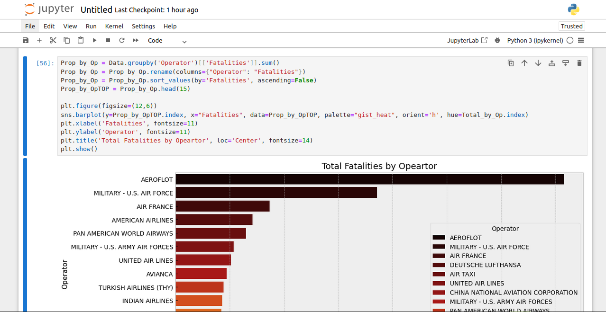

# How to Use and Run Jupyter Notebook in Daytona

## Introduction

Jupyter Notebook is a powerful and useful tool for data scientists, AI engineers, AI researchers, and other professionals in their work and personal projects. Knowledge about and how to use it is essential.

With the power of Daytona Dev Environment and Jupyter Notebook, our workflow can be as smooth and streamlined as possible.
In this comprehensive guide, we'll explore everything you need to get started using Jupyter Notebook in a Daytona playground, including hands-on experience with a real-world practical project.

### TL;DR

- Prerequisites
- What's Jupyter Notebook and Everything to Know to Get Started
- Why use Daytona
- Setting Up Daytona Playground for Jupyter Notebook
- Demo: Exploring the Jupyter Notebook UI
- Building a Jupyter Notebook Project in the Daytona Playground
- Conclusion

## Prerequisites

To follow along with a hands-on guide about Jupyter Notebook in Daytona, you'll need to have the following;

- An [IDE](20240819_definition_integrated%20development%20environment%20_ide_.md)(It could be VS Code, or JetBrains) or just a terminal.
- [Docker](20240819_definition_docker.md) installation on your PC or Mac. Click [here](https://docker.com) for more info.
- Daytona installation on your PC or Mac. Click [here](https://www.daytona.io/) for more info.
- A GitHub account to create a [repository](20240819_definition_repository.md). Link [here](https://github.com/) to create one, if you don’t have one.
- Basic knowledge of [Git](20240819_definition_git.md) and GitHub.

## What's Jupyter Notebook and Everything to Know to Get Started

### Introduction

Jupyter Notebook is a powerful open-source, interactive, web-based application that facilitates interactive computing. It offers a simple, streamlined, and document-centric experience, making it an essential tool for a wide range of applications such as data analysis and visualization, machine learning, scientific research, and education.  

It enables users to create and share documents that include live code, equations, visualizations, and narrative text. It supports multiple programming languages such as Python, R, Julia, and more, thanks to its extensible kernel architecture. This versatility makes it a preferred choice for data scientists, researchers, educators, and developers.  

The platform's interactivity allows users to run code snippets in individual cells, making it ideal for iterative development and debugging. Combined with its ability to integrate rich media content, Jupyter Notebook provides a dynamic and engaging environment for exploring and presenting ideas.  

Whether you're building machine learning models, performing exploratory data analysis, or documenting a scientific experiment, Jupyter Notebook empowers you to combine computation, explanation, and visualization in a single, unified workflow.

### Usage

Jupyter Notebook is a powerful, interactive computing tool that supports data analysis, visualization, and code execution in an easy-to-use web-based interface. Here's why and how it's commonly used:

- **Interactive Code Execution**: Write and execute code in individual cells, allowing for iterative development and real-time feedback. Supports multiple programming languages (e.g., Python, R, Julia), with Python being the most commonly used.

- **Data Analysis and Visualization**: Import and manipulate datasets directly within the notebook. Create visualizations using libraries like Matplotlib, Seaborn, and Plotly for exploratory data analysis and reporting.

- **Documentation**: Combine executable code with Markdown cells for well-documented workflows, making it easy to annotate code and explain processes. Embed equations using LaTeX for mathematical or scientific projects.

- **Collaboration and Sharing**: Share notebooks as `.ipynb` files or export them as HTML, PDFs, or slides for presentations. Collaborate through tools like GitHub or cloud-based platforms (e.g., Google Colab).

- **Reproducible Research**: Use notebooks to create a complete record of experiments, including data, code, and results, ensuring transparency and reproducibility. Ideal for academic research, machine learning experiments, and data pipelines.

- **Education and Training**: Popular in academia for teaching programming, data science, and AI, as it provides a hands-on learning experience. Facilitates learning through immediate feedback and step-by-step tutorials.

- **Prototyping and Experimentation**: A perfect tool for testing new ideas or algorithms quickly without the need for setting up a full development environment. Supports interactive widgets for dynamic user interfaces during prototyping.

Jupyter Notebook’s flexibility and rich feature set make it a go-to tool for professionals and learners in data science, machine learning, and beyond.

## Why use Daytona?

Running Jupyter Notebook in a containerized development environment like Daytona provides several advantages, including:

- **Isolation**: Each Daytona environment workspace operates independently, ensuring that dependencies and configurations specific to your Jupyter environment do not interfere with other projects or the host system.

- **Portability**: You can share your dev environment effortlessly by distributing the configuration file(s) like the `.devcontainer/devcontainer;json` file . Team members can replicate the setup on any system, regardless of its underlying operating system.

- **Security**: Daytona acts as a sandbox, restricting access to your host system and reducing the risk of accidental modifications or security vulnerabilities.

- **Ease of Setup**: You can use a pre-configured Jupyter Notebook Environment playground from Daytona which eliminates the need to manually set up one, providing a ready-to-use environment. *Note: In this guide, we'll create one.*

- **Flexibility**: You can create a custom `.devcontainer/devcontainer.json` config file to suit your needs, or run multiple workspaces simultaneously for different configurations and use cases.

By using Daytona for your Jupyter Notebook environment, you create a portable, secure, and consistent workspace that simplifies experimentation, collaboration, and deployment.

## Setting Up Jupyter Notebook in Daytona

Time to roll up our sleeves and get hands-on. We’ll kick things off by setting up a Jupyter Notebook [environment](20240819_definition_development%20environment.md) in a [Daytona workspace](20240819_definition_daytona%20workspace.md). Let’s get started.

### Step 1: Create a GitHub Repository

First head to the GitHub website and create a [repository](20240819_definition_repository.md) with the name of your choice. For my repository name, I’ll use `playground-jupyter-notebook`. The full URL path to the repository is `https://github.com/c0d33ngr/playground-jupyter-notebook`

### Step 2: Clone the repository using Git

After creating the repository, the next step is to clone the repository into your local PC or Mac. To clone the repository, open your terminal and run this command `git clone https://github.com/USERNAME/REPOSITORY-NAME` but replace the placeholders with your GitHub username and repository name you chose in step 1.

In my case, it’s `git clone https://github.com/c0d33ngr/playground-jupyter-notebook`

### Step 3: Prepare your `devcontainer.json` file and dataset in CSV format

Run the command to move into your cloned repository but don’t forget to replace `playground-jupyter-notebook` with the repository name you created if yours isn’t the same as mine.

```bash
cd playground-jupyter-notebook
```

Download the airplane crash dataset you are going to perform some data visualization tasks on which is in CSV format, from the GitHub repo [here](https://github.com/c0d33ngr/playground-jupyter-notebook/blob/main/Airplane_Crashes_and_Fatalities_Since_1908.csv).

*Note: It has to be in the directory of your clone repository. In my case, it's inside `playground-jupyter-notebook`.*

Now, let us proceed to the next step.

Create a hidden directory named `.devcontainer` where our `devcontainer.json` file will be. Let’s do so and move into it.

Run the command to do so

```bash
mkdir .devcontainer && cd .devcontainer
```

Let’s create our devcontainer.json file in the `.devcontainer` directory.

I use `nano` to create my `.devcontainer.json` file using this command.

```bash
nano devcontainer.json
```

Paste this code into your `devcontainer.json` file.

```yaml
{
    "name": "Jupyter Notebook Playground",
    "image": "mcr.microsoft.com/devcontainers/base:ubuntu",
    "features": {
        "ghcr.io/devcontainers/features/python:1": {}
    },
    "postCreateCommand": "pip install -r requirements.txt"
}
```

The `devcontainer.json` content contains configurations to start your Jupyter Notebook environment in a [Daytona workspace](20240819_definition_daytona%20workspace.md).

- `name`: This sets the name of the development container environment to `Jupyter Notebook Playground`.
- `image`: This uses a base Ubuntu image from the Microsoft image repository.
- `features`: This configuration adds Python setups in the Daytona workspace
- `postCreateComand`: This installs some Python packages needed for this guide and commonly used into the workspace.

After creating and saving the `devcontainer.json` file, move up back to the root directory of your clone [repository](20240819_definition_repository.md). For me, I run the command below.

```bash
cd ..
```

### Step 4: Create `requirements.txt` file

In the root directory, create a `requirements.txt` file to specify the Python libraries you want pre-installed in the Jupyter Notebook environment. Add the following content to the file:

```bash
pandas
numpy
matplotlib
seaborn
plotly
scikit-learn
tensorflow
keras
torch
scipy
statsmodels
dask
pyspark
nltk
spacy
ipython
requests
opencv-python
beautifulsoup4
```

Now, your directory tree should look like this below

```
├── Airplane_Crashes_and_Fatalities_Since_1908.csv
└── requirements.txt

0 directories, 2 files
```

### Step 5: Commit and Push Changes to GitHub

Run these commands to push your changes to GitHub.

```bash
git add .
git commit -m “add devcontainer.json file”
git push
```

Now, you have successfully pushed our updated repository, which contains our configuration file (`devcontainer.json`) for our Jupyter Notebook environment.

### Step 6: Verify Daytona Installation

Run this command to check `daytona` is properly installed on your PC or Mac.

```bash
daytona –-version
```

You should see your version of `daytona` installed.

### Step 7: Create a Daytona Workspace with a Jupyter Notebook Environment in it

Let’s start the daytona server by running the command.

```bash
daytona serve
```

You should see logs like my screenshot.

Open a new tab in your terminal, for Linux its `Shift + Ctrl + T`

Run the command below in a new tab of your terminal and follow the prompt instructions. It would ask you for a [workspace](20240819_definition_daytona%20workspace.md) name to use, choose the default.

Replace `USERNAME` and `REPOSITORY-NAME` with your username for GitHub and the repository name you created earlier.

```bash
daytona create https://github.com/USERNAME/REPOSITORY-NAME
```

In my case, it's this.

```bash
daytona create https://github.com/c0d33ngr/playground-jupyter-notebook
```

After you successfully run the above command you should see a screenshot like mine showing your Daytona workspace that contains the Jupyter Notebook environment is running.

You can now run this command to open the Jupyter Notebook [environment](20240819_definition_development%20environment.md) in your default [IDE](20240819_definition_integrated%20development%20environment%20_ide_.md) you choose when installing Daytona (Replace `WORKSPACE-NAME` with the name you used when creating the workspace above, in my case it's `playground-jupyter-notebook`).

```bash
daytona code WORKSPACE-NAME
```

### Step 8: Set Password and Run the Jupyter Notebook

```bash
jupyter server password
```

```bash
jupyter notebook
```

That’s it. It will then open your default web browser to the Jupyter Notebook URL running on localhost.

When the notebook opens in your browser, you will see the Notebook Dashboard, which will show a list of the notebooks, files, and subdirectories in the directory where the notebook server was started. In our case, it is similar to this screenshot below.

*Note: Yours would not have `LICENSE` and `README.md` files in yours as it wasn't included in the steps above cause it isn't neccessary in setting up Daytona playground.*


## Demo: Exploring the Jupyter Notebook UI

When you log in to the Jupyter server, the top of the interface provides a streamlined menu bar with essential options to navigate and manage your environment.

The **File** menu allows you to create new notebooks, text files, or folders, as well as upload existing files from your local system.

The **View** menu helps you toggle different layout elements, such as the toolbar or header, for a personalized experience.

The **Settings** menu provides configuration options for themes and additional customization.

The **Help** menu offers quick access to Jupyter documentation and community resources.

These options ensure that users can efficiently organize and interact with their projects right from the home interface. The screenshots of the UI are below


## Building a Jupyter Notebook Project in the Daytona Playground

In this section, you'll do some data analysis and visualization in Jupyter Notebook using the "**Airplane Crashes and Fatalities Since 1908**" dataset downloaded above in previous steps. You'll begin by importing essential libraries, cleaning the data to handle missing and inconsistent values, and transforming columns for consistency and ease of analysis. This process includes merging date and time fields, standardizing operator names, and preparing the dataset for exploration.

Next, you'll analyze temporal trends in airplane crashes, visualize yearly crash counts, and identify key operators with the most crashes and fatalities. By following this guide, you'll gain hands-on experience in building, analyzing, and visualizing data projects in Jupyter Notebook. Let’s begin!

Click the **Notebook** from the **File** menu option at the top bar to create an empty notebook file.


Select the **Python 3 ipykernel** from the pop up window


Now, you should have a blank notebook file with an empty cell and file name **Untitled.ipynb**


### Step 1: Import Libraries and Load the Dataset

To begin the data visualization, we need to import the necessary libraries and load the dataset into a Pandas DataFrame. Copy and paste the code below in the Jupyter Notebook cell

```bash
#importing the libraries and data
import numpy as np 
import pandas as pd 
import seaborn as sns
import matplotlib.pyplot as plt
from datetime import date, timedelta, datetime

Data = pd.read_csv('/workspaces/playground-jupyter-notebook/Airplane_Crashes_and_Fatalities_Since_1908.csv')
```

*Note: Repace `/workspaces/playground-jupyter-notebook/Airplane_Crashes_and_Fatalities_Since_1908.csv` with your own path to your `.csv` file from your PC. It should be enclosed in single or double quotation marks. Just in case you missed where to download the dataset, it can be found  [here](https://github.com/c0d33ngr/playground-jupyter-notebook/blob/main/Airplane_Crashes_and_Fatalities_Since_1908.csv).*


Click the little play button at the top to run the cell.


You can also click **Run selected cell** from the **Run** menu.


If you prefer to use just your keyboard to run the cell like me, press `Shift` + `Enter`.

After running the cell, you should see a similar display


### Step 2: Explore the Dataset

The code below sets a random seed and displays a random sample of the data so we can understand it

Copy and paste the code below in the new cell created automatically below the previous code in the Jupyter Notebook and run the cell. Use your prefered way - mine is `Shift` + `Enter`

```bash
np.random.seed(42) 
obs, feat = Data.shape
Data.sample(5)
```

You should see similar output


### Step 3: Summarize Dataset Dimensions and Features

Next, we summarize the dataset by displaying its dimensions (number of observations and features) and listing the column names. This gives us an overview of the dataset's structure and the available features for analysis.

Copy and paste the code below in the new cell and run it to see its output.

```bash
print(str("Dataset consist of " + str(obs) + " observations (crashes) and " + str(feat) + " features. Features are following:"))
print(",\n".join(Data.columns))
```

Yours should be similar to mine below


### Step 4: Calculate Missing Values in the Dataset

Before proceeding with any visualization, it’s important to check for missing values in the dataset. We calculate the number of missing values for each column to identify any potential data quality issues that may need to be addressed.

The code below does that. Cppy and paste it in a new cell and run it to see it's output.

```bash
Data.isnull().sum() #calculating missing values in rows
```

Your output should be similar to mine


### Step 5: Clean and Format Time and Operator Data

In this step, we will clean the time-related data by replacing incorrect or missing values, standardizing time formats, and combining date and time columns into a single column. Additionally, we will also standardize operator names to avoid inconsistencies such as different capitalizations.

The code below does exactly that. Copy and paste it into a new cell and run it

```bash
#cleaning up
Data['Time'] = Data['Time'].replace(np.nan, '00:00') 
Data['Time'] = Data['Time'].str.replace('c: ', '')
Data['Time'] = Data['Time'].str.replace('c:', '')
Data['Time'] = Data['Time'].str.replace('c', '')
Data['Time'] = Data['Time'].str.replace('12\'20', '12:20')
Data['Time'] = Data['Time'].str.replace('18.40', '18:40')
Data['Time'] = Data['Time'].str.replace('0943', '09:43')
Data['Time'] = Data['Time'].str.replace('22\'08', '22:08')
Data['Time'] = Data['Time'].str.replace('114:20', '00:00') #is it 11:20 or 14:20 or smth else? 

Data['Time'] = Data['Date'] + ' ' + Data['Time'] #joining two rows
def todate(x):
    return datetime.strptime(x, '%m/%d/%Y %H:%M')
Data['Time'] = Data['Time'].apply(todate) #convert to date type
print('Date ranges from ' + str(Data.Time.min()) + ' to ' + str(Data.Time.max()))

Data.Operator = Data.Operator.str.upper() #just to avoid duplicates like 'British Airlines' and 'BRITISH Airlines'
```


### Step 6: Analyze and Visualize Accident Trends Over the Years

In this step, we will group the data by year and plot the number of accidents per year to visualize trends over time. This helps us identify any significant changes or patterns in the frequency of accidents across different years.

Copy and paste the code below and run it to see the visualization.

```bash
Temp = Data.groupby(Data.Time.dt.year)[['Date']].count() #Temp is going to be temporary data frame 
Temp = Temp.rename(columns={"Date": "Count"})

plt.figure(figsize=(12,6))
plt.style.use('bmh')
plt.plot(Temp.index, 'Count', data=Temp, color='red', marker = ".", linewidth=1)
plt.xlabel('Year', fontsize=10)
plt.ylabel('Count', fontsize=10)
plt.title('Count of accidents by Year', loc='Center', fontsize=14)
plt.show()
```

Your visualization should be similar to mine.


### Step 7: Standardize Operator Names and Visualize Top Operators by Accident Count

Here, we will clean up operator names and then visualize the top 15 operators by the number of accidents. By creating a horizontal bar plot, we can quickly identify which operators are most frequently involved in accidents.

Copy and paste the code into a new cell and run it.

```bash
Data.Operator = Data.Operator.str.upper()
Data.Operator = Data.Operator.replace('A B AEROTRANSPORT', 'AB AEROTRANSPORT')

Total_by_Op = Data.groupby('Operator')[['Operator']].count()
Total_by_Op = Total_by_Op.rename(columns={"Operator": "Count"})
Total_by_Op = Total_by_Op.sort_values(by='Count', ascending=False).head(15)

plt.figure(figsize=(12,6))
sns.barplot(y=Total_by_Op.index, x="Count", data=Total_by_Op, palette="gist_heat", orient='h', hue=Total_by_Op.index)
plt.xlabel('Count', fontsize=11)
plt.ylabel('Operator', fontsize=11)
plt.title('Total Count by Opeartor', loc='Center', fontsize=14)
plt.show()
```

Your visualization should be similar to mine
.


### Step 8: Analyze and Visualize Fatalities by Operator

In this final step, we will analyze the total fatalities by operator and visualize the top 15 operators with the highest fatality counts. This provides insight into which operators are associated with the most severe accidents.

The code below does. Copy and paste it into a new cell and run it
.
```bash
Prop_by_Op = Data.groupby('Operator')[['Fatalities']].sum()
Prop_by_Op = Prop_by_Op.rename(columns={"Operator": "Fatalities"})
Prop_by_Op = Prop_by_Op.sort_values(by='Fatalities', ascending=False)
Prop_by_OpTOP = Prop_by_Op.head(15)

plt.figure(figsize=(12,6))
sns.barplot(y=Prop_by_OpTOP.index, x="Fatalities", data=Prop_by_OpTOP, palette="gist_heat", orient='h', hue=Total_by_Op.index)
plt.xlabel('Fatalities', fontsize=11)
plt.ylabel('Operator', fontsize=11)
plt.title('Total Fatalities by Opeartor', loc='Center', fontsize=14)
plt.show()
```



There are multiple ways to save a Jupyter Notebook file but I'll save mine with `Ctrl` + `Shift` + `S`.

A pop-up similar to the screenshot below should be displayed. Replace the **Untitled** with your preferred file name. I replaced mine with **data_visualization**.


One other way to save the file is to click the **Save Notebook As...** from the **File** menu. Screenshot below


*Note: You can get more resources about using Jupyter Notebook and more from the **Help** menu*


When done, you can shut down Jupyter Notebook environment by clicking the **Shut Down** from the **File** menu.


## Conclusion

In this guide, we covered how to effectively use Jupyter Notebook, a powerful open-source tool for interactive computing. Jupyter provides a simple, document-centric interface that supports various programming languages, including Python, R, and Julia, making it a versatile tool for data analysis, machine learning, and more. We also walked through setting up Jupyter Notebook in Daytona, demonstrating its ease of setup and practical benefits.

Throughout the example project, we applied Jupyter's features to clean, analyze, and visualize airplane crash data, using Python libraries like Pandas and Matplotlib. The combination of Jupyter's interactive environment and Python’s powerful data processing capabilities allowed us to efficiently uncover key trends and insights.

## References

* [Official Jupyter Notebook Website](https://www.jupyter.org)

* [Guide About Jupyter Notebook](https://12ft.io/proxy?q=https%3A%2F%2Fwww.techtarget.com%2Fsearchenterpriseai%2Ftutorial%2FHow-to-use-and-run-Jupyter-Notebook-A-beginners-guide)

* [Kaggle Airplane Crashes dataset](https://www.kaggle.com/datasets/imtkaggleteam/airplane-crashes)

* [Kaggle Data Visualization Project](https://www.kaggle.com/code/ruslankl/airplane-crashes-data-visualization#)
