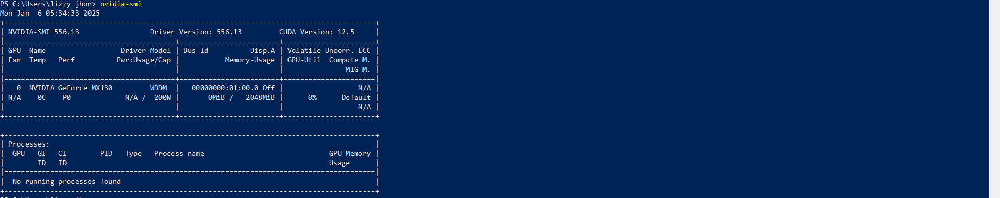
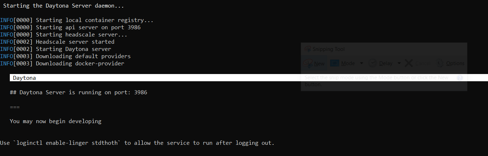
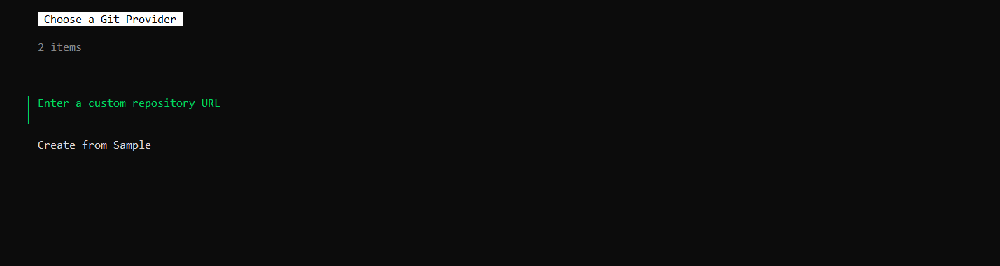
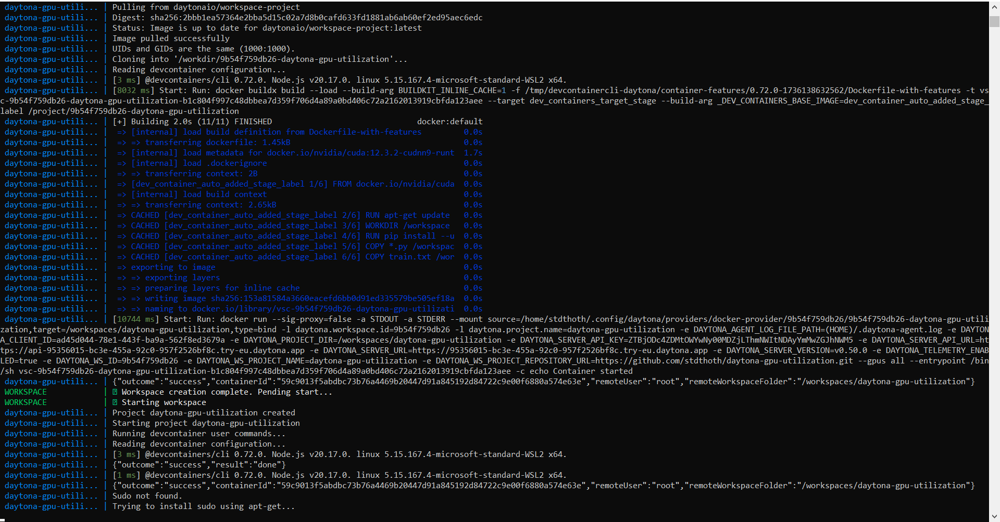
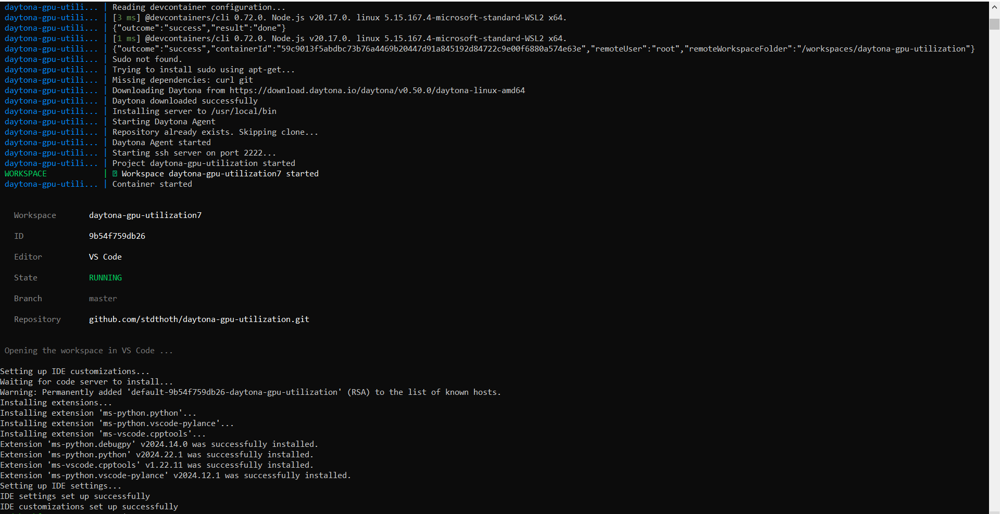
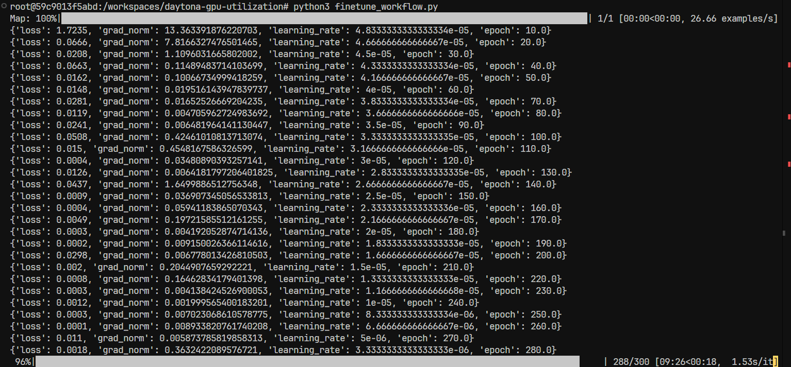
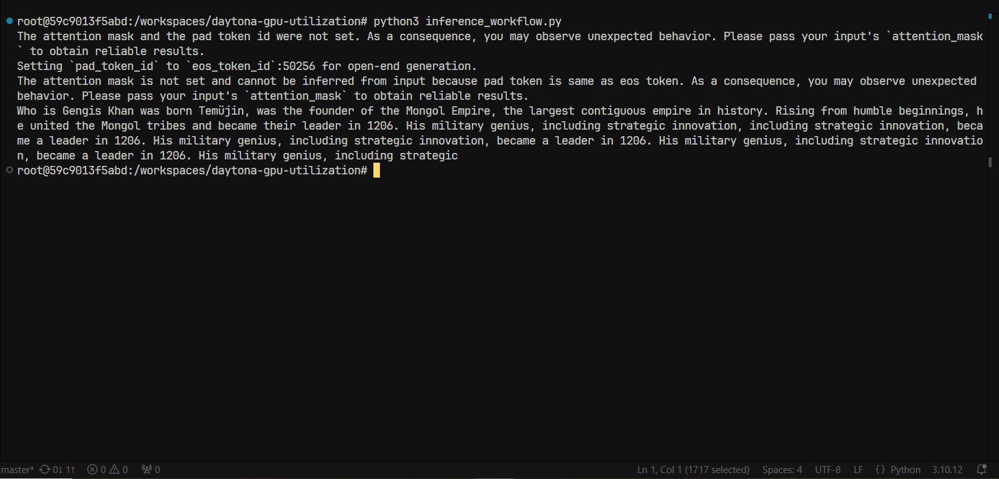

# GPU Utilization in Daytona for LLM Fine Tuning and Inference

## Introduction

GPUs (Graphics Processing Units) are specialized hardware designed to
accelerate the rendering of images, video, and animations. Originally
developed to handle the intense mathematical calculations required for rendering
graphics in real-time (like for video games), GPUs have evolved to become
versatile tools for a number of computational tasks. Over the last decade,
GPUs have transitioned from being purely graphics-focused components to becoming
essential for many non-graphics tasks.Their ability to handle massive
parallel computations has driven this shift.

## Overview of LLMs (Large Language Models)

Large Language Models (LLMs) are advanced AI systems designed to understand, generate,
and manipulate human language.Built using deep learning architectures, particularly transformer
models like GPT (Generative Pre-trained Transformer), LLMs are trained on vast datasets
comprising text from books,websites, and other sources.Their primary strength lies in generating
contextually relevant and coherent text based on user prompts.

  **Uses of LLMs**

- **Programming Assistance:** LLMs like GPT 4, Claude Sonnet 3.5 have been integrated into
programming by creating tools that generate code snippets and useful debugging tools.
- **Data Analysis:** LLMs can be used to summarize, extract insights, or analyze textual datasets
for numerous purposes.
- **Content Creation:** You can generate images, texts and to a certain extent videos with LLMs which
can be used by content creators to speed up their workflows
_ **Education:** Large Language Models can be used to explain complex concepts in a concise and structured
format, It can also be used for tutoring and creating a personalized learning experience.

## Overview of LLM Fine-Tuning

Fine-tuning is the process of adapting a pre-trained Large Language Model (LLM) to perform specific
tasks or excel in particular domains. While LLMs are initially trained on vast datasets to develop
a general understanding of language, fine-tuning leverages domain-specific data to refine the model’s
performance for specific applications. Fine-tuning is necessary because pre-trained Large Language Models (LLMs),
while good at general language understanding, often lack the precision required for numerous fields.
It enables models to become better by aligning them with the vocabulary, structure, and nuances of a particular
task or domain, thereby improving the quality and accuracy of outputs. Fine-tuning also allows for cost efficiency,
as it leverages pre-trained models instead of training from scratch, saving significant computational resources.
Additionally, it allows organizations to customize models to their specific application requirements, making them
more effective and contextually relevant.

  **Types Of Fine-Tuning**

- **Supervised Fine-Tuning:** This involves using labeled datasets where input-output pairs are defined
(e.g., translating text, answering questions, or summarizing content).
- **Reinforcement Learning from Human Feedback (RLHF):** A feedback-driven fine-tuning method where human evaluators
rate outputs, and the model learns to optimize for quality responses.
- **Few-shot or Zero-shot Fine-Tuning:** Few-Shot involves minimal additional training by conditioning the model
on a few examples or a task prompt, leveraging pre-existing knowledge.

  **Steps in Fine-Tuning**

- **Dataset Preparation:** This is the collection and preprocessing of task specific datasets, You should ensure
data is clean and representative of the task.
- **Model Configuration:** This is the process of choosing a pretrained model like GPT, BERT or LLaMA and configuring
parameters like learning rate, batch size and epochs, and epochs for training.
- **Training:**  Perform task-specific fine-tuning using the dataset while monitoring loss and accuracy metrics.
- **Validation:** Evaluate the fine-tuned model on unseen validation data to ensure its performance generalizes well.

## Overview of LLM Inference

Inference refers to the phase where a trained LLM is used to generate predictions or responses based on queries.
During inference, the model processes the input, retrieves relevant learned patterns, and outputs the most contextually
appropriate text.. The process begins with tokenizing the input into smaller units, such as words or subwords, which are
numerically encoded for model processing. The encoded tokens are passed through the LLM, where neural networks identify
contextual relationships between tokens. Based on these computations, the model predicts the most likely next token(s)
iteratively, generating the output text one token at a time. This continues until a stopping criterion, such as a specific
token or maximum length, is met. Finally, the generated tokens are decoded back into text and formattedas the final response.

  **Types of LLM Inference Tasks**

- **Text Generation:** This involves producing relevant texts for prompts e.g story writing, code generation e.t.c
- **Text Classification:**  This is the process of of categorizing input texts into different predefined labels using techniques
such as sentiment analysis.
- **Question Answering:** Extracting or generating answers based on a given question and context.
- **Summarization:** Condensing long text into concise summaries.
- **Translation:** Converting text from one language to another.

## Overview of Daytona

Daytona is a platform that simplifies the development environment setup by
offering dev environments for software developers. It enables users to create
and share fully configured development environments, allowing for faster
onboarding, collaboration, and consistent setups across teams.Daytona enables
you to manage and deploy Workspaces, which are reproducible development
environments built on standard OCI containers, and it includes native support
for the Dev Container standard. The architecture of Daytona is designed to
potentially support other configuration standards in the future, such as
Dockerfiles, Docker Compose, Nix, and Devfile.

**Features of Daytona**

- **Pre-configured Environments**: You can create environments with all
  dependencies, tools, and configurations pre-installed, so developers can start
  coding immediately without having to spend time configuring their setups.
- **Collaborative Workspaces**:The platform enables team collaboration by
  allowing multiple developers to work on the same environment. This can be
  particularly useful for pair programming, code reviews, or troubleshooting.
- **Containerized Environments**:Each development environment can be
  containerized, ensuring that the setup is consistent, reproducible, and
  isolated from other environments. This helps avoid the common "works on my
  machine" problem.
- **Reverse Proxy Support**:Daytona integrates a reverse proxy allowing you to
  access a workspace on a public or restricted network.

For more information about Daytona check out its [docs](https://daytona.io/docs)

In this guide you will learn how to build an environment using Daytona in which you can utilize your powerful Nvidia
GPU for the purpose of LLM Fine-Tuning and LLM Inference. Before you get started make sure you have
[Docker](https://docs.docker.com/get-started/get-docker/) installed, an IDE like [VS Code](https://code.visualstudio.com/download) or
[JetBrains](https://www.jetbrains.com/idea/download/),
[Daytona](https://www.daytona.io/docs/installation/installation/), [CUDA-enabled GPU](https://developer.nvidia.com/cuda-gpus), [Nvidia GPU Driver](https://www.nvidia.com/en-us/drivers/) and WSL2(Window Sub-System for Linux) and a Linux Distribution like Ubuntu. Both Window and Linux users can follow
this guide, the only difference is potential driver installations which will be clarified later on in this guide.

## TL;DR

- A GPU (Graphics Processing Unit) is a specialized processor designed to accelerate graphics rendering
  and parallel computing tasks, commonly used in gaming, AI, and data-intensive applications.
- A Large Language Model (LLM) is an AI system trained on vast text data to understand, generate,
  and manipulate human language for various tasks like text generation, translation, and question answering.
- LLM fine-tuning is the process of adapting a pre-trained language model to a specific task or domain by
  training it further on specialized data.
- LLM inference is the process of using a trained language model to generate responses or predictions based
  on input text.
- Daytona simplifies setting up developer playgrounds by providing reproducible,
  isolated environments with easy management and flexible configuration options.
- Prerequisites to follow this guide: Docker, IDE(VS Code or JetBrains), Daytona,
  WSL2 and CUDA Compatible GPU and its drivers.

You can find the Github repository where my devcontainer configuration files
which I used for this guide
[here](https://github.com/stdthoth/daytona-gpu-utilization).

## Installation and Verification of Nvidia Drivers and Toolkit

Before setting up the dev container configuration you should verify if your GPU
is CUDA compatible,if the drivers are installed on the host machine and the Nvidia
Container Toolkit installation status.

  Verify GPU driver status and install Nvidia Container Toolkit

  To verify your drver status open your terminal and run this command

  ```bash
  nvidia-smi
  ```
  You should get an output resembling the below image

  

  If you do not have drivers installed get them from [here](https://www.nvidia.com/en-us/drivers/)
  depending on your OS and GPU,If drivers are installled open your WSL2 distribution and check if
  the Nvidia Container Toolkit is installed with

  ```bash
    dpkg -l | grep nvidia-container-toolkit
  ```
  If installed it will show the package version, if it isn't installed run this command

  ```bash
    sudo apt-get install -y nvidia-container-toolkit
  ```
  Configure the runtime with this command
  
  ```bash
    sudo nvidia-ctk runtime configure
    sudo systemctl restart docker
  ```
  Once everything is setup you can run a CUDA enabled container with GPU access with
  this command

  ```bash
    docker run --gpus all nvidia/cuda:12.0-base nvidia-smi
  ```
  Ensure that the Windows/Linux drivers are compatible with the CUDA version in your Docker image,
  i.e a driver version of 12.5 should be used with a CUDA docker image of version 12.5 or less
  since there is backward compatibilty between them.

  > **Important Note:** For windows users If you have Nvidia GPU drivers already installed on their
  >system, CUDA becomes available within WSL2. The CUDA driver installed on windows will be stubbed
  >inside the WSL2, therefore users must not install any Nvidia GPU Linux driver within WSL2 to
  >avoid conflicts.

## Setup Dev Container Configuration for GPU Utilization
  
  Create a Dev Container configuration
  
  Here, you're going to create a dev container consisting of a `devcontainer.json` file, a
  `Dockerfile` and Python Scripts.  
  
  Create a new directory and move inside of it

  ```bash
  mkdir daytona-gpu-utilization && cd daytona-gpu-utilization
  ```
  Create a .devcontainer directory.This is where your devcontainer.json and dockerfiles will live

  ```bash
  mkdir .devcontainer && cd .devcontainer
  ```
  Inside the .devcontainer folder you are going to create a `devcontainer.json` file with the following code.
  This is the configuration file for the dev environment specifying settings and
  dependencies.

  ```json
    {
    "name": "Daytona GPU Utilization",
    "build": {
        "context": "..",
        "dockerfile": "Dockerfile"
    },
    "customizations": {
       "vscode": {
            "extensions": [
                "ms-python.python",
                "ms-vscode.cpptools",
                "ms-python.vscode-pylance"
            ]
        }
    },
    "runArgs": [
    "--gpus", "all"  // Ensures GPU access
  ],
    "forwardPorts": []
    
}
  ```
Let's breakdown the `devcontainer.json` file

- `name`: Specifies the name of the development environment.
- `build`: Configures the `Dockerfile` and build related options
- `customizations`:Allows customization of the development environment,
  specifically for VS Code.
- `vscode`: Automatically installs Python extension for VS Code, enabling
  some IDE features (e.g. linting, definition, debugging e.t.c)
- `runArgs`: This is the argument required to start the container. The variable `"[--gpus, "all"]`
  ensure the container starts with GPU access.

You will create a Dockerfile in the same directory

  ```dockerfile
  FROM nvidia/cuda:12.3.2-cudnn9-runtime-ubuntu22.04
  RUN apt-get update && apt-get install -y \
      python3-pip
  WORKDIR /workspace

  RUN pip install --upgrade pip \
      && pip install torch torchvision torchaudio transformers datasets accelerate torchmetrics

  COPY *.py /workspace/
  COPY train.txt /workspace/

  CMD [ "bash" ]
  ```
  Let's breakdown the `Dockerfile`

- `FROM nvidia/cuda:12.3.2-cudnn9-runtime-ubuntu22.04`: This is the image provided by Nvidia which ensures GPU accelerated computations and provides optimized libraries for deep learning workloads. You may choose to use other image tags like `base`or `devel`
depending on your specific need or complexity of operation
- `RUN apt-get update && apt-get install -y \python3-pip`: Installs Python3 and `pip` Python's package
  manager. The flag `-y` automatically confirms prompts during installation.
- `WORKDIR /workspace`: Sets the default working directory inside the container to `/workspace`, any subsequent
  operations like `COPY` and `RUN` will be relative to this directory.
- `RUN pip install --upgrade pip \ pip install torch torchvision torchaudio transformers datasets accelerate torchmetrics`:
  Ensures the latest version of `pip` is being used and installs necessary libraries like `torch` is the core PyTorch library
  which is necessary for deep learning operations,`torchvision`which is an image processing utility for PyTorch,`torchaudio`
  is an audio processing utility for PyTorch,`transformers` is Huggingface library for NLP models like GPT,`datasets` is used
  to manage datasets, `accelerate` is used to simplify distributed training and `torchmetrics` is used to provide metrics for
  evaluating PyTorch models.
- `COPY *.py /workspace/`: Copies all Python files from the host directory into the container.
- `COPY train.txt /workspace/`: Copies the `train.txt` file to your workspace.
- `CMD [ "bash" ]`: This opens up a shell prompt inside the container when you can execute your scripts manually.

Navigate to the parent directory, you will create several files which will be used for the LLM fine-tuning and
inference workflow

Create a `gpu_check.py` script for the purpose of checking the GPU availability and GPU device name

```python
import torch

if torch.cuda.is_available():
    print("GPU is available.")
    print("Device name:", torch.cuda.get_device_name(0))

else:
    print("GPU is not available.")
```

Create a `data.txt` file which will provide the dataset for fine-tuning the LLM

```text
    Genghis Khan was born Temüjin, was the founder of the Mongol Empire, the largest contiguous empire in history. 
    Rising from humble beginnings, he united the Mongol tribes and became their leader in 1206. His military genius, 
    including strategic innovation and organized armies, led to vast conquests across Asia and parts of Europe. 
    Genghis Khan established a strong empire with efficient governance, promoting trade, religious tolerance, 
    and cultural exchange. Despite his brutal conquests, his legacy includes unifying the Mongols and laying the 
    foundation for global trade, with his descendants further expanding the empire.
```
Create a `finetune_workflow.py` script that will be used to fine tune the LLM

```python
from transformers import GPT2Tokenizer, GPT2LMHeadModel, Trainer, TrainingArguments
from datasets import load_dataset

# Load dataset
dataset = load_dataset("text", data_files={"train": "train.txt"})

# Load tokenizer and model
tokenizer = GPT2Tokenizer.from_pretrained("gpt2")
model = GPT2LMHeadModel.from_pretrained("gpt2")

# Add or set a pad token
if tokenizer.pad_token is None:
    tokenizer.pad_token = tokenizer.eos_token  # Use the EOS token as padding token

# Tokenize data
def tokenize_function(examples):
    tokens = tokenizer(examples["text"], truncation=True, padding="max_length", max_length=50)
    tokens["labels"] = tokens["input_ids"].copy()  # Add labels for computing the loss
    return tokens

tokenized_dataset = dataset.map(tokenize_function, batched=True)

# Handle small datasets: Skip split if the dataset is too small
if len(tokenized_dataset["train"]) > 1:
    tokenized_dataset = tokenized_dataset["train"].train_test_split(test_size=0.5)
else:
    # Use the same dataset for both train and test
    tokenized_dataset = {"train": tokenized_dataset["train"], "test": tokenized_dataset["train"]}

# Training arguments
training_args = TrainingArguments(
    output_dir="./results",
    overwrite_output_dir=True,
    num_train_epochs=300,
    per_device_train_batch_size=2,
    save_steps=10,
    save_total_limit=2,
    logging_dir="./logs",
    logging_steps=10,
)

# Trainer
trainer = Trainer(
    model=model,
    args=training_args,
    train_dataset=tokenized_dataset["train"],
    eval_dataset=tokenized_dataset["test"],
)

# Fine-tune the model
trainer.train()

# Save the fine-tuned model
model.save_pretrained("./fine_tuned_gpt2")
tokenizer.save_pretrained("./fine_tuned_gpt2")
```
Create a `inference_workflow.py` script which whill be used to run LLM inference and prompt the fine tuned
GPT model

```python
from transformers import GPT2Tokenizer, GPT2LMHeadModel

# Load fine-tuned model
tokenizer = GPT2Tokenizer.from_pretrained("./fine_tuned_gpt2")
model = GPT2LMHeadModel.from_pretrained("./fine_tuned_gpt2")

# Generate text
input_text = "Who is Gengis Khan"
input_ids = tokenizer.encode(input_text, return_tensors="pt")

output = model.generate(input_ids, max_length=300, num_return_sequences=1)
print(tokenizer.decode(output[0], skip_special_tokens=True))

```

Initialize,commmit and create a GitHub repository

  ```bash
  git init
  git add .
  git commit -m "inital commit"
  ```

  After commiting your code you will push it to a remote repository of your
  choice.

  ```bash
  git remote add origin https://github.com/YOUR-GITHUB-USERNAME/YOUR-DIRECTORY-NAME.git
  git branch -M main
  git push -u origin main
  ```

## Setup workspace environment in Daytona

Here you are going to use Daytona to build the playground using Github as a
Provider and open a workspace in VS Code. You should ensure `daytona` is
installed on you machine before proceeding.

Execute the command provided below to start the `daytona` server daemon. when
prompted to start the server in the current terminal session click `yes`

```bash
  daytona server
  ```
Your output should look like the image below

  

Create a new workspace by running the below command

```bash
  daytona create
  ```
Your output should look like the image below

  

Select and add the repository where your files are located and click enter, the workspace will start building,
your output should look like the images below





After the workspace completes the build process your preferred IDE will open automatically like the image
below


## Running LLM fine-tuning on GPT 2

Before carrying out any operation you would want to verify if your GPU is available and being accessed, In
order to achieve this navigate to your terminal and running this command

```bash
  python3 gpu_check.py
```
Your output should look like the image below

  

To perform LLM fine-tuning workflow run this command

```bash
  python3 finetune_workflow.py
```
Your output should look like the image below

  

- `loss`: The loss measures how far off the model's prediction are from true values. It quantifies the error
during training. The training process aims to reduce this value.
- `grad_norm`: The norm (magnitude) of the gradient vector, which indicates the size of
the change in model parameters during optimization. This helps monitor and control the optimization process.
If the gradient norm is too large, it can lead to unstable updates.
- `learning_rate`: A hyperparameter that controls the size of the steps the optimization algorithm takes during
training. It balances the speed and stability of training. If the learning rate is too high it may diverge and if
it is too slow training may get stuck.

## Running LLM Inference on Fine-tune GPT 2 model

To perform LLM fine-tuning workflow in the workspace, navigate to your terminal and run this command

```bash
  python3 inference_workflow.py

```
Your output should look like the image below

  

## Common Issues and Troubleshooting

**GPU cannot be accessed or GPU is unavailable**: Check the status of your GPU drivers installed on your
host machine. Verify if Nvidia Container toolkit is installation status.

**Slow Performance during fine-tuning or inference**: Verify the script is using the GPU by running `nvidia-smi`.
Optimize script by quantitizing model or inceasing batch size.

**Build Target** : The build target may need to be set to docker manually. You
can set it with `daytona target set`

## Conclusion

In conclusion, by following this guide, you've successfully set up a Daytona GPU Powered enviroment.
With a reproducible and isolated environment at your disposal, you can now experiment, test, and
develop and run different LLM workflows without affecting any of your other projects.
This setup not only streamlines your workflow but also allows you to explore new ideas and technologies.